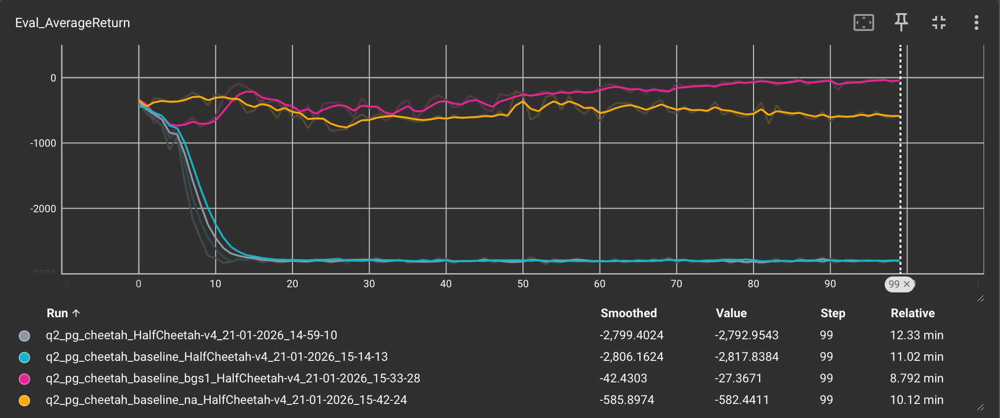
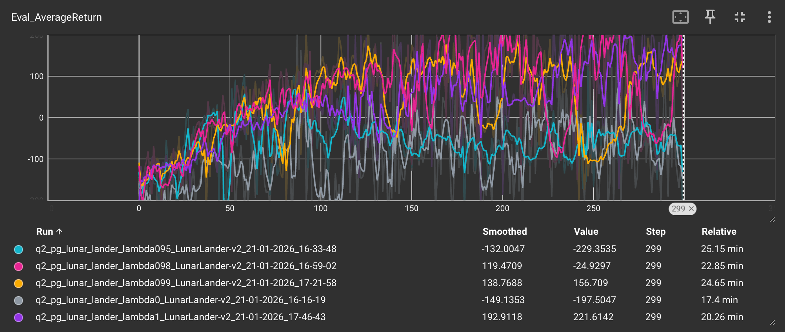

# Homework 2

## Experiment 1

  
  

### Analysis
- With a small batch size (b=1000), gradient variance is high, leading to highly unstable and techniques such as reward-to-go (RTG) and advantage normalization play a critical role in stablilzing training
- With a large batch size (b=4000) variance is reduced so even vanilla policy gradient methods learning successfully. But the combination of RTG and advantage normalization still achieves the fastest and most stable performance

## Experiment 2

  

### Analysis
- Across all settings, learning was highly unstable and often collapsed, resulting in very low average returns

- Gray (w/o baseline), Blue (Baseline)
    - The gray and blue curves represent vanilla policy gradient without a baseline and policy gradient with a value-function baseline. Both settings show very similar behavior that training collapses rapidly in the early stages, with average returns dropping to around -3000 and failing to recover. It indicates that simply adding a baseline is insufficient to address the high variance of policy gradient method in the long-horizon HalfCheetah
- Pink (PG + Baseline, bgs=1)
    - The pink curve use a baseline with only one gradient step per iteration. This setting exhibits the most stable behavior among all vriants and occasionally recovers to near-zero average return. It represents aggressively training the baseline can introduce additional instability
- Yellow (PG with baseline + Advantage Normalization)
    - The yellow curve shows policy gradient with both a baseline and advantage normalization. It prevents complete collapse and improves stability, performance remains limited around -500~-700 average return, indicating that variance reduction along is not sufficient for effective learning

## Experiment 3

  

### Analysis
- $\lambda=0$ (Gray)
    - Most unstable
    - Return quickly drop to large negative values and couldn't recover
    - Uses only 1-step TD error $\rightarrow$ low bias but very high variance
- $\lambda=0.95$ (Green)
    - More stable than $\lambda=0$ but still unstable
    - Average return remains in the negative region throughout training
    - Variance is slightly reduced, but still too high for stable learning
- $\lambda=0.98$ (Pink)
    - Clearly more stable
	- Average return steadily increases as training progresses
- $\lambda=0.99$ (Orange)
    - Average return reaches around 150
    - High $\lambda$ values are effective for long-horizon credit assignment
- $\lambda=1$ (Purple)
    - Best overall performance
    - Final average return iis 221
    - Achieves the solved threshold for LunarLander
    - Although variance is high, the large batch size in this environment makes learning effective

- As $\lambda$ increases, learning becomes significantly more stable and achieves higher final performance. Small $\lambda$ values (e.g., $\lambda$ = 0 or 0.95) rely heavily on short-horizon TD errors and suffer from high variance, leading to unstable or failed learning. In contrast, larger $\lambda$ values ($\lambda$ = 0.98, 0.99, and 1.0) effectively incorporate longer-term return information, resulting in smoother learning curves and substantially higher average returns. The best performance is achieved with $\lambda$ = 1.0, which closely resembles Monte Carlo returns and reaches an average score 221