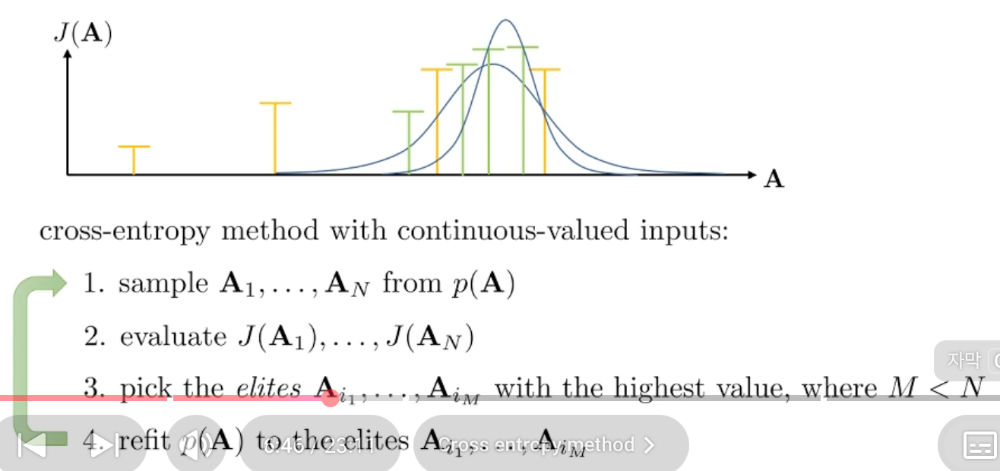
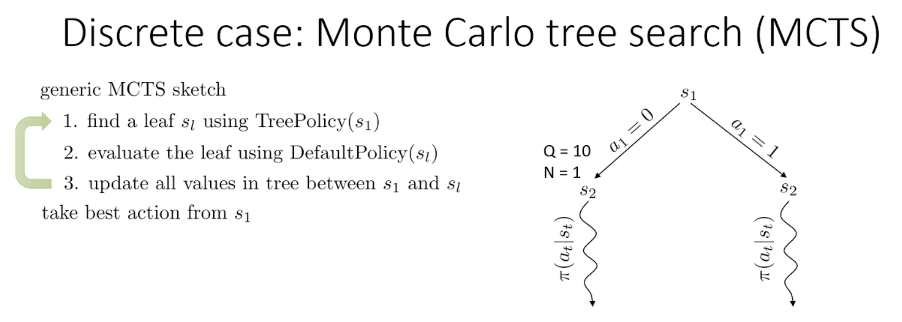
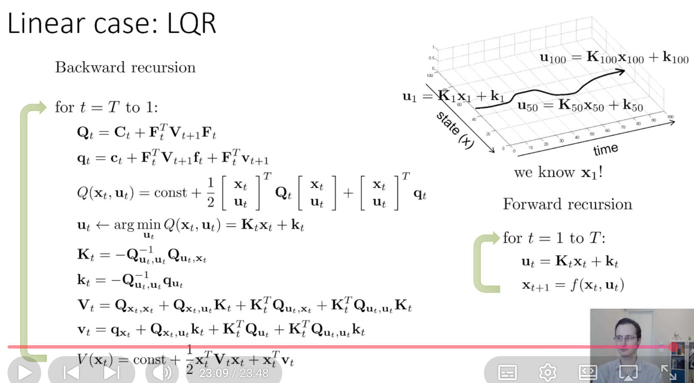
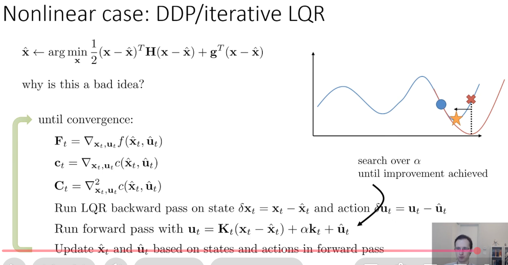

## 0. Meta
- Course: CS 285, Reinforcement Learning
- Date: 2026.01.05
- Lecturer: Sergey Levine
- Source/Link: https://www.youtube.com/watch?v=4SL0DnxC1GM&list=PL_iWQOsE6TfVYGEGiAOMaOzzv41Jfm_Ps&index=40

### Part 1: open loop vs closed loop
- Limitation → Fix
    - prev: Model-free RL only samples trajectories and cannot reason "what if we took a different action" because $p(s'|s,a)$ is unknown.
    - current: 
        - But we often know the dynamics {e.g. games {already known the rules}, simulated environments {robots, video game}), also we can learn the dynamics
        - So If we know dynamics, we can plan/control by optimizing actions or a feed back policy using the model!
- Professor’s Emphasis
    - Open-loop planning can be optimal in simple deterministic settings, but in stochastic settings where new information is revealed, it is generally suboptimal
- Flow of this part (어떤 흐름으로 강의가 진행되는지)
    1. Just minizing $c(s_t, a_t)$ is not consider about that future state determine by the past action. → To write constraint optimization problem
    2. In the simple deterministic settings, the deterministic case works well. But in the stochastic case is suboptimal when the useful information revealed at the future
    3. open-loop commits to $a_{1:T}$ before observing future states, so it cannot condition actions on revealed information → can lead to overly conservative or bad plans

- Terminology Map: 
    1. transition probability = transition dynamics = dynamics = model
    3. open-loop: Optimize and action sequence $a_{1:T}$
    2. closed-loop : Optimize a policy (state → action mapping) $\pi(a|s)$

- Why it matters: 
    - At the stochastic setting especially when future observations reveal useful iinformation, open-loop plans are often highly suboptimal, so closed-loop is generally works well. So we need a closed-loop perspective that uses observations to adapt actions

- Anchor equation/diagram: 
    - Deterministic planning (constrained form): $\min_{a_{1:T}}\sum_{t=1}^{T} c(s_t,a_t)\ \text{s.t. } s_{t+1}=f(s_t,a_t)$
    - Stochastic open-loop distribution: $p(s_{1:T}\mid a_{1:T})=p(s_1)\prod_t p(s_{t+1}\mid s_t,a_t)$
    - Closed-loop objective (RL form): $\max_{\pi}\; \mathbb{E}_{\tau\sim p(\tau;\pi)}\Big[\sum_{t} r(s_t,a_t)\Big]$

### Part 2: [제목] - (예: 하지만 상태 분포 불일치라는 치명적 문제 발견)
- Limitation → Fix (1줄)
    - Gradient/DP method would be hard to work well if it's hard to rely on the Dynamics → Solve this ploblem using black-box open-loop optimization → 
- Professor’s Emphasis (핵심 한 줄): 
- Flow of this part (어떤 흐름으로 강의가 진행되는지)
    1. Problem of open-loop planning: Making sequence of actions $a_{1:T}$ from the given state
    2. Random shooting method (guess & check): Easy to implement and using GPU, but too rely on the luck and diffcult to use it on the high demention
    3. Upgrade to CEM: Refit distribution $p(\mathbf{A})$ repeatedly with elite (top sample) to focus on good areas
    4. But CEM has limitation of dimention and still only open-loop
    5. MCTS (closed-lop): Full tree search is exponentially expensive → expand to limited depth + estimate value via default policy rollouts and repeat planning each step to incorporate feedback

- Terminology Map (용어 등치/정의,주요 알고리즘 정리/주요 개념 정리): 
    - Random shooting method (Guess & check)
        - Sampling some actions from some distribution→evaluation with rollout→choice the best return
        - Rely on luch of action which sampled randomly is really good one
        - This method is easy to implement and using GPU, but too rely on the luck and diffcult to use it on the high demention
    - Cross-entropy method (CEM)
        - Random shooting is too inefficient. How about update distribution?
        - Repeatedly fit a new distribution to the region where the good samples lie, resample from that distribution, and then refit it again
        - Tipically use Gaussian distribution
        - Process
        
            1. Sample from $A_1,\dots,A_N \sim p_(A)$  
            2. Evaluate $J(A_i)$
            3. Select elites with the pick highest value M elites (If $M<N$ select top 10%)
            4. Refit the distribution: refit $p(A)$ to the elites using MLE
            5. Iterate steps 1~4 
        - The problem of CEM method
            - very harsh dimensionality limit
            - Only open-loop planning
    - Monte carlo tree search (MCTS)
        - Full tree search is exponentially expensive. → Cannot expand all paths 
        - So we constraint depth and other constrants of depth estimate value with default policy
        - Choose nodes with best reward, but also prefer rarely visited nodes
        - 30~60 demention is maximum
        
    - UCT Treepolicy
        - We use UCT when we're not sure which path do we search first
        - We used to decide which path to explore first
        - prefers higher average return $Q/N$ and rarely visited nodes
        - nodes do not represent uniquely index states
- Anchor equation/diagram (있으면 1개)
UCT score
- $\text{score}=\frac{Q}{N} + c\sqrt{\frac{\log N_{\text{parent}}}{N_{\text{child}}}}$
    - $\frac{Q}{N}$: Average reward untill now. prioritize high node
    - $c\sqrt{\frac{\log N_{\text{parent}}}{N_{\text{child}}}}$: Give a bonus to rarely visited node. Exploration more

### Part 3
- Limitation → Fix
    - prev: Black-box planning (CEM)/tree search (MCTS) is the method that solve the problem with sampling. So at the continous control it's not efficient and accurate
    - current: If we get a dynamics and derivatives of the cost, we can slove trajectory optimization with derivation (especially second-order), LQR will give a efficient result!
- Professor’s Emphasis (핵심 한 줄): 
- Flow of this part (어떤 흐름으로 강의가 진행되는지)
    1. Switch to trajectory optimization using derivative of dynamics
    2. How about doing first-order GD with backpropagation → it works really bad because Jacobian multiplication at the long horizon cause vanishing/exploding gradient
    3. So second-order structure is better like Newton
    4. LQR: linear dynamics + quadratic cost
- Terminology Map (용어 등치/정의)
    - In an optimal control state=$X_t$, action=$u_t$, reward maximize ↔ cost minimize
    - Shooting vs colocation
        - shooting: optimize only actions → high early action sensitivity
        - colocation: Set state and action as a variance. Connect each other with constraint → we can improve conditioning
    - LQR
        - problem setup: The last state $x_t$ is unknown, we only know $x_1$ and other $x_2,\dots,x_T$ will be chosen by result of chosen $u$
        - initial state $x_1$ is already given, we wanna select action $u_t$ each step and minimize total cost (loss)
        
        - Backward recursion
            - We don't know future states, but we use the function $V_{t+1}$ that summarizes optimal future cost, So current optimal policy is selected when you know the result when you do future optimal policy
            - $V_{t+1}(x)$: How many cost left when the state is x at the t+1
            $u_t \leftarrow \arg\min_{u_t} Q(x_t,u_t) = K_t x_t + k_t$: This is the optimal equation after optimize Q from $u_t$
        - forward recursion
            - Selecting from $x_1$, generate the actual trajectory by applying the controller
            - $u_t = K_t x_t + k_t,\quad x_{t+1}=f(x_t,u_t)$
- Anchor equation/diagram (있으면 1개)
LQR - optimal control equation
- $u_t = K_t x_t + k_t$

### Part 4: [제목] - (예: 계산 효율을 위해 2차 근사인 내추럴 그래디언트 도출)
- Limitation → Fix
    - prev: LQR assumes linear deterministic dynamics and quadratic cost → nice closed-form recursion, but not realistic (real systems 
    are stochastic + nonlinear)
    - current
        1. If the4 dynamics noise is Gaussian, LQR's control law stays optimal → LQG (stochastic extension)
        2. If the system is nonlinear, locally approximate it as LQ and repeatedly solve → iLQR/DDP
- Flow of this part
    1. Can we still use LQR in the Nonlinear dynamics?
        - Idea: Taylor expansion around the current best trajectory
        - Linearize dynamics, quadratize cost is return to a local LQR problem
    2. iLQR algorithm (iterative LQR)
        - Repeat until convergence
            - Backward pass: solve the local LQR to get improvement controller in deviation from 
            - Forward pass: rollout using the true nonlinear dynamics to get a new trajectory
            - update $(\hat x,\hat u)$ to the new trajectory and iterate
    3. DDP vs iLQR (connected by Newton connection)
        - iLQR is similar with Newton method but ignores 2nd derivatives of dynamics and it's usually good enough!!
        - DDP includes more Newton but computationally heavier because of there's 3 dementation of tensor
    4. Line search using trust region ($\alpha$) for parctical stability
        - Decrease $\alpha$ untill actual cost imporves (classic line search)
- Terminology Map (용어 등치/정의): 
    - LQR problem: 원래 비선형 문제를 기준 주변에서 LQR 형태로 바꾼 서브문제를 말하는 것, 전체는 iLQR/DDP 반복으로 해결
    - iLQR (iterative LQR)
        - limitation of prev method
            - At the long horizon, derivation is chain multiplication, so Jacobian mulitiply a lot
            - Effect of initial action is too back, conditioning is bad and GD is unstable and slow
        - difference between LQR and iLQR
            - LQR: The problem is originaly linear dynamics + quadratic cost, LQR can slove one-way
            - iLQR: The problem is non-linear so we cannot use LQR directly, 현재 궤적 주변에서 문제를 LQR처럼 보이도록 근사하고 이걸 모든 trajectory에 반복해서 좋아지게 만드는 알고리즘
        - Taking the full step can break the trustworthiness of that local quadratic approximation, we run the forward pass with a line search (a trust-region–style backtracking) to scale the update and ensure the new trajectory actually improves the cost. We repeat this process until convergence
        - Adjust $\alpha$
            - $\alpha$ = 1: Apply the local-approximate solution with a full (large) step
                - Pros: If the local approximation is accurate, you can get a big improvement in a single update
	            - Cons: If the step is too large, the local (linear/quadratic) approximation can break down, and the true cost can actually increase
            - $\alpha$ close with 0: STay closer to the previous trajectory (safer update)
                - In the extreme case $\alpha$ = 0, you remain very close to the old trajectory, so the update becomes extremely small.
	            - Since iLQR’s approximation is only reliable near the current trajectory within (trust region) reducing $\alpha$ keeps the rollout inside that reliable region, making it more likely that the update will truly decrease the cost under the real nonlinear dynamics.
    - DDP (Differential Dynamic Programming)
        - iLQR + 2nd-order dynamics derivatives (more faithful Newton approximation).
	- Line search / α-backtracking
    
	    - A “trust region” trick: shrink the feedforward step to ensure real improvement.
        - Decrease $\alpha$ untill actual cost imporves (classic line search)
- Why it matters (왜 중요한가 1~2줄): 
- Anchor equation/diagram (있으면 1개): 
    
## 2. Important Equations / Diagrams
    - (수식)
        - 역할
        - 연결
## 3. My Confusion & Clarification (질문과 해결)
Q. 
A. 
