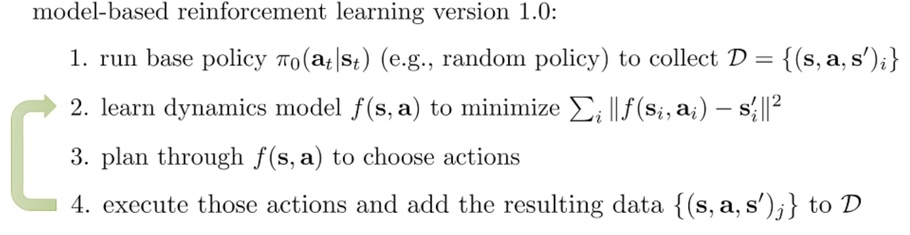
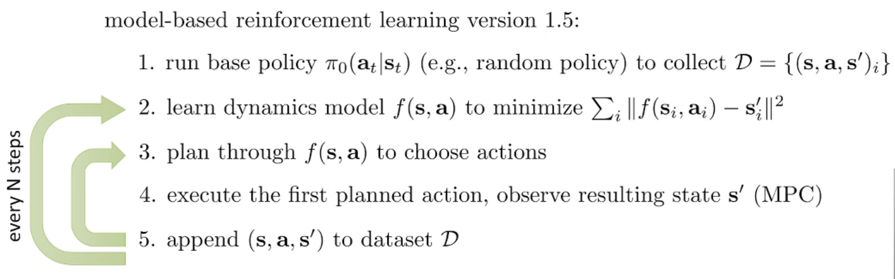
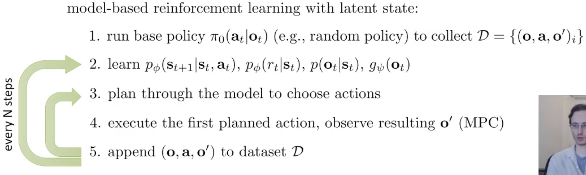

## 0. Meta
- Course: CS 285, Reinforcement Learning
- Date: 2026.01.07
- Lecturer: Sergey Levine
- Source/Link:  <!-- 유튜브 링크, 슬라이드 링크 등 -->

## 1. Logical Flow (강의 파트별 논리 전개)
<!--각 파트가 이전 파트의 어떤 '한계'를 지적하고 '해결책'을 제시하는지 한 줄로 요약하며 정리-->

## Part 1
- Limitation → Fix<!--이전 파트 한계 → 이번 파트 해결책-->
    - We train the model $f$ on data collected by a base policy $\pi_0$ on the state distribution $p_{\pi_0}(s_t)$. But when we plan through the model, the plan is executing another policy $\pi_f$ which has its own state distribution $p_{\pi_f}(s_t)$. Since $p_{\pi_f}(s_t) \neq p_{\pi_0}(s_t)$, we experience distributional shift and the model makes wrong predictions and the error will be compounding in the rollouts
    - Fix
        1. ver 1.0 (DAgger for model): excuting $\pi_f$ from model, keep collecting state-transfer tuple data. Mitigate the distributional shift with expanding the dataset to distribution of $\pi_f$
        2. ver 1.5 (MPC): Instead of executing an long plan at once, replanning each time steps. Observe the real next state, and plan again immediately.
- Professor’s Emphasis <!--(핵심 한 줄): 강의에서 교수님이 ‘딱 박아준’ 문장-->
    - The reason that the problem happens is because $p_{\pi_f}(s_t)$ is not equal to $p_{\pi_0}(s_t)$, so we are experiencing distributional shift
- Flow of this part <!--(어떤 흐름으로 강의가 진행되는지)-->
    1. the most obvious model-based RL prototype: random exploration → supervised model learning → planning
    2. planning with model is like executing with another policy, it makes a different state distribution than the data collection policy $\pi_0$. Since $p_{\pi_f}(s_t)\neq p_{\pi_0}(s_t)$, we get distributional shift, and model errors leading to error compounding over rollouts.
    3. DAgger for models to fix distributional shift: execute those actions in the real environment, add the resulting transitions to the dataset, retrain the model on all data and repeat these steps. It mitigates distributional shift in principle
    4. From the DAgger, when you keep doing an open-loop sequence of actions, even a small model error can accumulate. When you realize you made a mistake it might be too late
    5. MPC: plan a sequence but execute only the first planned action, observe the real next state and re-plan immediately. Replanning makes the procedure uch more robust to model errors, thought it is considerable more computationally expensive
- Terminology Map <!--(용어 등치/정의)-->
    - Dynamics model: deterministic: $s_{t+1}=f(s_t,a_t)$, probabilitic: $p(s_{t+1}\mid s_t,a_t)$
    - Base policy: $\pi_0$, Initial policy for collecting data
    - Dagger
        - precess
        
    - MPC (Model Predictive Control)
        - process
            
        - pros: we can do much better with much more smaller model. can be much more robust to mistakes in the model than the naive 1.0 procudure 
        - cons: much more computationally expensive because we need to plan every single steps
- Anchor equation/diagram <!--(있으면 1개): 이 파트의 핵심 수식/도식 이름만-->
    - 	Distribution mismatch: $\;p_{\pi_f}(s_t)\neq p_{\pi_0}(s_t)$

## Part 2
- Limitation → Fix<!--이전 파트 한계 → 이번 파트 해결책-->
    - At the initial time, there's not lots of data so it cause high uncertainty and low data regime. The model easily overfit and estimate uncertainly
    - The model estimate state with distributuion include uncertainty, and select action with expected value reflectign uncertainty at the planning. It can mitigate model error exploitation with avoding uncertain region
- Flow of this part <!--(어떤 흐름으로 강의가 진행되는지)-->
    1. Performance gap: Deep model-based RL show that increse their performance early, the final performance of model-free RL is more higher
    2. There's few reason
        - low-data vs high-capacity: If you wanna do iterative data collection, model should be good to collect reasonable data, but deep-net cannot collect well if there's few data
        - model-based algorithm's planning keep select error
    3. So we decided to include uncertainty estimation 
    4. Selecte expected value in the uncertain model: The planner automatically select safe place because at the uncertain region, it looks good when you only see the average, but if variance or uncertainty is big the expected will decrease
    5. If the model is too cautious, it will not do exploration.
## Part 3
- Limitation → Fix<!--이전 파트 한계 → 이번 파트 해결책-->
    - The model show the output distribution like $p(s_{t+1}\mid s_t,a_t)$, use that distribution as a uncertainty. Because in OOD, not only mean also variance can train wrong way, also overfitted model be overconfident
    - So what we want is uncertainty of $\theta$ of model parameter instead of output noise. So we approximate posterior and derivate $\theta$ when we estimate to make estimated distribution reflected a parameter uncertainty
- Flow of this part <!--(어떤 흐름으로 강의가 진행되는지)-->
    1. Neural network makes $p(s_{t+1}\mid s_t,a_t)$ → use entrophy as uncertainty
    2. Model estimate wrong either mean and variance when planner go toward OOD. 
    3. Uncertainty is in the parameter $\theta$ not the output
    4. Bayesian NN → learn variational inferce next lecture
    5. Bootstrap ensembles: Train various model to make a different mistake each other at OOD. And measure uncertainty.
- Why it matters <!--(왜 중요한가 1~2줄) 이걸 놓치면 다음 파트가 왜 나오는지 이해가 안 됨-->
    - To prevent the problem that the model abuse spurious peaks, uncertatinty should be model uncertainty not the output noise
- Anchor equation/diagram <!--(있으면 1개): 이 파트의 핵심 수식/도식 이름만-->
- Posterior predictive
$p(s_{t+1}\mid s_t,a_t,\mathcal D) \;=\; \int p(s_{t+1}\mid s_t,a_t,\theta)\, p(\theta\mid \mathcal D)\, d\theta$
- Bootstrap ensemble
## Part 4
- Limitation → Fix<!--이전 파트 한계 → 이번 파트 해결책-->
    - Before: Planning is the problem to solve optimizing the sum from $t=1$ to $H$ of the reward
    - Now: We have $N$ possible models. So choose a sequence of actions through $a_H$ that maximizes the reward on average over all the models
- Flow of this part <!--(어떤 흐름으로 강의가 진행되는지)-->
    1. Which problem the single-model planning solve?
    2. If you change to ensemble posterior, objective change
    3. Evaluate candidate action sequence using Monte carlo
- Terminology Map <!--(용어 등치/정의)-->
    - Posterior (사후 분포)
        - prior: 데이터를 보기전에 $\theta$ 가 이럴 것 같다라는 믿음
        - Posterior: 데이터를 본 후에 $\theta$ 가 이럴 확률로 믿음을 업데이트한 것 ($\theta$ = 모델파라미터, 신경망 가중치)
        - Why posterior is important in model-based RL
            - 우리가 진짜 원하는 건 다음 상태가 얼마나 랜덤하냐가 아닌 지금 데이ㅓ로는 모델이 뭘로 정해졌는지 확신이 없다는 불확실성임 = $p(\theta\mid D)$
            - 데이터가 적으면 posterior가 넓어짐 (불확실)
            - 데이터가 많아지면 posterior가 좁아짐 (확신 상승)
            - Bootstrap ensemble → 정확한 posterior를 계산하기 어렵기 때문에 여러개의 모델을 학습해서 가능한 $\theta$ 를 모아놓고 planning할 때 그중 하나를 뽑거나 평균내며 불확실성을 반영
## Part 5
- Limitation → Fix<!--이전 파트 한계 → 이번 파트 해결책-->
    - prev: Up until now, we have assumed that $s_t$ is a clean state and performed planning by learning the transition dynamics $p(s_{t+1|s_t,a_t})$ but image $a_t$ has few problems
        1. high dimensionality
        2. redundance 
        3. partial observability
    - Fix
        - Observation model ($p(o_t\mid s_t)$): Restore high dimention image
        - Dynamics model ($p(s_{t+1}\mid s_t,a_t) $): time dynamics
        - Reward model ($p(r_t|s_t,a_t)$)
- Professor’s Emphasis <!--(핵심 한 줄): 강의에서 교수님이 ‘딱 박아준’ 문장-->
    - We typically deal with a POMDP, we know the observations and actions, but we do not know the states
    - latent model needs expected log likelihood + approximate posterior
- Flow of this part <!--(어떤 흐름으로 강의가 진행되는지)-->
    1. Why use only image is hard: image has high dimention+redundance+POMDP. So it's really hard to know real state $s_t$ from single observation $o_t$
    2. POMDP
        - we only have $o_t$, $a_t$ and also there's hidden state $s_t$
        - Originally we wanna do $p(s_{t+1}\mid s_t,a_t)$ but we don't know $s_t$
    3. solve the problem
        - seperate model to latent model
            - $p(o_t\mid s_t)$: process high dimention of image
                - trained by MLE
                - Maximize the log probability of $s_{t+1}$
            - $p(s_{t+1}\mid s_t,a_t)$: time dynamics
            - $p(r_t|s_t,a_t)$: reward model
    4. Deterministic encoder: the simplist case
        - Set $s_t = g_\psi(o_t)$ you can remove expectation
    5. Substitute it to Model-based RL 1.5 (MPC)
    
        - Substitute directly model-based RL ver 1.5!

- Terminology Map <!--(용어 등치/정의)-->
    - approximate posterior
        - full smoothing posterior: $q_\psi(s_t,s_{t+1}\mid o_{1:T}, a_{1:T})$
            - Most accurate but most complicated
            - Use full smoothing when you have heavily partially observed setting
        - single-step encoder: $q_\psi(s_t\mid o_t)$
            - Simplest but least accurate
            - Use single-step when u pretty much guess the state from the current observation
    - POMDP
        - You can't fully infer the environment's true state $s_t$ from the current observation $o_t$ alone
- Why it matters <!--(왜 중요한가 1~2줄) 이걸 놓치면 다음 파트가 왜 나오는지 이해가 안 됨-->
    - On the image, just predicting next frame can be unstable easily because of the POMDP
- Anchor equation/diagram <!--(있으면 1개): 이 파트의 핵심 수식/도식 이름만-->
    - Deterministic encoder substitution: $s_t = g_\psi(o_t)$
