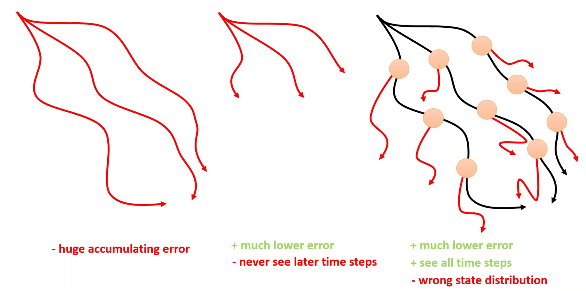
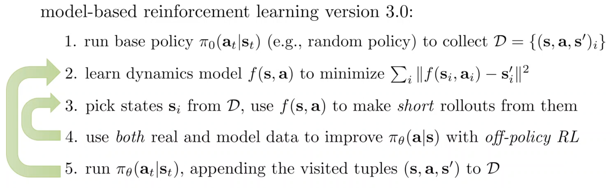
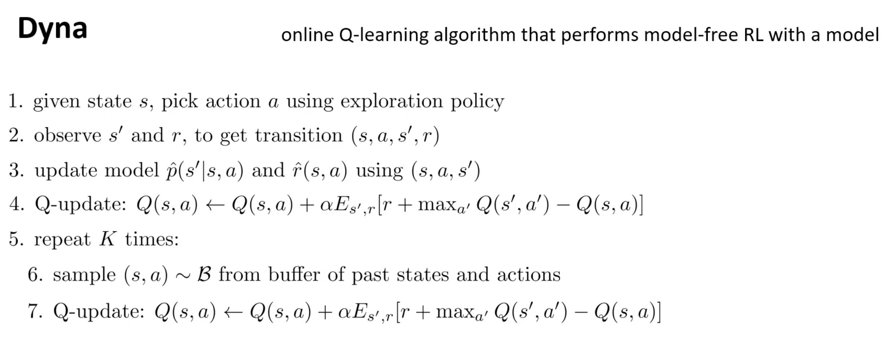
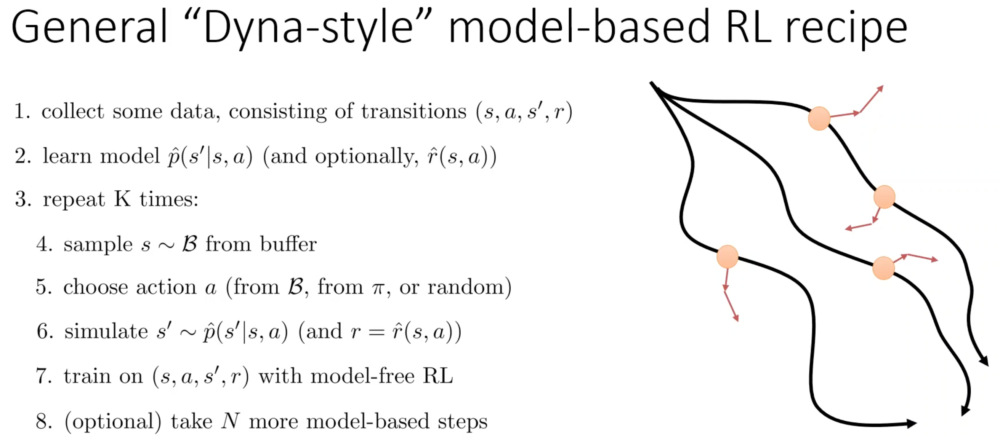
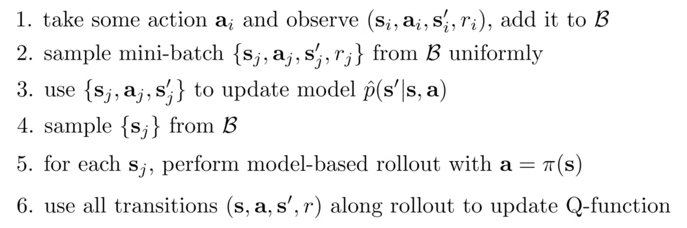

## 0. Meta
- Course: CS 285, Reinforcement Learning
- Date: 2026.01.09
- Lecturer: Sergey Levine
- Source/Link: https://www.youtube.com/watch?v=UQGS4ycGv8g&list=PL_iWQOsE6TfVYGEGiAOMaOzzv41Jfm_Ps&index=50&pp=iAQB

## Part 1
- Limitation → Fix<!--이전 파트 한계 → 이번 파트 해결책-->
    - prev: Model-based RL v1.5 (MPC) replans every step, which helps with model error, but each plan is still open-loop (optimizes an action sequence). So they optimize an acton sequence and don't account for the fact that you'll get future observations and can react later
    - fix: Change toward the closed-loop setting: optimize a policy $\pi(a|s)$ instead of action sequence. 
        - MBRL v2.0: Differentiate through the learned dynamics and rewards to train the policy directly
        - But it isn't working well because of gradients exploding/vanishing. So usually use model as a simulator not a differentiable funciton to make synthetic data.
- Professor’s Emphasis <!--(핵심 한 줄): 강의에서 교수님이 ‘딱 박아준’ 문장-->
    - Backpropagating through long chains of learned dynamics and policy is like naively training an RNN with BPTT: gradient tend to explode or vanish
- Flow of this part <!--(어떤 흐름으로 강의가 진행되는지, 강의의 흐름을 반영하는건 맞지만 어떻게 알고리즘을 발전해나가는지 정리)-->
    1. MPC (v1.5)
        - collect data → train dynamics model → plan action sequence → execute first action → add transition to buffer → replan every step → periodically retrain the model.
    2. problem
        - Random shooting/CEM optimize and action sequence commited in advance
        - prof said about math test, MPC think that we can dicide the answer after check what the problem is. But it won't take a test because it'll decide right now but I might wrong because I don't know what's the problem is. 
        - So MPC doesn't replan like a open-loop
        - Conclusion: Optimize a policy that maps observed state to actions, matching the original RL objective
    3. Differentiate through the model (v2.0) and limitation
    
        - Build a computation graph with policy $\pi_\theta$, learned dynamics $f$, and reward $r$, then backprop through time to improve $\theta$
        - Early actions have compounding effects → huge gradients early, tiny gradients late → ill-conditioned optimization
        - Long chains multiply many Jacobians → exploding/vanishing gradients (same pathology as naive RNN BPTT)
        - LSTM-style fixes aren’t available because you can’t choose the real dynamics; $f$ must match the environment, which may be highly curved
    4. Use the model to simulate more synthetic samples (experience) and apply derivative-free (model-free) RL methods on that data
- Terminology Map <!--(용어 등치/정의)-->
    - Open-loop: Optimize an action sequence without conditioning of futer observation
    - Closed-loop: Optimize a policy $\pi(a|s)$ that reacts to the current state/observation
- Why it matters <!--(왜 중요한가 1~2줄) 이걸 놓치면 다음 파트가 왜 나오는지 이해가 안 됨-->
    - In this part, prof said that why the most obvious approacth end-to-end backpropagation through a learned model often fails, motivating why many practical model-based methods instead use models to generate data and then run model-free RL
## Part 2
- Limitation → Fix<!--이전 파트 한계 → 이번 파트 해결책-->
    - prev: Differentiate through the model tries to bckprop through the learned dynamics over long horizons. But the pathwise (backprop)gradient  contains a long product of Jacobians, causing exploding or vanishing gradients problems and severe ill-conditioning
    - fix
        1. Use policy gradient instead of pathwise gradients (likelihood-ratio/REINFORCE): those r not include Jacobian products
        2. MBRL (v2.5) use the model generate rollouts, then do PG updates from sampled trajectories
        3. But MBRL still fails with long model rollouts
        4. Use short model rollouts branched from real states
- Professor’s Emphasis <!--(핵심 한 줄): 강의에서 교수님이 ‘딱 박아준’ 문장-->
    - Policy gradient is a gradient estimator and can be used for any stochastic computation graph not only RL!
    - Long model rollouts are the enemy
- Flow of this part <!--(어떤 흐름으로 강의가 진행되는지, 강의의 흐름을 반영하는건 맞지만 어떻게 알고리즘을 발전해나가는지 정리)-->
    1. Two gradient method
        - Likelihood-ratio/policy gradient: gradient estimator which uses samples and doesn't depend on transition derivatives
        - Pathwise/backprop gradient: Chain rull differentiation through the dynamics and rewards. In here introduces Jacobian products
    2. Why pathwise through model is bad
        - Backprop through time multiplies lots of chain rule and cause explode/vanish like naive RNN BPTT
        - Second-order help like LQR in trajectory optimization isn't convenient because policy parameters couple all time steps
    3. Model based RL via model-free gradients (v2.5)
        - Collect real data → learn dynamics model → "sample many trajectories" in the model with current policy → update policy using policy gradient / actor-critic → repeat model-sampling + PG steps many times (without new real data) → occasionally go back to real env to gather more data and retrain model
        - Policy gradients aboid Jacobian products and model sampling makes more samples
    4. Limitation of v2.5
    
        - Same phenomenon as imitationleanring: distribution shift
        - Model errors push rollouts into slightly wrong states → those states are less trained → bigger errors → divergence from reality grows with horizon ($O(\epsilon T^2 )$)
        - Also v2.5 change the plicy to be good under the model, it makes the shift even larger
    5. Short model rollouts + real state branching (v3.0)
    
        - Collect some long real trajectoryies occasionally.
        - Sample states from anywhere along them including late time steps
        - From the each samples real state, run very short model rollouts
        - Train using both real + model data, typically with off-policy RL like Q-learning/off-policy actor-critic. Because the state distribution becomes a mixture distribution
- Terminology Map <!--(용어 등치/정의)-->
    - Policy gradient (Likelihood-ratio gradient estimator): Use sampling which doesn't contain a product of dynamics Jacobians
    - Pathwise gradient = backpropagation gradient: It contains long Jacobian products
- Why it matters <!--(왜 중요한가 1~2줄) 이걸 놓치면 다음 파트가 왜 나오는지 이해가 안 됨-->
    - This part explain why backprop through the leared model is unstable, why just use PG in the model still fails with long rollouts, and why modern model-based method often rely on short model rollouts + off-policy learning to control compounding model error
    - 
## Part 3
- Limitation → Fix<!--이전 파트 한계 → 이번 파트 해결책-->
    - Limitation: Attempting to rollout the model for long horizons causes errors to accumulate $O(\epsilon T^2 )$ and it diverges
    - Fix: Use model as a data generator instead of backprop
- Flow of this part <!--(어떤 흐름으로 강의가 진행되는지, 강의의 흐름을 반영하는건 맞지만 어떻게 알고리즘을 발전해나가는지 정리)-->
    1. Use off-policy backbone: use Q-leanring and also actor-critic variants work similiarly
    2. Classic Dyna
    
        - Use only 1-step model rollouts. If the model is accurate, performance will work well even thought really short estimation
        - 
    3. Dyna-style (modern MBRL v3.0 v)
    
        - It only requires short as few as one step rollouts from model
        - still sees diverse states
    4. Model-accelerated off-policy RL
    
    - General version of Dyna-style
        - Pros: Sample effecient because they're using their samples to train this model being used to amplify the data set. So training speed is fast and put more data to Q-learning process than collecting from MDP
        - Cons: If the model is not perfect, there's model bias.
- Terminology Map <!--(용어 등치/정의)-->
    - Model bias: errors in $\hat p / \hat r$ cause the learner to optimize the wrong objective.
    - MBA (Model-Based Acceleration): 모델 기반 데이터를 활용해 학습을 가속화
    - MVE (Model-Based Value Expansion): 모델 롤아웃을 통해 타겟 밸류(y)를 더 멀리까지 보고 추정하여 Q-러닝의 정확도를 높임
    - MBPO (Model-Based Policy Optimization): 장표의 6단계 절차와 가장 유사하며, 짧은 롤아웃을 통해 정책을 최적화. 요즘 표준으로 쓰이는 알고리즘
- Why it matters <!--(왜 중요한가 1~2줄) 이걸 놓치면 다음 파트가 왜 나오는지 이해가 안 됨-->
    - 
- Anchor equation/diagram <!--(있으면 1개): 이 파트의 핵심 수식/도식 이름만-->
    - 
## Part 4
- Limitation → Fix<!--이전 파트 한계 → 이번 파트 해결책-->
    - 
- Professor’s Emphasis <!--(핵심 한 줄): 강의에서 교수님이 ‘딱 박아준’ 문장-->
    - 
- Flow of this part <!--(어떤 흐름으로 강의가 진행되는지, 강의의 흐름을 반영하는건 맞지만 어떻게 알고리즘을 발전해나가는지 정리)-->
    -
- Terminology Map <!--(용어 등치/정의)-->
    - 
- Why it matters <!--(왜 중요한가 1~2줄) 이걸 놓치면 다음 파트가 왜 나오는지 이해가 안 됨-->
    - 
- Anchor equation/diagram <!--(있으면 1개): 이 파트의 핵심 수식/도식 이름만-->
    - 
    
## 2. Important Equations / Diagrams
    - (수식)
        - 역할
        - 연결
## 3. My Confusion & Clarification (질문과 해결)
Q. 
A. 
