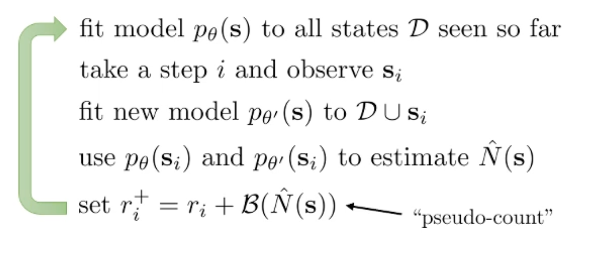
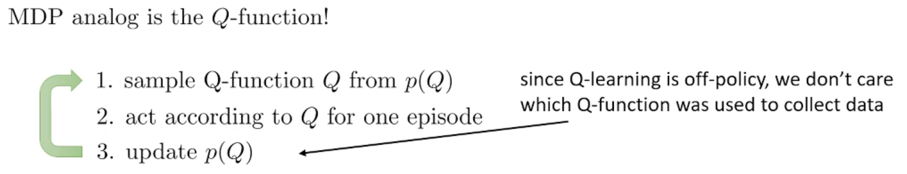

## Meta
- Course: CS285, Deep Reinforcement Learning
- Date: 2026.01.10
- Lecturer: Sergey Levine
- Source/Link: https://www.youtube.com/watch?v=RTLeJrp5Yp4&list=PL_iWQOsE6TfVYGEGiAOMaOzzv41Jfm_Ps&index=54

## Part 1
- Limitation → Fix<!--이전 파트 한계 → 이번 파트 해결책--> 
    - prev: Standard deep RL can fail catastrophically when reward are sparse/poorly shaped/temporally delayes. Because it often depend on stochastical method like epsilon-greddy which is ineffective for discovering long-horizon reward
    - fix: Solving exploration problem as managing uncertainty and minimizing Regret not by exploring randomly
- Professor’s Emphasis <!--(핵심 한 줄): 강의에서 교수님이 ‘딱 박아준’ 문장-->
    - 
- Flow of this part <!--(어떤 흐름으로 강의가 진행되는지, 강의의 흐름을 반영하는건 맞지만 어떻게 알고리즘을 발전해나가는지 정리)-->
    1. Probelm motivation
        - At the easy game like Pong or Breakout from Atari, it's easy to get a reward luckly
        - But the hard gram like Montezuma's Revange, sparse + delayed + misleading incentives so agent can get stuck exploiting known reward loops
        - Also at the card game Mao, rule is quite easy but if you have to learn getting lots of panalty without rule, it's really hard situation
    2. Exploitation vs Exploration
        - Exploration: Trying an unfamiliar action in search of a higher reward (Gong to a new restaurant)
        - Exploitation: Choosing to action that yields the highest reward based on the information available (Going to a fav restaurant)
        - Optimal exploration: Use a hypothetical Bayesian agent that maintains uncertainty about the world and chooses actions to resolve it
            - we use it as a gold standard and measure regret because we canot calculate accurately
    3. Tractability
        
        1. Multi-armed bandits (Easy way): There's no state, just single time step and theorycally exsist optimal
        2. Contextual Bandits: There's a context, but current action does not effect to next state
        3. Small finite MDPs: You can calculate acculately because of the state space is small but complicate than the Bandit
        4. Large/infinite MDPs (Difficult way): Deep-learning based RL environment with continuous state space like image. It relys on the hacks
    4. Bandit muchine (POMDP)
        - Each arm has an unknown reward distribution parameterized by $\theta_i$
        - Solving the POMDP yields the optimal exploration strategy but belief state is huge.
        - So we can do very well with much simpler strategies not solvign Bayes-optimal directly!
        - Calculate regret: $\mathrm{Reg}(T)= T\,\mathbb{E}[r(a^*)] \;-\; \sum_{t=1}^{T} r(a_t)$
- Terminology Map <!--(용어 등치/정의)-->
    - sparse Reward: 보상이 가끔씩만 주어져 학습이 어려운 상태
    - Exploration vs Exploitation
	    - Exploitation: pick the best-known action so far
	    - Exploration: try uncertain/novel actions to potentially find better long-term reward
    - Regret: 최적의 선택을 했을 때와 실제 선택의 기대 보상 차이
- Anchor equation/diagram <!--(있으면 1개): 이 파트의 핵심 수식/도식 이름만-->
    - Regret
    $\mathrm{Reg}(T)= T\,\mathbb{E}[r(a^*)] \;-\; \sum_{t=1}^{T} r(a_t)$

## Part 2
- Limitation → Fix<!--이전 파트 한계 → 이번 파트 해결책-->
    - prev: Bayes-optimal exploration solving the befief-state POMDP, but that's intractable because belief space is huge!. Also naive random exploration can waste samples and incur large regret
    - fix: Use simple, theoretically principled bandit strategies that achieve optimal regrt without soving the full POMDP
        - Optimism in the face of uncertainty (UCB)
        - Posterior sampling / probability matching (Thompson sampling)
        - Information gain–based exploration (information-directed sampling)
- Flow of this part <!--(어떤 흐름으로 강의가 진행되는지, 강의의 흐름을 반영하는건 맞지만 어떻게 알고리즘을 발전해나가는지 정리)-->
    - This part's goal: Minimize regret with strategies that are  probably close (Big-O) to Bayes-optimal POMDP solotion, but without solving it
    1. UBC (Optimism)
        - New state = good state
        - Change greedy method $\hat\mu(a)$ only focus on average reward to optimistic estimate $\hat\mu(a)+\text{bonus}(a)$
        - Bonus is bigger for actions with higher unceertainty (usually approximated by low counts $N(a) which selecting that action$)
    2. Posterior sampling (Thompson sampling)
        - Maintain a belief $\hat p(\theta)$ and sample a model $\theta\sim \hat p(\theta)$ in that distribution
        - Act optimally under that sample then update belief
    3. Information gain style algorithm
        - Make the value of learning explicit via entropy reduction
        - Choose actions that trade off: learn a lot vs don't be too suboptimal
    - Bandits are a controlled setting where these assumptions can be justified by regret guarantees
- Terminology Map <!--(용어 등치/정의)-->
    - Posterior sampling (Thompson sampling)
        - Maintain a belief over your model. Sample a model and pretend that model is the right one, and take the optimal action under that model and then update th emodel distribution based on what you observed
    - UCB
        - $a_t = \arg\max_a \left(\hat\mu_t(a) + \sqrt{\frac{2\ln t}{N_t(a)}}\right)$
        - N_t(a): 지금까지 arm a를 뽑은 횟수
	    - 많이 뽑을수록 $N_t(a)\uparrow$ → 보너스 $\downarrow$
	    - 거의 안 뽑은 arm은 보너스가 큼 → 한 번쯤 뽑아보게 됨 $\rightarrow$ 몇번 iteration을 돌다보면 불확실성이 줄고 보너스가 감소해서 진짜 평균이 높은 arm만 남게되어 exploration first, exploitation later가 수식 하나로 구현됨
        - 한번도 안해본건 일단 optimistic하게 평가해서 한번쯤 시도해보고 별로인게 확실해지면 시도를 안함
    - Thompson sampling/Posterior sampling
        - UBC $\rightarrow$ 보너스로 uncertainty를 처리/Thompson $\rightarrow$ more Baeysian
        - 현재 postprior에서 전체 $\theta$를 샘플링후 샘플된 $\theta$가 진짜라고 가정하고 그 모델에서 최적 arm (기대보상의 최댓값)을 선택하고 실행. 관찰된 보상을 바탕으로 posterior 업데이트
        - 데이터가 부족하면 posterior가 넓기 때문에 샘플할 때 어떤 arm이 좋은 arm일지 선택하는게 자주 바뀌기 때문에 여러 arm을 자연스럽게 탐색함. 반대로 데이터가 쌓이면 posterior가 한 곳으로 모이기 때문에 거의 항상 같은 최적 arm이 샘플되며 exploitation으로 수렴함
        - $\theta$: bandit에서 각 arm의 보상분포 $p(r|a)$를 정하는 파라미터
    - Information gain style algorithm
        - equation: $\Delta(a) = \mathbb{E}\big[r(a^*) - r(a)\big]$
            - $\Delta(a)$: 이 arm이 얼마나 손해일지.
            - $a^*$는 진짜 최적 arm, 하지만 모르기 때문에 현재 poeterior (belief) 아래에서 기대값으로 얼마나 손해일 것 같은지를 계산
        - $g(a)=IG(\theta_a, r_a \mid a)$
            - $g(a)$가 크면 이 arm을 한번 했을 때 내 posterior가 많이 바뀜
        - $a_t = \arg\min_a \frac{\Delta(a)^2}{g(a)}$
            - $\Delta(a)^2$: 손해 비용 (크면 나쁨) 
            - $g(a)$: 정보 가치 (크면 좋음) 
        - Cases
            1. $g(a)$가 아주 작을 때 (배울게 없음): 무한대로 발산하기 때문에 손해를 감수했는데도 학습이 안되기 때문에 최악의 case
            2. $\Delta(a)$가 아주 클때: 정보 얻기위해 너무 큰 손해를 얻는건 별로임
            3. $\Delta(a)$가 조금 크더라도 $g(a)$가 아주 클 때: 비싸지만 배우는것도 그만큼 많음. 해볼만 함
        - 결론적으로 $\frac{손해^2}{정보이득}$ 이 가장 작은 행동을 골라서 최대한 덜 손해보면서 최대한 많이 배우는 탐색을 함
## Part 3
- Limitation → Fix<!--이전 파트 한계 → 이번 파트 해결책-->
    - prev: We can give a UCB bonus with accurate count like $N(a)$ in Bandit, but we almost never revisit the exact same state rarely in deep RL so we cannot apply count-based bonus and $N(a) is meaningless$
    - fix
        - Optimistic exploration in RL: add an exploration bonus to the reward $r^+(s)=r(s)+b(N(s))$ encouraging novel state visits
        - Pseudo-counts: replace exact counts with a density model $p_\theta(s)$ and derive a pseudo-count from how the density changes after ovserving
- Flow of this part <!--(어떤 흐름으로 강의가 진행되는지, 강의의 흐름을 반영하는건 맞지만 어떻게 알고리즘을 발전해나가는지 정리)-->
    1. Expand bandit to MDP
        - UCB works in bandit because we can count how often each action was tried and use an uncertainty bonus. So It assumes and environment without a state
        - But in deep RL needs exploration over states not just actions
    2. Count-based exploration
        - Count how many times visting state ($N(s)$ or $N(s,a)$) instead of action 
        - Exploration bonus: $r^+(s)=r(s)+b(N(s))$
            - To encourage the agent to visit a new state, a bonus proportional to the inverse of the number of visit is added to the existing reward
    3. Counts break in deep RL
        - In high-dimensional/continuous spaces, we almost never revisit the exact same state. So exact counts become useless
    4. Pseudo-counts via density
        
        - If $s_i$ is truly novel, the model's likelihood changes a lot after seeing it once. It means $\hat N(s_i)$ is small and bonus is large
        - If $s_i$ is a familiar, likelihood barely changes. It means $\hat N(s_i)$ is large and bonus is small
- Anchor equation/diagram <!--(있으면 1개): 이 파트의 핵심 수식/도식 이름만-->
    - Pseudo-count from density change
    $\hat N(s)=\frac{p_\theta(s)\,\big(1-p_{\theta'}(s)\big)}{p_{\theta'}(s)-p_\theta(s)}$
## Part 4
- Limitation → Fix<!--이전 파트 한계 → 이번 파트 해결책-->
    - prev: Count-based/pseudo-count rely on  the density model update or the states are exactly same. So learning/updating density and difficult at the high dimention
    - fix: There's few way to replace count to novelty
        1. Count after compress state using hash
        2. Approximatly estimate density score by classifier
        3. Prediction error based heuristic
- Flow of this part <!--(어떤 흐름으로 강의가 진행되는지, 강의의 흐름을 반영하는건 맞지만 어떻게 알고리즘을 발전해나가는지 정리)-->
    1. Classic counting will distroy when the state space bigger and density model is hard to optimize 
    2. Hashing & EX2
        - Hashing
            - Map each state $s$ to a lossy $k$-bit code
            - If the representation is good, sililar states collide, so counts become meaningful again
        - EX2
            - Train a classifier to predict Have we seend this state before. If the classifier can easily distinguish the current state as new, then the state is highly novel
    3. Training a new classifier from scratch every time is inefficient, and the approach is still constrained by the probability density
    4. Heuristic Method
    - Exprienced type: Predictor has already trained and matches the target well $\rightarrow$  small error $\rightarrow$ low novelty
    - First visit type: Predictor is not trained and cannot be matched $\rightarrow$ large error $\rightarrow$ high novelty $\rightarrow$ large bonus
    - Novelty = prediction error $\|f_\theta(s)-f^*(s)\|^2$
	- Add it as exploration bonus: $r^+ = r + \beta \cdot \|f_\theta(s)-f^*(s)\|^2$
- Terminology Map <!--(용어 등치/정의)-->
    - Count: Counting how many times did you see the exat same state

## Part 5
- Limitation → Fix<!--이전 파트 한계 → 이번 파트 해결책-->
    - prev: Step-wise random exploration is not temporally coherent like $\epsilon$-greedy, so it rarely discovers behaviors that require long, consistent action sequences
    - fix: Use posterior/Thompson-style exploration in MDPs by sampling a Q-function and acting consistently for an single entire episode and updating distribution
- Flow of this part <!--(어떤 흐름으로 강의가 진행되는지, 강의의 흐름을 반영하는건 맞지만 어떻게 알고리즘을 발전해나가는지 정리)-->
    1. Maintain a belief over reward parameters $\theta$ sample $\theta$ act optimally under that sampled world
    2. MDP analog
        
        - Choosing action should rely on the $Q(s,a)$, we wanna get a distribution of Q-function
    3. Use a bootstrap ensembles representing Q-distribution to reduce a cost to train divers network
    4. Random Q-function
        - $\epsilon$-greedy는 매 스텝마다 확률적으로 엉뚱한 행동을 섞음. 그렇기 때문에 행동이 앞뒤로 흔들리면서 (oscillate) 일관된 목표를 향해 오래 밀고 나가는 시퀀스가 잘 안나옴 (Seaquest 게임에서 연속으로 위로 올라가는 긴 시퀀스가 나오기 힘들어 수면위에서 공기 보충하는 행동을 발견하기 어려움)
        - Randon Q-funcion
            - 행동을 랜덤하게 가져가는게 아닌 Q-function 자체를 랜덤하게 하나 뽑는다는 것. 그리고 한에피소드동안 그 Q를 고정하고 argmax처럼 행동함.
            - 그 결과로 에피소드 내에서는 정책이 내부적으로 일관됨. Seaquest 게임에서 처럼 위로 가는게 좋다라고 믿었으면 끝까지 위로가는 전략을 밀고나가기 쉬워짐.
            - 랜덤이라는게 스텝 단위 노이즈가 아닌 에피소드 단위로 일관된 가설이 됨
        - pros & cons
            - pros: Count bonus 처럼 reward shaping을 안해도 됨. 구현이 깔끔하고 튜닝 파라미터 부담이 적어짐
            - cons: very good bonuses often do better. Montezuma's Revenge같은 경우 보너스 기반 방법이 더 잘 먹힐 경우가 있음
- Terminology Map <!--(용어 등치/정의)-->
    - Bootstrapped DQN을 통해 posterior sampling을 흉내내는 방식
        - 진짜 psterior $p(Q|D)$를 정확히 가지고있기 어렵기 때문에 여러개의 Q를 ensemble로 만들어서 분포처럼 사용.
        - 각 head가 데이터/초기화 차이 때문에 약간씩 다른 Q를 학습함
        - 매 에피소드마다 head 하나를 뽑은 후 그 head로 행동하며 샘플된 Q로 행동을 근사함
## Part 6
- Limitation → Fix<!--이전 파트 한계 → 이번 파트 해결책-->
    - prev
    - fix: Information Gain을 통해 observation을 수행한 후 에이전트의 모델이 얼마나 정교해졌는지를 엔트로피 감소량이나 KL Divergence로 직접 측정하여 bonus로 사용함
- Flow of this part <!--(어떤 흐름으로 강의가 진행되는지, 강의의 흐름을 반영하는건 맞지만 어떻게 알고리즘을 발전해나가는지 정리)-->
    1. reward or state density보다 dynamics model($P(s'|s,a)$)에 대한 IG를 구하는게 MDP를 배우는데 가장 유용한 신호임
    2. KL divergence: IG는 새로운 데이터를 보기 전의 모델 분포와 본 후의 분포 사이의 KL divergence와 동일함을 보이기
    3. Prediction gain
        - Density model $P_\theta(s)$를 가지고 있을 때 새상태 s를 보고 학습 없데이트를 해서 $\theta \rightarrow \theta'$ 가 되면 그 상태의 log-likelihood가 얼마나 변했는지 측정
        - $PG(s) = \log p_{\theta'}(s) - \log p_{\theta}(s)$
    4. Variational Information Gain (VIME)
        - dynamics 모델 $p_\theta(s'|s,a)$의 파라미터 $\theta$에 대해, 어떤 transition $y=(s,a,s')$를 관측했을 때 $IG(y) \approx KL\big(p(\theta \mid h,y)\ \|\ p(\theta\mid h)\big)$
        - h는 지금까지의 히스토리/리플레이버퍼
        - 어떤 transition이 파라미터 posterior를 크게 바꾸면 dynamics에 대해 많이 배운 transition이니까, 그 transition을 유도하는 행동을 더 하자
        - 근데 여기서 진짜 posterior는 못구하기 때문에 변분분포 $q_\phi(\theta)$ 로 근사
        - 	새 transition을 포함해 다시 학습하면 $\phi\to \phi'$ 그럼 보너스를 $bonus = KL\big(q_{\phi'}(\theta)\ \|\ q_\phi(\theta)\big)$
    5. IG와 에러기반 보너스가 결국 닮아감
        - KL을 사용하는 방식은 베이즈적으로 변화량을 재는 방식
        - 네트워크 파라미터가 얼마나 변했나, 예측 에러가 얼마나 큰지에 대한 의미가 결국 새롭고 모르는 영역에서 변화/에러가 크다는 것을 나타냄
            - IG(VIME): posterior가 크게 바뀜 (분포 변화가 큼)
	        - 파라미터 변화량: 업데이트가 큼
	        - 모델/예측 오차(RND 포함): 에러가 큼
- Terminology Map <!--(용어 등치/정의)-->
    - Info gain
        - $IG(z,y|a)$
        - 관심 변수 z에 대한 정보를 가장 많이 얻을 수 있는 관찰 결과를 가져오는 행동을 선택하는 것
