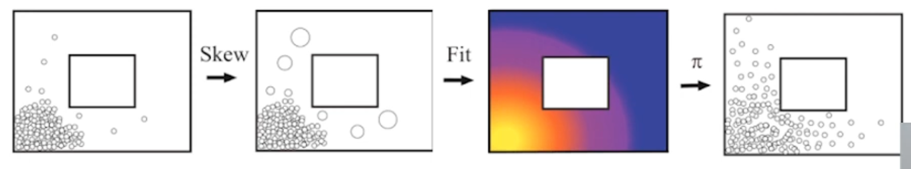
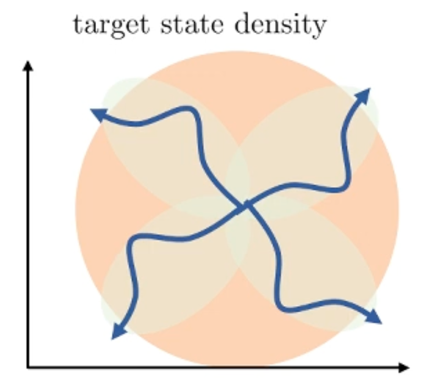
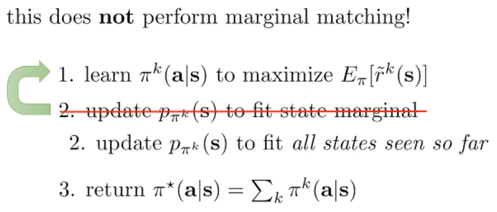
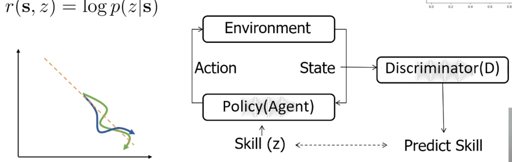

## Meta
- Course: CS285, Deep Reinforcement Learning
- Date: 2026.01.
- Lecturer: Sergey Levine
- Source/Link: 

## Part 1
- Terminology Map <!--(용어 등치/정의)-->
    - $p(x)$: Distribution
    - $H(p(x))$: Entropy. $H(p(x)) = -\mathbb{E}_{x\sim p(x)}[\log p(x)]$ 
    - Mutual infromation
        - Definition: $I(X;Y) = D_{\mathrm{KL}}\big(p(x,y)\ \|\ p(x)p(y)\big)$
        - KL dibergence: How much different between two distributions are
        - Equivalent form: $I(X;Y)= H(Y) - H(Y\mid X)$
    - State marginal distribution of policy $\pi$: $\pi(s)$
    - State marginal entropy
        - $H(p_\pi(s))$
        - how much the policy covers the state space
    - Empowerment
        - $\displaystyle I(S_{t+1};A_t)=H(S_{t+1})-H(S_{t+1}\mid A_t)$
            - $(S_{t+1})$ is big $\rightarrow$ There's diverse $s_{t+1}$ from $s_t$ (Lots of choices)
            - $H(S_{t+1}\mid A_t)$ is small $\rightarrow$ If you choose specipic action, you can predict the future (controlable/reliable)
        - So empowerment make to prefer diverse and controlable state
## Part 2
- Limitation → Fix<!--이전 파트 한계 → 이번 파트 해결책-->
    - prev: Explorate to find a state given a reward. If the reward doesn't exist or postpone, agent cannot learn anything
    - cur: The agent try to imagin a goal and reach it without reward
- Flow of this part <!--(어떤 흐름으로 강의가 진행되는지, 강의의 흐름을 반영하는건 맞지만 어떻게 알고리즘을 발전해나가는지 정리)-->
    1. Set a goal that the robot make a state from the state wich user gave
    2. Use latent space: Image is too complicate to deal with. So convert image to latent vector using generate model like VAE
    3. Sampling z from the prior of generate model and make virtual goal image
    4. Training a policy $\pi(a|x,x_g)$ via RL taking both the current state and a virtual goal as inputs to determine actions
    5. Discover of data imbalance: The agent repeatedly porposes goals it has already mastered, failing to explore new behaviors
    6. Skew-Fit
        
        - Retraining the generative model by assigning higher weight to ra ㅜrely visited states
        - $\max \; \mathcal H(p(G)) - \mathcal H(p(G\mid S))\;=\;\max \; I(S;G)$
        - good exploration (state coverage) ↔ H(p(G)) $\uparrow$
        - effective goal reaching ↔ $H(p(G\mid S))$ $\downarrow$
        - Explore to maximize $I(S;G)$
## Part 3
- Limitation → Fix<!--이전 파트 한계 → 이번 파트 해결책-->
    - prev: Explore just with intrinsic motivation(=noelty bonus)$p_\pi(s)$ represent entire but final policy $\pi$ is tail-chasing so it cannot guarantee the real state coverage
    - fix: Define good exploration as a state marginal matching. 
        - Train density using visit data for all past policies
        - The final solotion is not the final policy, but a mixture of past policies
- Flow of this part <!--(어떤 흐름으로 강의가 진행되는지, 강의의 흐름을 반영하는건 맞지만 어떻게 알고리즘을 발전해나가는지 정리)-->
    1. Intrinsic motivation: $-\log p_\pi(s)$ rewards rare state $\rightarrow$ novelty driven exploration without rewards
    2. But if the reward-free, it cause tail chasing. So policy keep move to rear visited place only, and it will fluctuate. So the final policy isn't uniform coverage, instead only density estimaotr is better
    3. State marginal matching
        - $\min_\pi D_{\mathrm{KL}}(p_\pi(s)\ \|\ p^*(s))$
        - Initial idea: can we use intrinsic motivation? ($\tilde r(s) = \log p^*(s) - \log p_\pi(s)$)
            - $\log p^*(s)$: The state with high target density $\rightarrow$ bonus!
            - $-\log p_\pi(s)$: The states that are frequent under current policy $\rightarrow$ panalty(=novelty bonus)
            - But it does not perform margianl matching
                
                - 왜냐하면 RL은 보상 $\tilde r(s)$를 고정된 함수로 보고 최적화 하려고 함. 하지만 $-\log p_\pi(s)$ 는 정책 $\pi$가 바뀌면 같이 바뀌는 항.
                - 결과적으로는 매 iter마다 정책은 지금 덜 간곳으로 튀고 마지막 정책 하나는 target distribution을 닮지 않음
                - - It looks like minimize $D_{KL}(p_\pi\|p^\*)$ but $-\log p_\pi(s)$ depends on $\pi$ so It cannot be marginal matching and cuase tail-chasing
                - 그림에서 순간순간은 novelty를 따라가지만 정책 하나가 $p^*$를 만들도록 안정화되지 않음
        - How to fix?
            
            1. Instead of fitting the density model $p_{\pi^k}(s)$ only on data from the latest policy, fit it on all states seen so far
            2. Instead of returning the last iterate $\pi_K$, return a mixture policy (historical average) over all past policies
                - $\pi^*(a\mid s) = \sum_{k} \pi^k(a\mid s)$
    4. Conclusion
        - $p(G) = \arg\max_p \mathcal H(p(G))$ is good idea. Maximum entorpy
- Terminology Map <!--(용어 등치/정의)-->
    - Tail chasing: 정책이 현재 낮은 density만 쫓아다녀 최종 정책이 안정적 분포를 못 갖는 현상
## Part 4
- Limitation → Fix<!--이전 파트 한계 → 이번 파트 해결책-->
    - prev: Visiting a various states is available but it's hard to represent as goal-reaching for all available actions
    - fix: Set a skill index $z$ and make $\pi(a|s, z)$ to learn different each action mode
- Flow of this part <!--(어떤 흐름으로 강의가 진행되는지, 강의의 흐름을 반영하는건 맞지만 어떻게 알고리즘을 발전해나가는지 정리)-->
    1. Reaching diverse goals does not necessarily cover the full space of sills
    2. Skill-conditioned policy
        - Use $\pi(a|s,z)$, z is a skill ID
        - different skills should occupy different regions of the state space
    3. Diversity promoting reward
        
        - Give a state you should be able to infer which skill is being executed
        - As policy and discriminator alternately improve, the decision boundary becomes sharper and the skills become increasingly separated
