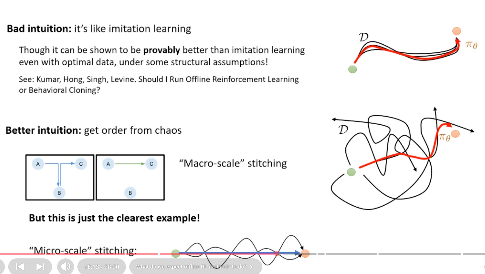
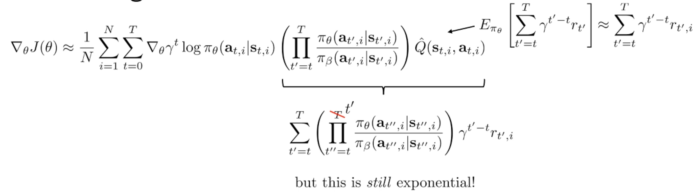
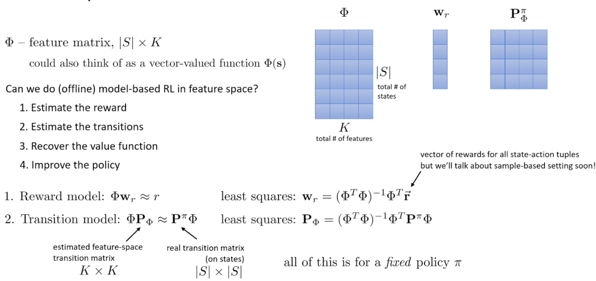
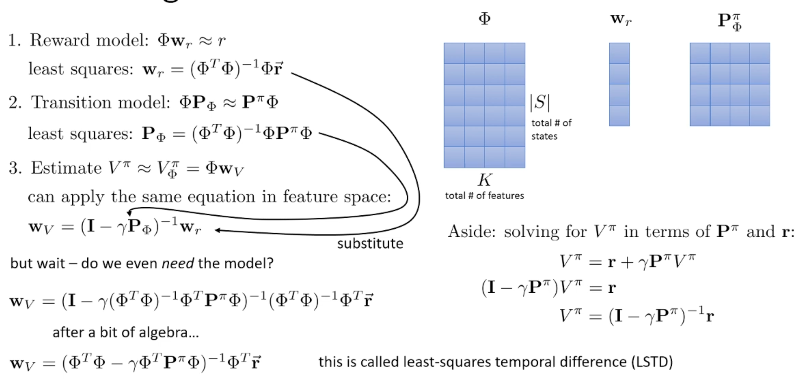
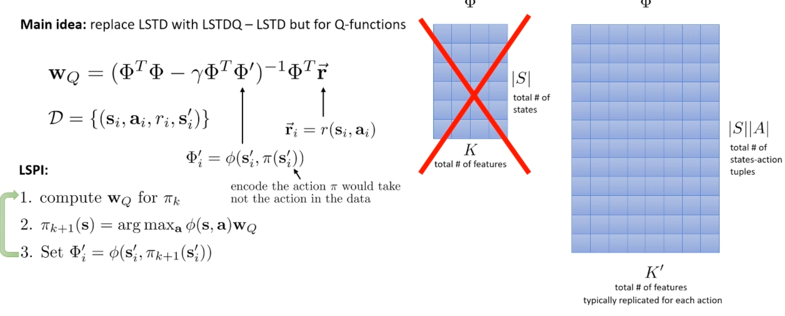

## Meta
- Course: CS285, Deep Reinforcement Learning
- Date: 2026.01.14
- Lecturer: Sergey Levine
- Source/Link: https://www.youtube.com/watch?v=NV4oSWe1H9o&list=PL_iWQOsE6TfVYGEGiAOMaOzzv41Jfm_Ps&index=64

## Part 1
- Limitation → Fix<!--이전 파트 한계 → 이번 파트 해결책-->
    - prev
        - Online RL still relies on iterative environment interaction to keep improving. If you need to collect huge scale of data is impossible
        - offline value-based RL (Q-learning/actor-critic) on a fixed dataset often not work well. It cause overestimate Q-value and policy performs terribly
        - Distribution shift + counterfactual queries
    - fix: Train from fixed dataset $D$ collectd by and unknown behavior policy $\pi_\beta$
- Flow of this part <!--(어떤 흐름으로 강의가 진행되는지, 강의의 흐름을 반영하는건 맞지만 어떻게 알고리즘을 발전해나가는지 정리)-->
    1. Generalization gap
        - Supervised learning succeeds with huge diverse datasets + big models → strong generalization
        - But standard RL succeeds mostly in more closed-world and it must collect the new data online
        - Idea: Make a data-driven RL reusing a collected huge amount of data 
    2. Possibility of offline RL (data_driven RL)
        - Given a fixed transition dataset $D={(s, a, s', r)}$ collected by bahavior policy $\pi_\beta$, learn the best policy you can without new data collection
        - Off-policy Evaluation: Estimate a value from other policy is harder than value from same policy which collected data
    3. Stitching via Dynamic programming (Q-learning)
        
        - Off-line RL can be better than imitation. Parts of good behaviors can be recombine
        - if you saw $A\to B$ and $B\to C$, you can infer $A\to C$. With enough coverage, dynamic programming can compose long-horizon solutions
        - In the Figure1, extracting and recombining the best segments from multiple suboptimal trajectories, we can synthesize and optimal trajectory via microscopic-csale stitching
    4. Problem of naive offline Q-learning
        - Counterfactual queries: Q-function is accurate at the space with data, but it shows the random value at the OOD. At this time policy $\pi$ train to maximize Q-value, it choose overestimated OOD action coincedently
    5. At the next part
        - Using off-line data's  generalization (Stitching) and constraint overestimation of OOD at the same time
        - Deal with Conservative value functions & Policy constraints

- Terminology Map <!--(용어 등치/정의)-->
    - Behavior policy $\pi_\beta$
	    - The (usually unknown) policy that generated the dataset. not assumed expert
    - Off-policy evaluation (OPE)
	    - Given $\mathcal{D}$, estimate $J(\pi)$ for a given target policy $\pi$ (hard when $\pi \neq \pi_\beta$)
    - Out-of-sample vs Out-of-distribution (OOD)
	    - Out-of-sample: unseen data point but stilll from the same underlying distribution → generalization can work.
	    - OOD: action/state far outside $\pi_\beta$ support → value estimates unreliable and dangerous.

## Part 2
- Limitation → Fix<!--이전 파트 한계 → 이번 파트 해결책- ->
    - prev: If you off-policy gradient or return with importance sampling (IS), gradient will degenerate as T. The variance will be bigger like exponantial T
    - fix: It's impossible to solve everything. To avoid exponentially exploding importance weight, you must sue value-function-based bootstrap
- Flow of this part <!--(어떤 흐름으로 강의가 진행되는지, 강의의 흐름을 반영하는건 맞지만 어떻게 알고리즘을 발전해나가는지 정리)-->
    1. Offline RL using IS
        
        - If the data is from $\pi_\theta$, adjust it using IS
        - But when the trajectory (length of trajectory is T) is long, weights are multiplied in proportion tof T, so the variance increases exponentially
        - It cause weight degeneracy where the weights are concentrated on only on specific sample
    2. Try to decrease variance
        - The doubly robust (DR) estimator
            - Bandit problem: tehres only one time step and all you're trying to do is estimating the reward 
        - Marginalized importance sampling
            -  Instead of using a product of action probabilities, estimate importance weights that are ratios of state probabilities or state action probabilities ($w(s,a)$)
            - Set a consistency condition like Bellman equation and solve a fixed point problem to learn weight $w$
- Terminology Map <!--(용어 등치/정의)-->
    - Bellman equation: $Q(s,a) = r(s,a) + \gamma Q(s',a')$ consistancy of condition of value-function

## Part 3
- Limitation → Fix<!--이전 파트 한계 → 이번 파트 해결책-->
    - prev 
        - IS off-line method can cause exploding variance because of the horizon $T$. It's really unstable
        - If you change it to value-based RL, naive value-based off-line method can distory Q or V easily because of distribution shift and argmax (overestimation.OOD problem)
    - fix
        - Linear fitted value funtion based approximate DP
        - LSTD (Least-Squares TD), LSPI (Least-Squares Policy Iteration) which expand to Q from LSTD
        - But prof said that this pard of fix cannot solve distribution shift, we can only fix how we estimate value with batch data

- Flow of this part <!--(어떤 흐름으로 강의가 진행되는지, 강의의 흐름을 반영하는건 맞지만 어떻게 알고리즘을 발전해나가는지 정리)-->
    1.  Start like model-based RL at the feature space
        
        - State feature matrix: $\Phi \in \mathbb{R}^{|S|\times K}$
            - reward: $r \approx \Phi w_r$
	        - transition in feature space: $P^\pi \Phi \approx \Phi P_\phi$
                - This matrix must be $K\times K$ (feature $\rightarrow$ feature mapping)
            - Calculate $w_r, P_\Phi$ by least squares normal equations
    2. Least-Squares Temporal Difference (LSTD)
        
        - We stated by fitting linear reward and transition models in the feature space, plug them into the feature-space Bellman equation. And after algebra the explicit model parameters cancel out. This is the LSTD method which directly solves the Bellman fixed point with a least-squares solution
        - Final equation
            - ${w_V = (\Phi^\top\Phi - \gamma \Phi^\top P^\pi \Phi)^{-1}\Phi^\top r}$
        - But LSTD is for policy evaluation, so if you imporove policy using LSTD then it will not work because of distribution shift (OOD)
            - In the policy imrrovement, new policy try to go out of coverage, and LSTD generalize the value of the region and make overestimate (argmax helps to overestimate)
    3. Least-Squares Policy Iteration (LSPI)
        
        - offline RL의 목표는 좋은 정책을 학습하는 것. 결국 평가 $\rightarrow$ 개선을 반복해야함 (policy iteration, PI). PI를 V로 하려면 다음 상태에서의 action/transition 분포가 강하게 묶여서 불편해지기 때문에 $Q(s,a)$로 바꾸기
        - $\Phi'_i = \phi\big(s'_i,\;\pi(s'_i)\big)$
            - 다음 상태 $s_i$는 데이터에 있으니 그대로 쓰고, 그 다음 행동은 데이터의 $a_i$가 아니라 "현재 우리가 학습중인 정책 $\pi$가 고를 행동"을 넣음
            - 우리가 estimate 하려는건 현재 정책 $\pi$의 Bellman backup이니까 타깃이 $r_i + \gamma Q(s'_i, \pi(s'_i))$ 형태로 들어가야 policy evaluation + improvement 루프가 가능

- Terminology Map <!--(용어 등치/정의)-->
    - 
- Why it matters <!--(왜 중요한가 1~2줄) 이걸 놓치면 다음 파트가 왜 나오는지 이해가 안 됨-->
    - 
- Anchor equation/diagram <!--(있으면 1개): 이 파트의 핵심 수식/도식 이름만-->
    - 

## My Confusion & Clarification <!--(질문과 해결)-->
- Q. 왜 policy evaluation + improvement 루프가 가능하려면 $r_i + \gamma Q(s'_i, \pi(s'_i))$ 왜 이런 형태로 들어가야하는지?
- A.
    1. Definition of Q: 처음에 (s,a)를 한번 고정해서 진행하고, 그 다음부터는 policy $\pi$를 따라가며 얻는 기대 누적 보상
        - $	Q^\pi(s,a)=\mathbb{E}_\pi\Big[\sum_{t=0}^\infty \gamma^t r_t \,\Big|\, s_0=s,a_0=a\Big]$
    2. Policy itertion에서 evaluation 단계는 현재 policy $\pi$에 대해 $Q^\pi$가 만족해야하는 Bellman expectation equation(=Bellman backup의 고정점)을 푸는것
        - $Q^\pi = T^\pi Q^\pi$
    3. Bellman expectation equation: 총리턴 = 첫 보상 + 다음 state부터 정책을 따랐을 때의 미래 리턴으로 분해
        - $Q^\pi(s,a)=\mathbb{E}\Big[r(s,a)+\gamma\,\mathbb{E}_{a'\sim \pi(\cdot|s')}\big[Q^\pi(s',a')\big]\Big]$
        - 여기서 $\pi$가 deterministic policy면 $a=\pi(s)$로 정해지니 안쪽의 기댓값이 사라짐
            - $Q^\pi(s,a)=\mathbb{E}\big[r(s,a)+\gamma Q^\pi(s',\pi(s'))\big]$
        - Offline dataset의 transition $(s_i,a_i,r_i,s'_i)$에 대해 위 기댓값을 샘플로 근사하면
            - $y_i = r_i + \gamma Q^\pi(s'_i,\pi(s'_i))$
- Q. LSPI/ LSTDQ에서 $\Phi'$가 왜 $\phi(s'_i,\pi(s'_i))$
- A. 
    - 선형 근사 $Q(s,a)\approx \phi(s,a)^\top w$를 쓰면 TD traget이 아래와 같아짐
    - $r_i+\gamma \phi(s'_i,\pi(s'_i))^\top w$
    - 이걸 least squares로 근사
