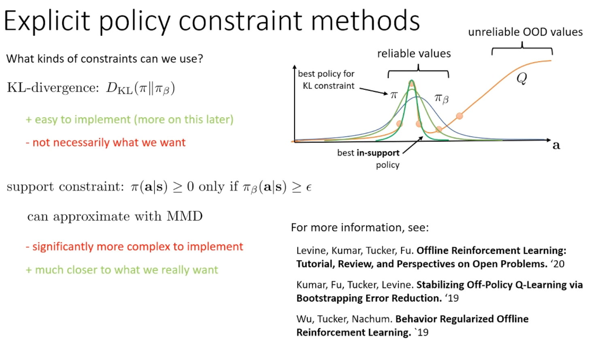
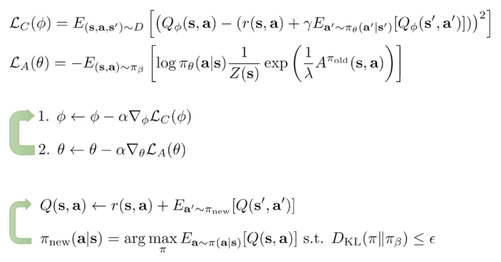
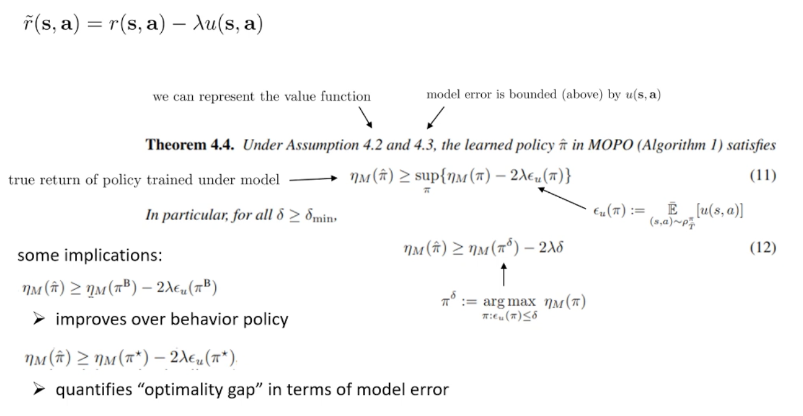
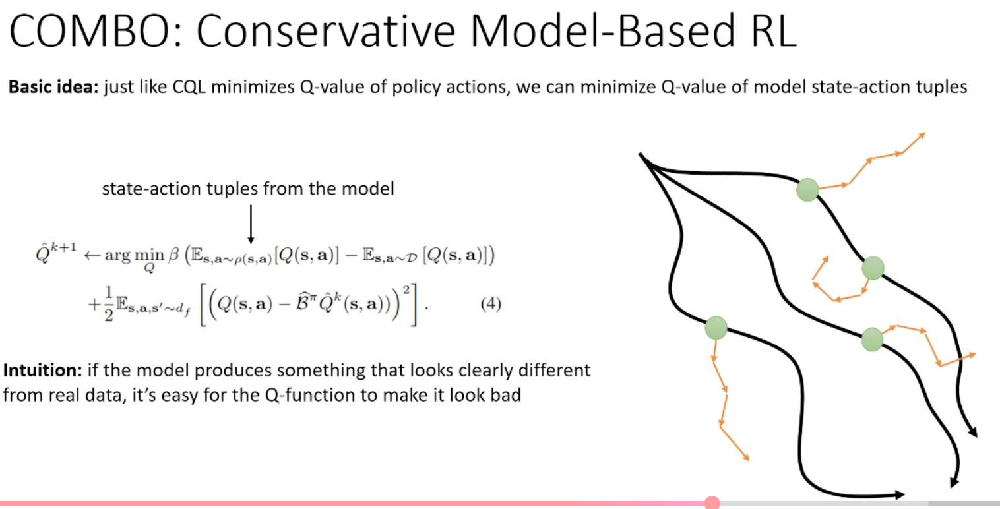
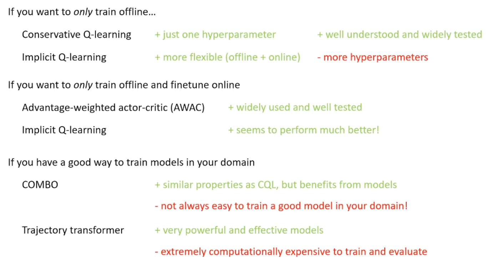
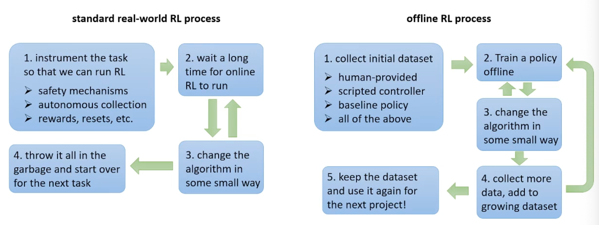

## Meta
- Course: CS285, Deep Reinforcement Learning
- Date: 2026.01.16
- Lecturer: Sergey Levine
- Source/Link: https://www.youtube.com/watch?v=TCn26YClkCw&list=PL_iWQOsE6TfVYGEGiAOMaOzzv41Jfm_Ps&index=67

## Part 1
- Limitation → Fix<!--이전 파트 한계 → 이번 파트 해결책-->
    - prev: In offline RL, we have a fixed dataset $D$ collected by a behavior policy $\pi_\beta$
 . The primary reason standard RL fails here is distributional shift
    - fix: Constrain the learned policy to stay within the dataset support
- Flow of this part <!--(어떤 흐름으로 강의가 진행되는지, 강의의 흐름을 반영하는건 맞지만 어떻게 알고리즘을 발전해나가는지 정리)-->
    1. Explicit policy constraints
        
        - Update critic as usual, but modify actor to stay close to $\pi_\beta$ (like $KL \le \epsilon$). Practical issues: $\pi_\beta$ unknown → need BC model or sample-only tricks
        - In the Figure1
            - Blue curve is behavior policy ($\pi_\beta$), probability is different each action $a$s
            - Orange dots are sample (actions) from dataset, y-axis is Q-value of action
                - Second dots from left is especially high $\rightarrow$ It would be good action
            - Orange Q-function curv: Learn to fit Q to Bellman target, the learning graph looks like orange curv
                - Low probability of $\pi_\beta$ part which right tail part, Q nee dto do extrapolate and it's unreliable
                - Also even though the biggest value of orange curve can be in the right trail part, it's OOD part so you should not trust it
    2. Implicit constraints
        - Solve the KL-ocnstrained probelm in closed from
        - Weighted BC: Imitate dataset actions but upweight high-advantage actions   
    3. Remove OOD action queries in backups
        - Avoid enforcing the constraint xplicitly during the policy gradient step. Instead, we solve for the mathematically optimal policy in closed form
        - Advantage Weighted Actor-Critic (AWAC)
            
            - Instead of complex KL penalties, AWAC uses weighted behavioral cloning. It treats the offline
            - $\phi \leftarrow \phi - \alpha \nabla_\phi \mathcal{L}_C(\phi)$: Update with critic TD loss
            - $\theta \leftarrow \theta - \alpha \nabla_\theta \mathcal{L}_A(\theta)$: Update actor with weighted BC
                - In here, actor is updated to imitate good data action strongly, not updating to maximize Q directly
            - But when you calculate critic target and advantage, it still need $\pi_theta$ So OOD action query still can causing → Try to remove policy from target
    4. Remove OOD action queries in backups (IQL)
        - $Q(s,a)\leftarrow r(s,a)+\gamma\,\underbrace{\mathbb{E}_{a'\sim \pi_{\text{new}}}[Q(s',a')]}_{V(s')}$
            - $V(s')$는 $\pi_{\text{new}}$ 아래의 value이고, 이걸 계산하려면 $a'\sim \pi_{\text{new}}$ 를 샘플링 해야함.
            - 하지만 offline에서는 $a'\sim \pi_{\text{new}}$가 데이터에 없는 action (OOD)을 뽑을 수 있으니 Q가 action에서 extrapolation error/overestimation을 일으켜서 target이 망가짐
        - Just set V(s) as a different network and fit with MSE?
            - $(V(s_i)-Q(s_i,a_i))^2$
            - $a_i$ is a action from $\pi_\beta$ not from $\pi_{new}$
            - So V will go to $\mathbb{E}_{a\sim \pi_\beta}[Q(s,a)]$. It learns value of behavior policy
        - 하나의 state에서 Q traget은 분포처럼 보임
            - 한 상태 s에서 실제로는 비슷한 상태들에서 서로 다른 action들이 관측되고 그래서 Q(s,a) 타겟들이 여러 값으로 분포를 이룬다고 볼 수 있음
            - 여기서 평균을 구하는것이 아닌 데이터가 허용하는 action들 중에서 best choice를 구하는 것 (히스토그램의 제일 우측 점선)
        - 평균대신 upper quantile을 맞추자 (Expectile)
            - $$\ell_2^\tau(x)=\begin{cases}(1-\tau)x^2 & \text{if } x>0\\\tau x^2 & \text{else}\end{cases}$$
            - $\tau$를 크게 두면 V가 너무 작아 $Q-V>0$인 경우를 더 세게 penalty 주게 되어 V(s)가 분포의 상탕 (upper tail)쪽으로 끌려 올라감
            - 상위 expectile ≈ best에 가까운 값을 맞춤
        - 결론
            - $V(s)\leftarrow \max_{a\in \Omega(s)} Q(s,a),\quad\Omega(s)=\{a:\pi_\beta(a|s)\ge \epsilon\}$
            - 아무 action에 대한 max가 아닌 behavior policy support 안에서의 max를 근사한다
            - V 학습도 $Q(s,a)$를 오직 데이터 action $(s,a)\in D$ 로만 찍기 때문에 Q를 한번도 훈련 안 된 action으로 평가할 일이 없기 때문에 OOD 문제가 backup에서 사라짐

## Part 2
- Limitation → Fix<!--이전 파트 한계 → 이번 파트 해결책-->
    - prev: Choosing the action which maximaize Q-value at the Bellman backup overestimation will cause when OOD actions coincidently get high value
    - fix: Adjust Q-function directly to repair point which overestimated, instead of constraints actor
- Flow of this part <!--(어떤 흐름으로 강의가 진행되는지, 강의의 흐름을 반영하는건 맞지만 어떻게 알고리즘을 발전해나가는지 정리)-->
    1. Conservative Q-function
        
        - 높은 Q-value를 갖는 (OOD일 가능성이 큰) action을 찾는 분포 $\mu$를 만들고, 그 action들의 Q를 낮추는 항을 추가
        - 근데 모든 Q-value를 낮추기만 하면 지나치게 비관적이게 돼서 실제 가치를 찾지못함
    2. Conservative Q-leanring
        - OOD action에 대한 Q를 낮추고
        - 데이터셋 분포 내 액션은 Q를 올려주기
        - 데이터 분포 내부 액션과 외부 액션이 균형을 이루며 결과적으로 현재 정책의 가치를 과대평가 하지 않는 lower bound를 학습하게 됨
    3. LCQL
        - Critic (Q-function)의 손실함수만 변경
        - $\mu$: High Q-actions를 일부러 고르게 만드는 보조 분포
        - Discrete action: $\mu$를 명시적으로 계산하지 않고도 간편하게 최적화 가능 
        - Continuous action: Importance sampling을 사용하여 $\mu$에 대한 기댓값 추정
- Terminology Map <!--(용어 등치/정의)-->
    - push-down term: $\mathbb{E}_{a\sim\mu}[Q(s,a)]$를 낮추는 항
    push-up term: $\mathbb{E}_{(s,a)\sim D}[Q(s,a)]$를 올려 데이터 내부는 유지/강화
## Part 3
- Limitation → Fix<!--이전 파트 한계 → 이번 파트 해결책-->
    - prev: Model-based method, the policy could learn to take actions that trick the model into going into states with very high reward because those states are out of distribution. So we still have the auto distribution actions problem and OOD state problem  
    - fix: If the policy starts tricking the model to going into carzy states it foets some kind of panalty to change its behavior to come back to regions that are closer to the data
- Flow of this part <!--(어떤 흐름으로 강의가 진행되는지, 강의의 흐름을 반영하는건 맞지만 어떻게 알고리즘을 발전해나가는지 정리)-->
    1. Model-based Offline Policy Optimization (MOPO)
        
        - Add uncertainty penalty $u$ to reward (Give a penalty to the point which model would wrong)
        - If the penalty is bigger than actual model error, we can prove that trained policy is better than original action policy ($\pi_\beta$) at least
        - Penalized reward
            - $\tilde r = r - \lambda u$
    2. COMBO
        
        - CQL minimizes Q-values of policy actions. So we can minimize Q-values of model state action tuples
        - Q-function try to make the model based states and actions look worse, and if it cannot make them look worse than the data. 
            - It means they're indistinguishable from the data = The model is actually being correct the model is not producing states and actions that look unrealistic
    3. Trajectory Transformer
        - Deal with a Rl as a Big sequence density estimation problem not a simple state-action estimation
        - $p_\beta(s_{1:T},a_{1:T})$를 sequence density estimation으로 학습하고 확률 높은(=in-distribution) trajectory 내에서 planning
- Terminology Map <!--(용어 등치/정의)-->
    - Dyna-style (offline adaptation): real data state에서 시작해 짧은 model rollout으로 추가 학습 신호를 만드는 방식(offline에서는 rollout이 더 위험)
    - 
## Part 4
- Flow of this part <!--(어떤 흐름으로 강의가 진행되는지, 강의의 흐름을 반영하는건 맞지만 어떻게 알고리즘을 발전해나가는지 정리)-->
    1. Role of Thrub
        
    2. Advantage of offline RL
        