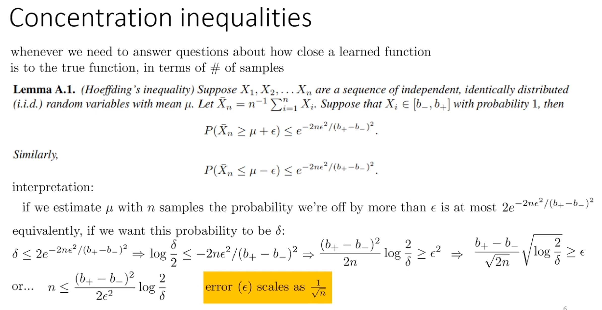
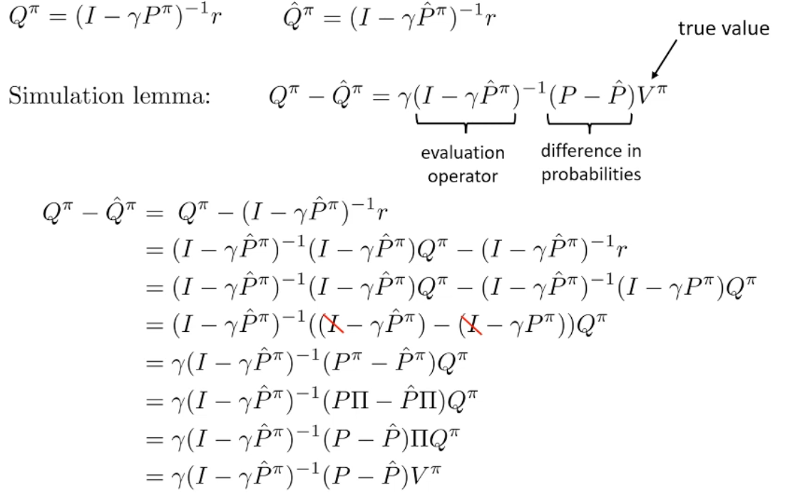
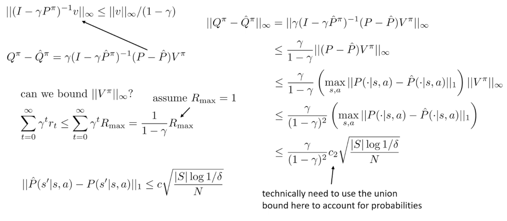
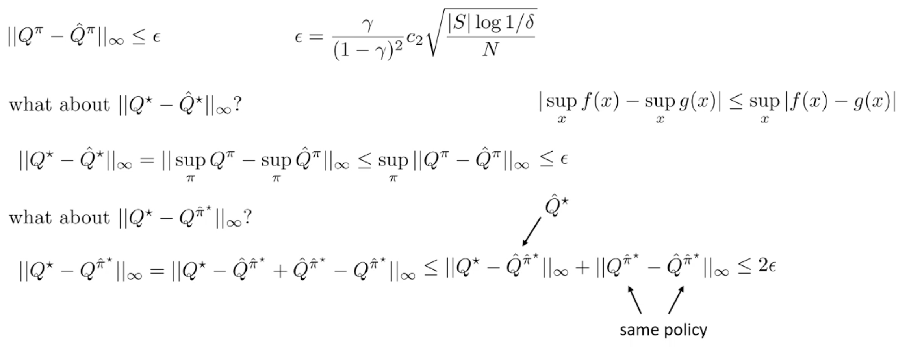
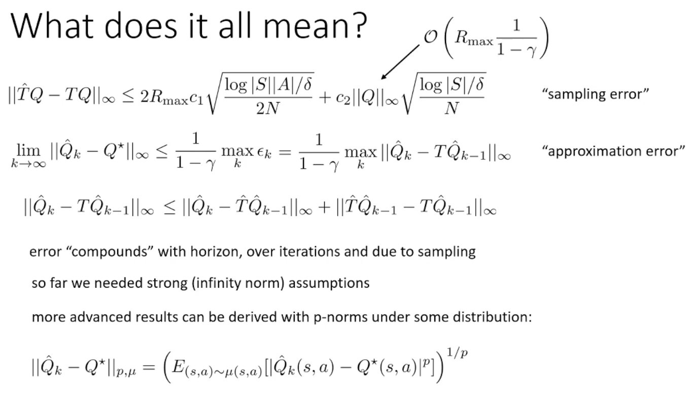

## Meta
- Course: CS285, Deep Reinforcement Learning
- Date: 2026.01.17
- Lecturer: Sergey Levine
- Source/Link: https://www.youtube.com/watch?v=o1dB2xDcCuo&list=PL_iWQOsE6TfVYGEGiAOMaOzzv41Jfm_Ps&index=71

## Part 1
- Limitation → Fix<!--이전 파트 한계 → 이번 파트 해결책-->
    - prev
    - fix
- Flow of this part <!--(어떤 흐름으로 강의가 진행되는지, 강의의 흐름을 반영하는건 맞지만 어떻게 알고리즘을 발전해나가는지 정리)-->
1. RL theory's common queations
    1.  $||\hat Q_k-Q^*|| \leq \epsilon$
        - 1- $\delta$ 만큼의 확률로 차이가 $\epsilon$ 이하가 된다는 것을 보장할 수 있음
    2. $||Q^{\pi k}-Q^*|| \leq \epsilon$
        - $Q^{\pi k}$ is different thing with $\hat Q^k$
        - $\hat Q_k$가 값을 잘못 과대 평가할 수 있기 때문. $Q^{\pi k}$는 실제 정책의 q값이며, 일반적으로 $argmax$ 정책에 해당하는 부분임
    3. If I use this exploration algorithm, how high is my regret
2. We need stron g assumption
    - 탐색까지 같이 분석하면 최악의 경우가 너무 비관적임 $\rightarrow$ 탐색을 제외하고 학습의 샘플 복잡도를 보자
    - How close is $\hat Q^\pi$ to $Q^\pi$
        - 진짜 MDP에서 평가한 $Q^\pi$ vs 추정 모델 $\hat P$에서 평가한 $\hat Q^\pi$
        - worst case 기준으로 보겠다는 뜻 (가장 나쁜 state-action)
    - How close is $\hat Q^*$ if we learn it using $\hat P$?
        - $\|Q^*-\hat Q^*\|_\infty \le \epsilon$
    - How good is the resulting policy
        - $\hat P$ 모델에서 얻은 정책이 우리가 얻을 수 있는 최상의 정책보다 얼마나 나쁜지를 알려줌
        - $\hat P$에서 최적이라 나온 정책 $\hat \pi$를 진짜 환경에 가져가면 얼마나 손해 보나?
        - $\hat\pi$: $\hat Q^*$에 대한 greedy policy
3. Hoeffding's inequalities
    
    - 모델을 얼마나 잘 배웠는지
    - 오차 크기 ($\epsilon$): $\epsilon \sim \frac{1}{\sqrt{n}}$
4. Simulation lemma
    
    - $(I-\gamma \hat P^\pi)^{-1}$
        - 그 한스텝 오차가 미래로 누적되는 정도
            - 기하급수 누적이라 $\frac{1}{1-\gamma}$가 여기서 나옴
    - $(P-\hat P)V^\pi$
        - 다음 상태 분포를 잘못 예측한 만큼의 기대가치 차이
        - 모델이 틀린 정도가 다음 상태의 가치 $V^\pi$로 가중됨
    - $\gamma$: 오차가 다음 상태로 가는 항에서 발생하니까 한번 discount
    - 마지막에 Q에서 V로 바꾸는 이유?
        - $V^\pi = \Pi Q^\pi$
        - 상태별 가치 = 행동분포로 Q를 평균낸 것
    - 결론적으로는 모델이 틀린만큼 다음 상태ㅏㄱ치 $V^\pi$가 큰 곳에서 더 크게 흔들리고, 그 흔들림이 $(I-\gamma \hat P^\pi)^{-1}$ 때문에 시간축으로 누적됨
5. Sample complexity bound
    
    - $\|Q^\pi-\hat Q^\pi\|_\infty\le\frac{\gamma}{(1-\gamma)^2}\;c_2\sqrt{\frac{|S|\log(1\delta)}{N}}$
    - 샘플은 $\frac{1}{\sqrt N}$으로 좋아지는데 horizon은 $(1-\gamma)^{-2}$로 제곱으로 터짐. 즉 RL에서 long horizontal porblem이 어려운 이유
6. Final
    
    - 모델이 최적값 자체를 $\epsilon$만큼 왜곡할 수 있고 그 정책을 실제 환경에서 평가하면 또 $\epsilon$만큼 또 틀릴 수 있기때문에 최악의 경우 2  $\epsilon$

## Part 2

- Flow of this part <!--(어떤 흐름으로 강의가 진행되는지, 강의의 흐름을 반영하는건 맞지만 어떻게 알고리즘을 발전해나가는지 정리)-->
    1. Analyze approximation error
        
        - Assume $\|\hat Q_{k+1}-T\hat Q_k\|_\infty\le \epsilon_k$
        - Fitted Q-Iteration 같은 model-free 방법은 매 반복바다 생기는 작은 오차가 Bellman backup을 타고 시간축으로 누적 및 증폭 되는데, 그 증폭 크기가 horizon(1/(1-$\gamma$))에 의해 결정됨
        데이터가 유한해서 생기는 sampling error는 보통 $(1-\gamma)^{-2}$까지 커질 수 있고 함수 근사(회귀)에서 생기는 approximation error는 $(1-\gamma)^{-1}$로 누적된다