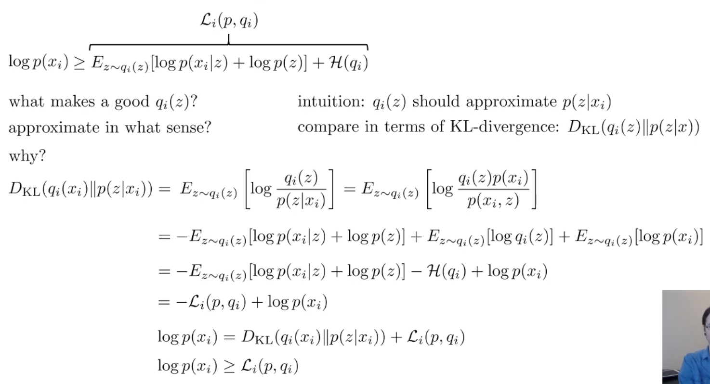

## Meta
- Course: CS285, Deep Reinforcement Learning
- Date: 2026.01.17
- Lecturer: Sergey Levine
- Source/Link: https://www.youtube.com/watch?v=UTMpM4orS30&list=PL_iWQOsE6TfVYGEGiAOMaOzzv41Jfm_Ps&index=73

## Part 1
- Flow of this part <!--(어떤 흐름으로 강의가 진행되는지, 강의의 흐름을 반영하는건 맞지만 어떻게 알고리즘을 발전해나가는지 정리)-->
    1. Actual data probability $p(x), p(y|x)$ is really complicated. 
    2. So it's really hard to represent multi model or structual dirtribution with single Gaussian
    3. So they start to use Latent variable model.
        - Use latent variable $z$
        - $p(x)=\int p(x\mid z)p(z)dz$
    4. But when you train the model, you cannot calculate log of integral from MLE objective function
        - MLE: $\max_\theta \frac{1}{N}\sum_i \log p_\theta(x_i)= \max_\theta \frac{1}{N}\sum_i \log \int p_\theta(x_i\mid z)p(z)\,dz$
        - Alternative: expected log-likelihood
            - $\theta \leftarrow \arg\max_\theta \frac{1}{N}\sum_i \mathbb{E}_{z\sim p(z\mid x_i)}\big[\log p_\theta(x_i, z)\big]$
    5. How do we calculate $p(z)$ give $x_i$

## Part 2
- Limitation → Fix<!--이전 파트 한계 → 이번 파트 해결책-->
    - prev: We wanted to use the expected log-likelihood
    - fix
        - Variational/approximate posterior $q_i(z)$ to approximate $p(z|x_i)$
        - Use Jensen's inequality to derive a tractable lower bound on $\log p(x_i)$ (ELBO)
        - Optimize ELBO
- Flow of this part <!--(어떤 흐름으로 강의가 진행되는지, 강의의 흐름을 반영하는건 맞지만 어떻게 알고리즘을 발전해나가는지 정리)-->
    1. Variational approximation
        - We need $p(z|x_i)$ but we cannot calculate because it's compolicated
    2. Jensen's inequality
        - Equation: $\log \mathbb{E}[Y] \ge \mathbb{E}[\log Y]$
    3. ELBO-KL decomposition
        
        - ELBO (Evidence Lower Bound)
            - $\mathcal{L}_i(p,q_i)=\mathbb{E}_{q_i(z)}[\log p(x_i\mid z)+\log p(z)] + \mathcal{H}(q_i)$
            - $x_i$를 잘 설명하는 latent $z$ 영역에 $q_i$가 mass를 두도록 함
            - $\mathcal{H}(q_i)$: entropy term. $q_i$가 한 점에 붕괴하지 않고 퍼지도록 해줌
            - 그래서 높은 peak에 올라가고 싶지만 entropy때문에 너무 좁게는 못감. 그래서 peak 주면을 커버할 수 있게됨
        - Decomposition
            - $\log p(x_i)=D_{KL}(q_i(z)\,\|\,p(z\mid x_i))+\mathcal{L}_i(p,q_i)$
            - $\log p(x_i)$는 우리가 진짜 최적화 하고 싶은 값. 하지만 ELBO는 이걸 직접 최대화 하지 못하니 대신 올리는 값
            - 이 차이는 정확히 poesterior 근사 오차 $D_{KL}(q_i(z)\|p(z\mid x_i))$로 측정됨
        - Lower bound
            - $\log p(x_i)\ge \mathcal{L}_i(p,q_i)\quad (\because D_{KL}\ge 0)$
            - $\log p(x_i)$는 $q_i$에 대해 상수라서, $\arg\min_{q_i} D_{KL}(q_i) = \arg\min_{q_i}\left(-\mathcal{L}_i(q_i)+\text{const}\right) = \arg\min_{q_i}\left(-\mathcal{L}_i(q_i)\right)$
            - $-\mathcal{L}$을 최소화하는 건 $\mathcal{L}$을 최대화하는 것 $\arg\min_{q_i} D_{KL} \iff \arg\max_{q_i} \mathcal{L}_i$
## Part 3
- Limitation → Fix<!--이전 파트 한계 → 이번 파트 해결책-->
    - prev: You need to optimize each approximate posterior $q_i(z)$ for each data $x_i$. When the parameter increase $O(N)$. If the data is huge, it will explode
    - fix: 
        1. Amortized variational inference
        2. Use reparameterization trick 
- Flow of this part <!--(어떤 흐름으로 강의가 진행되는지, 강의의 흐름을 반영하는건 맞지만 어떻게 알고리즘을 발전해나가는지 정리)-->
    1. Previous method
        - $z\sim q_i(z)$ sample → update $\theta$ $\nabla_\theta \log p_\theta(x_i\mid z)$
        - $q_i$ is updated to increase ELBO $\mathcal{L}_i$
        - Problem: Each data need parameter $q_i$ → total parameter is $N\cdot \text{dim}(z)$
    2. Amortized variational inference
        - Because of th parameter number, let's amortize inference cost using single inference network $q_\phi(z\mid x)$
        - Even thought a new single data comes as an input, getting $\mu, \sigma$ with doing single forward. we don't need to infer each time
        - steps
            1. Sample $z\sim q_\phi(z\mid x_i)$
            2. $\theta \leftarrow \theta + \alpha \nabla_\theta \mathcal{L}$
            3. $\phi \leftarrow \phi + \alpha \nabla_\phi \mathcal{L}$
        - But it has high variance
            - $\nabla \log q_\phi(z\mid x)$ is sensitive for sampling noise also gradient variance will increase so you need to increase number of sample or dicrease lr
    3. Reparameterization trick
        - $z = \mu_\phi(x) + \sigma_\phi(x)\odot \epsilon, \quad\epsilon\sim \mathcal{N}(0,I)$
            - In this equation, $\epsilon$ doesn't depend on $\phi$
            - So we can change expectation like this
            - $\mathbb{E}_{z\sim q_\phi(z\mid x_i)}[r(x_i,z)]=\mathbb{E}_{\epsilon\sim \mathcal{N}(0,I)}[r(x_i,\mu_\phi(x_i)+\epsilon \sigma_\phi(x_i))]$
            - So we can just backprop because $\phi$ is in r
        - pros
            - PG multiplies by $r$ as a plain scalar $\rightarrow$ Gradient estimate is noisy and has high variance
            - Reparameterization differentiates $r$ directly $\rightarrow$ Giving a more informative gradient direction and typically much lower variance
        - cons
            - Cannot use at the discrete latent, use only continuous latent
            - If it's discreate, you should use score-function
- Terminology Map <!--(용어 등치/정의)-->
    - Amortized variational inference
	    - 데이터마다 q_i를 따로 최적화하지 않고, 하나의 네트워크 $q_\phi(z\mid x)$로 모든 posterior를 예측
    - Reparameterization trick 
        - z를 직접 뽑지 말고 $z=\mu_\phi(x)+\sigma_\phi(x)\epsilon,\ \epsilon\sim\mathcal N(0,I)$처럼 고정된 노이즈 $\epsilon$ 를 신경망으로 변환해서 샘플링하면, 샘플링 과정을 미분 가능하게 만들어 backprop으로 저분산 gradient를 얻는 방법
- Why it matters <!--(왜 중요한가 1~2줄) 이걸 놓치면 다음 파트가 왜 나오는지 이해가 안 됨-->
    - VAE/월드모델/latent dynamics 모델에서 posterior 추정이 병목인데, amortization이 그 병목을 없애고, reparameterization이 학습을 안정적으로 만들어서 실제로 돌아가게 함
    
## Part 4
- Limitation → Fix<!--이전 파트 한계 → 이번 파트 해결책-->
    - prev: 각 데이터마다 posterior inference를 하면 $q_i$ 파라미터 수가 데이터 크기 $N$에 비례해서 커지고, 큰 데이터셋에서 inference가 병목이 됨.
    - fix: Use Amortized variational inference 
        - 데이터별 $q_i(z)$를 따로 최적화하지 않고, 하나의 inference network $q_\phi(z\mid x)$가 모든 $x$에 대해 posterior를 즉석에서 예측하게 함
        - Inference 비용이 $O(N)$으로 최적화. 또한 forward pass로 바뀌며 대규모 데이터 및 온라인 학습에서 실용적으로 됨
- Flow of this part <!--(어떤 흐름으로 강의가 진행되는지, 강의의 흐름을 반영하는건 맞지만 어떻게 알고리즘을 발전해나가는지 정리)-->
    1. $\log p(x_i)$ 최대화를 하고싶지만 $\log p(x_i)=\log\int p(x_i,z)\,dz$ 적분을 풀기 엄청나게 어려움. posterior $p(z\mid x_i)$도 직접 계산 못하기때문에 z를 하나 찝는게 아니라 분포 전체를 써보자
    2. ELBO
        - 임의의 분포 $q_i(z)$를 도입해서 
        - $\log p(x_i)\ \ge\ \mathcal L_i(p,q_i)=\mathbb E_{z\sim q_i}\big[\log p(x_i\mid z)+\log p(z)\big]+\mathcal H(q_i)$
        - gap = posterior 근사오차임 (KL)       
    3. $q_i$를 데이터마다 최적화하면 너무 비싸기 때문에 amortization를 통해 하나의 네트워크에서 모든 posterior를 근사하는 분포를 encoder의 한번의 forward pass로 빠르게 예측
    4. $\phi$ 미분이 불가능함
        - $\mathcal L(\theta,\phi)= \mathbb E_{z\sim q_\phi(z\mid x)}\big[\log p_\theta(x\mid z)\big]- D_{KL}\big(q_\phi(z\mid x)\,\|\,p(z)\big)$
        - $\phi$는 두군데에 있는데, entropy쪽은 closed form이라 미분이 가능하지만, $z \sim q_\phi(z\mid x)$ 샘플링 부분에서 $z$는 $\phi$에 의존하는 확률분포에서 뽑힌 랜덤변수이기 때문에 미분이 안됨
    5. Reparameteriation trich
        - 샘플링을 없애는게 아니라 위치를 바꾸자
        - $[z\sim q_\phi(z\mid x)=\mathcal N(\mu_\phi(x),\sigma_\phi(x))]$ $\rightarrow$ $[\epsilon\sim\mathcal N(0,1),\quad z=\mu_\phi(x)+\sigma_\phi(x)\epsilon]$
        - 샘플링을 노이즈 $\epsilon$으로 분리해서 backprop이 가능
    6. Sequence VAE
        - 두개 네트워크
            - Encoder
                - Posterior 근사
                - $q_\phi(z\mid o) = \prod_t q_\phi(z_t \mid o_{1:t})$
            - Decoder
                - Generative model
                - $p_\theta(o\mid z) = \prod_t p(o_t\mid z_t)$
        - Objective function
            - $\mathcal L(\theta,\phi)= \mathbb E_{z\sim q_\phi(z\mid o_{1:T})}\Big[\sum_t \log p_\theta(o_t\mid z_t)\Big]- D_{KL}\big(q_\phi(z\mid o_{1:T}) \,\|\, p(z)\big)$
            - 첫항: reconstruction (decoder 학슴)
            - 두번째 항: prior regularization (latent space 정돈)
        - Encoder는 reconstruction을 잘 하기 위해 z를 활용하려 하지만, 동시에 $q_\phi(z|x)$가 prior $p(z)$에서 너무 멀어지지 않도록 KL regularization이 이를 제약

## My Confusion & Clarification <!--(질문과 해결)-->
- Q. prior = dynamics??
- A. 
    - posterior 
        - $q_\phi(z_t \mid o_{1:t}, a_{1:t-1})$
        - 관측을 보고 지금 latent state가 뭐였을지를 필터링 및 추정하는 네트워크
    - prior (dynamics) 
        - $p_\theta(z_{t+1}\mid z_t, a_t)$
        - 지금 상태에서 액션을 주면 다음 상태가 어떻게 될지 예측 alc 생성하는 모델
    - 월드 모델에서는 실제 관측 없이 rollout을 통해서 미래를 만들어야하고, rollout에서는 dynamics로만 굴러가기때문