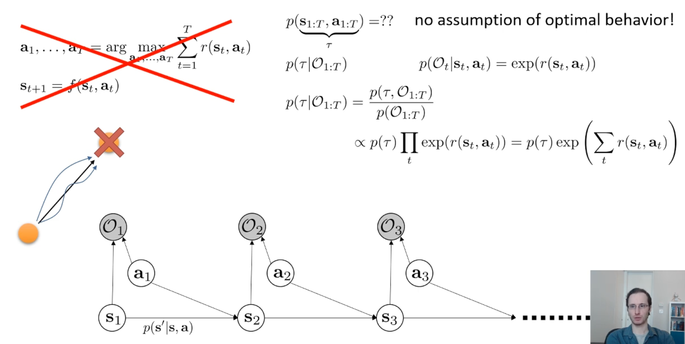
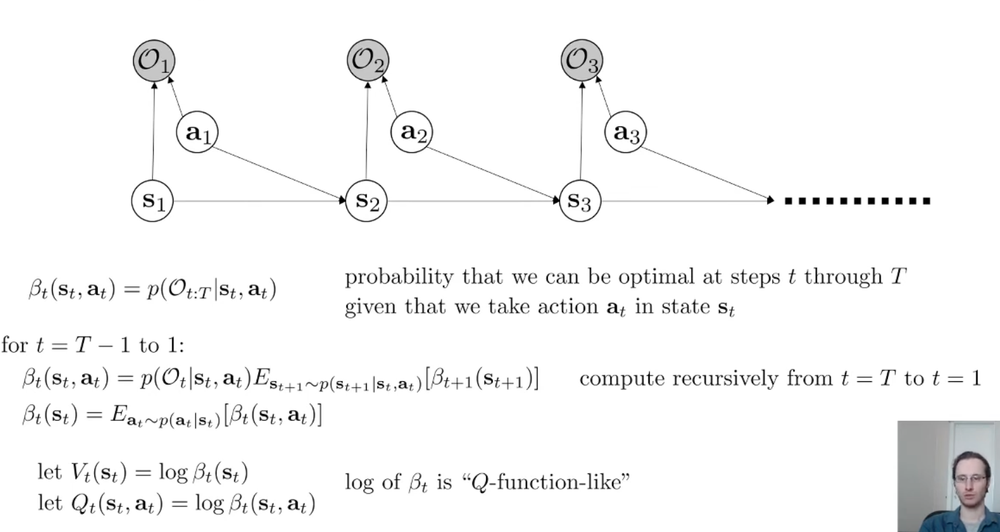
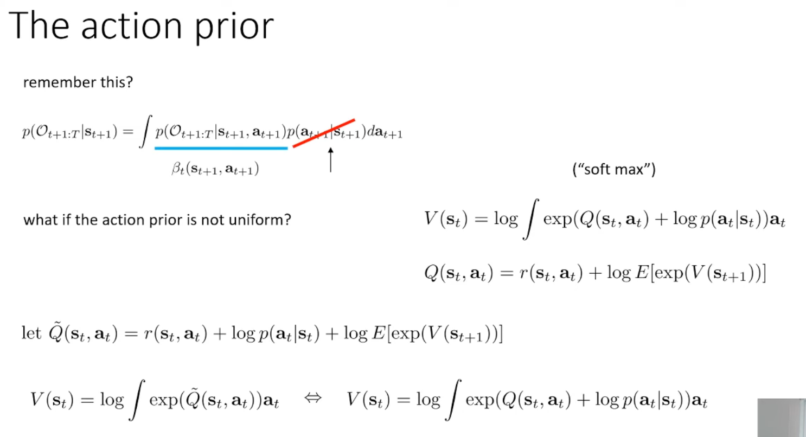
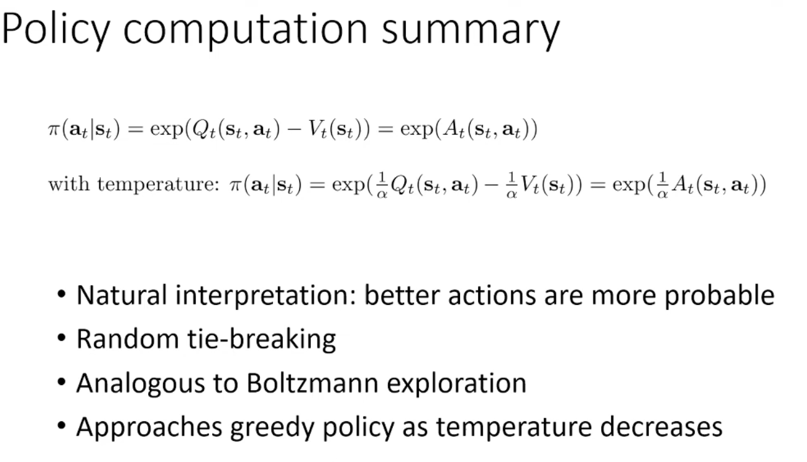
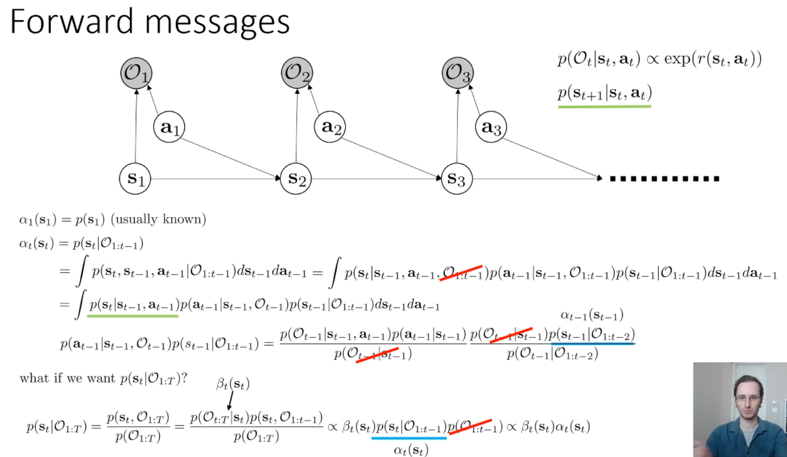
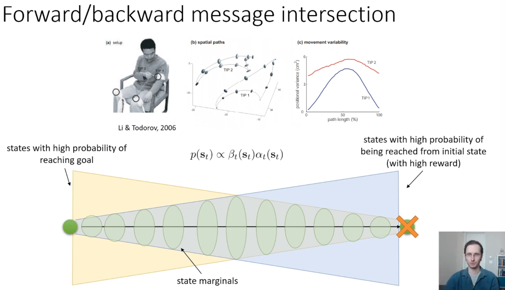
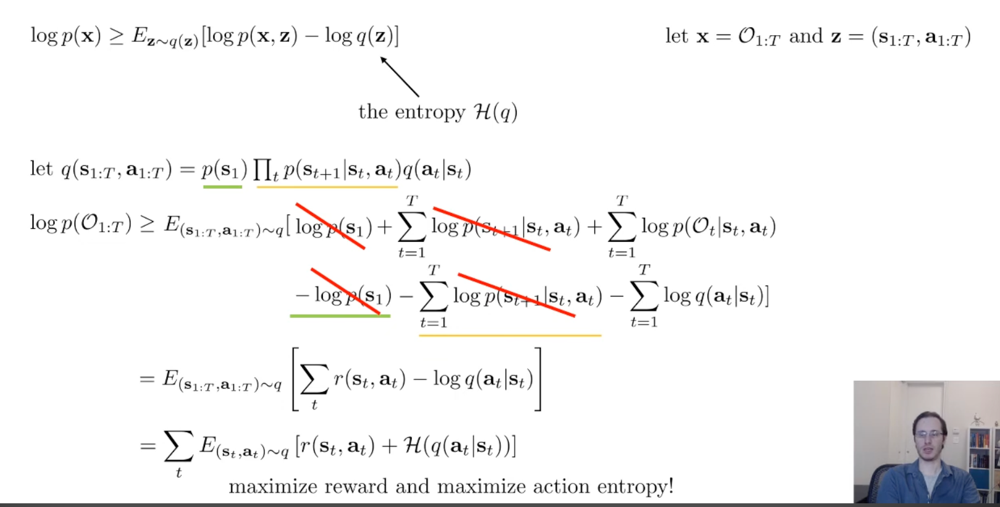
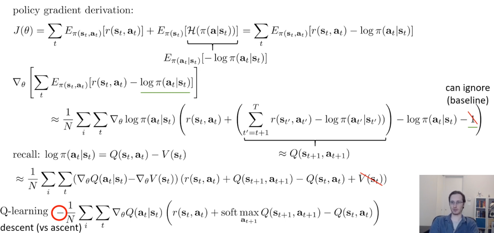

## Meta
- Course: CS285, Deep Reinforcement Learning
- Date: 2026.01.19
- Lecturer: Sergey Levine
- Source/Link: https://www.youtube.com/watch?v=MzVlYYGtg0M&list=PL_iWQOsE6TfVYGEGiAOMaOzzv41Jfm_Ps&index=77

## Part 1
- Limitation → Fix<!--이전 파트 한계 → 이번 파트 해결책-->
    - prev: Real agents act near-optimaly and stochastically. So classical formulations cannot explain randomness as rational
    - fix: Reframe control as probabilistic inference by adding optimality variables $O_t$ into a graphical model, so that conditioning on being optimal yields a stochastic near-optimal policy
- Flow of this part <!--(어떤 흐름으로 강의가 진행되는지, 강의의 흐름을 반영하는건 맞지만 어떻게 알고리즘을 발전해나가는지 정리)-->
    1. human or animal act like suboptimal. especially monkey reach to a goal well but trajectories all different and sometimes lazy. So classic formlation cannot explain randomlity well
    2. Graphical model + optimality variable
        
        - Original approch
            - $a_{1:T} = \arg\max_{a_1,\dots,a_T}\sum_{t=1}^T r(s_t,a_t),\quad s_{t+1}=f(s_t,a_t)$
            - Find single optimal trajectory maximizing reward deterministically
            - problem
                - Can't explain stochastic action
                - Different with human/animal's lazy or random
                - So remove this idea
        - p(s_{1:T}, a_{1:T}) = ?
            - Trajectory distribution define as MDP's dynamics
            - Here's no assumption of optimal 
        - Add new Optimality variable $O_t$
            - $O_t$: It's optimal/well done task at time $t$ and it's observable
        - $p(O_t=1 \mid s_t,a_t) = \exp(r(s_t,a_t))$
            - high reward = high probability of optimal
            - little bit low reward = probability is not 0
            - It represent soft optimality
- Terminology Map <!--(용어 등치/정의)-->
    - Trajectory \tau: $(s_{1:T}, a_{1:T})$

## Part 2
- Limitation → Fix<!--이전 파트 한계 → 이번 파트 해결책-->
    - prev
    - fix
- Flow of this part <!--(어떤 흐름으로 강의가 진행되는지, 강의의 흐름을 반영하는건 맞지만 어떻게 알고리즘을 발전해나가는지 정리)-->
    1. Problem in the control inference graphic model (Inference = planning)
        1. Compute backward messages: $\beta_t(s_t,a_t)=p(O_{t:T}\mid s_t,a_t)$
	    2. Compute policy: Compute $\pi(a_t\mid s_t)=p(a_t\mid s_t, O_{1:T})$ 
	    3. Compute forward messages: $\alpha_t(s_t)=p(s_t\mid O_{1:t-1})$
    2. Backward messages
        
        - $\beta_t(s_t,a_t)=p(O_{t:T}\mid s_t,a_t)$
            - state $s_t$에서 action $a_t$를 했다고 가정할 때, $t$부터 $T$까지 계속 optimality(= $O_t$=1들)를 만족할 확률
            - 이 $(s,a)$가 얼마나 좋은 선택인지를 확률적으로 평가한 값
        - red underline: 
        - We can compute $\beta_t(s_t,a_t)=p(O_{t:T}\mid s_t,a_t)$ from future $\beta_{t+1}$ with backward pass recursively
        - In RL, the optimal value-function is optimal Q-function, but in inference perspective, the optimal value-function is softmax of q-function
    3. If the action prior is not uniform
        
        - $p(O_{t+1:T}\mid s_{t+1},a_{t+1})$ = $\beta_{t+1}(s_{t+1},a_{t+1})$
        -  $p(a_{t+1}\mid s_{t+1})$ is action prior
        - $V(s)=\log\int \exp\big(Q(s,a)+\log p(a\mid s)\big)\,da$
            - prior가 uniform이 아니면 softmax를 할 때 action들이 동일하게 취급되지 않고 $p(a\mid s)$ 가 큰 행동이 더 기본적으로 더ㅓ 그럴듯하게 반영됨
        - reward 가 non-uniform prior를 흡수할 수 있으니 단순화를 시킴
    4. Policy computation
        
        - $\pi(a\mid s)=\exp(A(s,a))$: Advantage가 큰 행동일수록 더 자주 선택됨
        - $\pi(a\mid s)=\exp\left(\frac{1}{\alpha}Q(s,a)-\frac{1}{\alpha}V(s)\right)= \exp\left(\frac{1}{\alpha}A(s,a)\right)$
            - $\alpha$가 작아질수록: $\exp(A/\alpha)$가 더 날카로워져서 거의 argmax(greedy/deterministic)에 가까워짐
	        - $\alpha$가 커질수록: 분포가 퍼져서 더 랜덤/소프트해짐
    5. Forward messages
        
    6. Forward/Backward message intersection
        
        - Backward $\beta$: 여기서부터 목표까지 잘 끝낼 수 있을지
        - Forward $\alpha$: 시작점부터 여기까지 올 가능성이 얼마나 있는지
        - State marginal
            - $p(s_t\mid O_{1:T}) \propto \alpha_t(s_t)\beta_t(s_t)$ → 시작에서 도달 가능 ∩ 목표로 도달 가능이 near-optimal trajectory의 핵심 영역 (cigar shape)

## Part 3
- Limitation → Fix<!--이전 파트 한계 → 이번 파트 해결책-->
    - prev: If you solve control with exact inference, it will cause optimism bias and you cannot do exact inference at the random dynamics 
    - fix: Approximate $p(\tau \mid O_{1:T})$ variational inference
- Flow of this part <!--(어떤 흐름으로 강의가 진행되는지, 강의의 흐름을 반영하는건 맞지만 어떻게 알고리즘을 발전해나가는지 정리)-->
    1. $\beta, \alpha$로 policy를 뽑기는 성공. 하지만 Optimism bias가 생김.
    2. Optimism bias problem
        - $Q(s,a)= r(s,a)+\log \mathbb E_{s'\sim p(\cdot|s,a)}[\exp(V(s'))]$
        - If I get a high reward even once, log-exp will overesitmate it like a lottery
        - Inference change dynamics posterior to evidence like $p(s_{t+1}\mid s_t,a_t, O_{1:T})$
    3. Fix dynamics at the variational posterior $q$
        
        - maximize reward and maximize action entropy
        - Define $q(\tau)$ to share the same initial state and dynamics as $p$
        - Only optimize the action distribution $q(a_t\mid s_t)$
        - The resulting objective becomes maximize expected reward + maximize action entropy
    4. Optimizing the variational lower bound
        
        - The entropy-regularized objective can be optimized via dynamic programming
        - Leads to soft value iteration
            - Bellman backup for $Q$
            - Softmax (log-sum-exp) backup for $V$
        - Optimal policy:
            - $\pi(a\mid s) \propto \exp(Q(s,a) - V(s))$
    - Exect inference는 보상 높게 나온 세계 (lottery)에 맞춰서 dynamics까지 바꿔버려서 (posterior dynamics) 복권 같은 행동을 과대평가함. 그래서 dynamics는 고정하고 action 만 변경하는 variational q로 바꿔서 RL 목적 eqation을 얻는다.
        - 복권에 당첨될 기댓값은 별거 아니지만 $\log E[exp(v)]$로 인해 optimism bias가 생김
## Part 4
- Flow of this part <!--(어떤 흐름으로 강의가 진행되는지, 강의의 흐름을 반영하는건 맞지만 어떻게 알고리즘을 발전해나가는지 정리)-->
    1. Soft Value Iteration → Soft Q-learning
        
        - hard max → soft max (log-sum-exp)
    2. Policy Gradient ≈ Soft Q-learning
        
        - difference
            - Policy gradient: 실제 다음 action $a_{t+1}$ (on-policy)
	        - Q-learning: softmax over all actions (off-policy)
        - Under soft optimality, both policy gradient and soft Q-learning optimize inference objective with different way

## Part 5
- Flow of this part <!--(어떤 흐름으로 강의가 진행되는지, 강의의 흐름을 반영하는건 맞지만 어떻게 알고리즘을 발전해나가는지 정리)-->
    1. Reinforcement learning with deep Energy-Based Policies
        - 두개의 경로중에 어떤 경로가 최적인지 알아낼 때 까지 두가지 가설을 모두 탐색하는 특성을 가짐
    2. Sotchastic energy-based policies provide pretraining
        - 어떤 방향으로든 빠르게 달리면 리워드를 받음
        - 특정 방향으로 미세 조정해야하는 상황에서는 soft q-learning으로 학습한 정책은 잘못된 방향으로 실행하지 않고 올바른 방향만 유지하는 방법을 학습함
    3. soft actor-critic
        - Policy gradient와 같지만 실제로는 KL을 직접 최소화하기보다는 entropy-regularized policy gradient