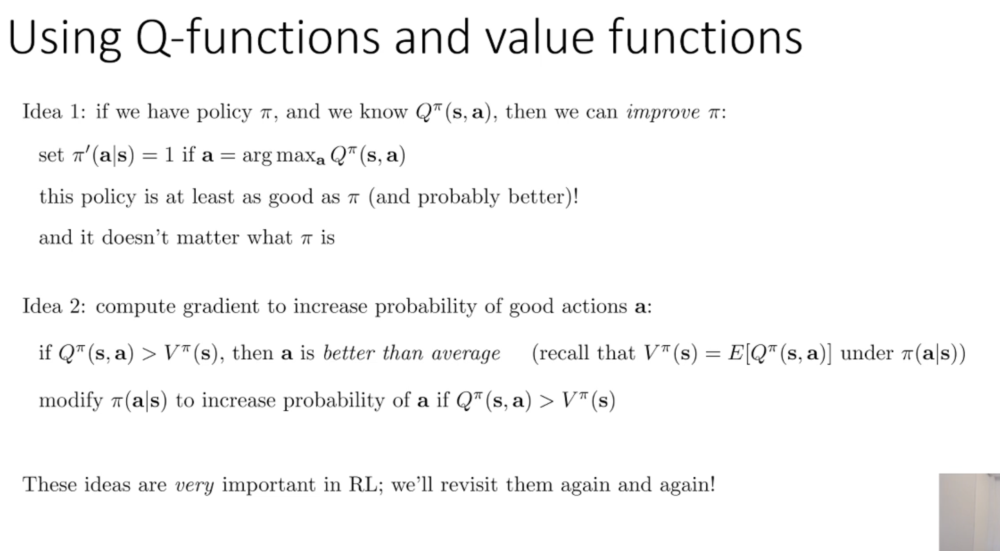
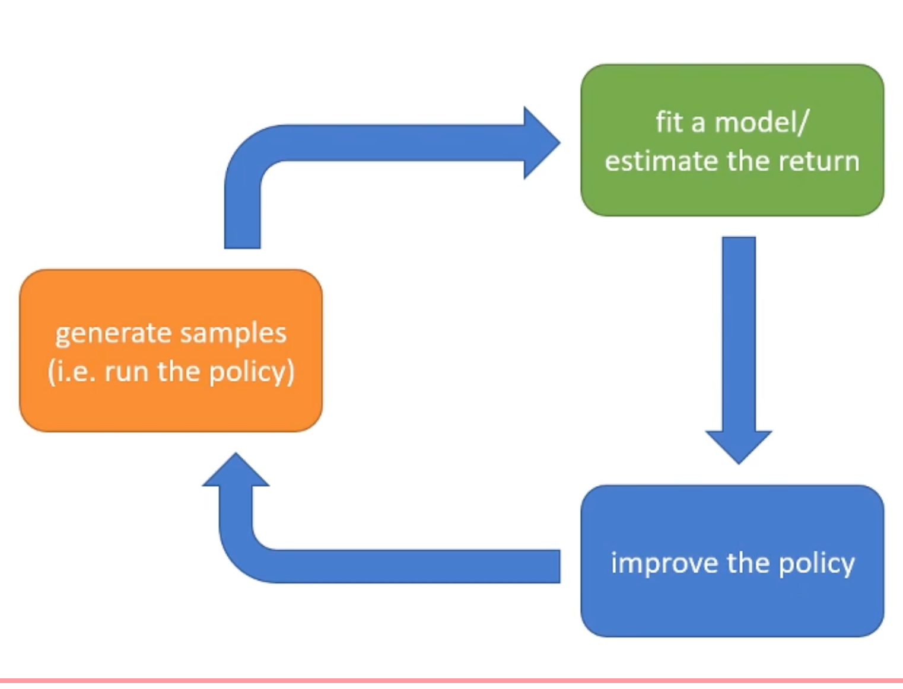

## 0. Meta
- Course: CS 285, Reinforcement Learning
- Date: 2025.12.08
- Lecturer: Sergey Levine
- Source/Link: https://www.youtube.com/watch?v=jds0Wh9jTvE&list=PL_iWQOsE6TfVYGEGiAOMaOzzv41Jfm_Ps&index=9&pp=iAQB

---

## 1. Big Picture (one-sentence summary of this lecture)
<!-- 오늘 강의의 핵심 메시지/주제 한두 줄 -->
- The goal of reinforcement learning: Finding a parameter $\theta$ define a policy so as to maximize the expected value of the sum of rewards over the trajectory
- There are many RL algorithms because they make different trade-offs (sample efficiency, stability, assumptions like observability/episodicity/continuity).
---

## 2. Key Concepts
<!-- 중요한 용어 / 개념 리스트업 (정확한 정의가 아니어도 됨, 나중에 수정 가능) -->
- MC (Markov Chain): The process of changing state rely on the current state without agent's action
  - M = ${S, T}$
  - $S$: state space
  - $T$: transition operator -> They’re function/matrix, but actually they’re linear operator running above distribution. so they call as a transition operator
- MDP (Markov Dicision Process): The process of changing state and reward probabilistically according to agent's action
   - (S, A, T, r)
- POMDP (Patially Observable MDP): Agent's have to do action only according to observation which has partial information instead of state which has fully information 
   - (S, A, O, T, E, r)

- $R(\tau) = \sum_{t=1}^T r(s_t, a_t)$
   - The cumulative rewards received during the episode

- $\pi_\theta(a \mid s)$
   - probability to do action $a$ at state $s$

- $p_\theta(\tau)$
   - The probability distribution over trajectories induced by the policy
   - They call it distribution because even with the same policy $\theta$, a different trajactory $\tau$ comes out probabilistically each time

$$
Q^\pi(s_t,a_t)=\sum_{t’=t}^{T}\mathbb{E}{\pi\theta}\big[,r(s_{t’},a_{t’})\mid s_t,a_t,\big]
$$
    - The expected cumulative rewards when starting from the current (s, a) pair and following policy $\pi$ thereafter

$$
V^\pi(s_t)=\sum_{t’=t}^{T}\mathbb{E}{\pi\theta}\big[,r(s_{t’},a_{t’})\mid s_t,\big]
$$
    - The expected cumulative reward when starting from current state $s_t$ and following policy $\pi$ thereafter. Leave celecting the action to policy $\pi$

- On-policy vs Off-policy
  - On-policy: the algorithm must collect new samples whenever the policy changes (old samples become invalid).
  - Off-policy: the algorithm can reuse past data collected under different policies.

- Sample efficiency
  - How many environment interactions are required to obtain a good policy?

- Stability & convergence
  - Whether the algorithm converges, and if so, to what (good policy? Bellman fixed point?).

- Common assumptions
  - Full observability: we can access Markovian states (or observations that satisfy the Markov property)
  - Episodic learning: the environment can be reset and has finite-horizon episodes.
  - Continuity / smoothness: dynamics and value functions are continuous (important for many model-based / optimal control methods).
---

## 3. Important Equations / Diagrams
<!-- 수식, 그림/도식 설명. 수식은 LaTeX로 적어두면 나중에 재사용하기 좋음 -->
- $\pi_\theta(a \mid s)$
 - probability to do action $a$ at state $s$

- $p_\theta(\tau)$
 - They call it distribution bc even with the same policy $\theta$, a different trajectory $\tau$ comes out probabilistically each time
 - So taking the expecation implies averaging over all possivble trajectories under the policy, rather than considering a single episode

---

## 4. Main Logic / Algorithm Steps
<!-- 강의에서 설명한 절차, 알고리즘 흐름을 단계별로 정리 -->

1. Idea 1: if we have policy $\pi$, and we know $Q^\pi(s,a)$, then we can improve $\pi$
 - Change the policy to always choose, at each state $s$, the action with the highest Q-value
 - At this new policy $\pi$ is at least as good than original policy $\pi$
 - If you know the right Q, it doesn't matter which policy was
 - So Q used to use to improve policy whereas V used to use to check averaging skill

2. Idea 2: compute gradient to increase probability of good actions $a$
 - $if Q^\pi(s,a) > V^\pi(s)$ -> this action $a$ is good action better than average ($V(s)$)
 - So change policy like this
  - Increase the probability of actions a for which $Q^\pi(s,a) > V^\pi(s)$
  - Decrease the probability of actions for which $Q^\pi(s,a) < V^\pi(s)$

## 5. Examples from the Lecture
<!-- 강의에서 든 예시, 직관, 비유, 데모 정리 -->

- At the green box, train Q-funciton or V-function
- At the blue box, use trained Q-function or V-funtion to improve the policy

---

## 6. My Confusions & Clarifications
<!-- 강의 들을 때 헷갈린 것들 + 나중에 찾아보고 이해한 내용 -->
### 6.1 What I didn’t understand (at first)
- 1. $p_\theta(\tau)$

- 2. The difference between Q-func and V-func is only a, is it big difference??

### 6.2 What I found later (from web search, GPT, and books)
1. $p_\theta(\tau)$
 - They call it distribution bc even with the same policy $\theta$, a different trajectory $\tau$ comes out probabilistically each time
 - So taking the expecation implies averaging over all possivble trajectories under the policy, rather than considering a single episode
    
2. The difference between Q-func and V-func is only a, is it big difference??
 - Q-function: At state s, Q-func tells you for each action a, the expected return if you take that action now and then follow pilicy $\pi$.
 - V-function: At state s, V-func summarizes the expected rutrun under the whole policy $\pi$ as a single value by aeraging Q over actions sampled from $\pi$
 - So Q helps with selecting action, whereas V tells you the average value of a state under the policy

---
