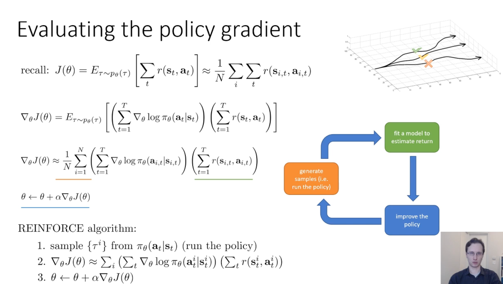

## 0. Meta
- Course: CS 285, Reinforcement Learning
- Date: 2025.12.
- Lecturer: Sergey Levine
- Source/Link: (https://www.youtube.com/watch?v=GKoKNYaBvM0&list=PL_iWQOsE6TfVYGEGiAOMaOzzv41Jfm_Ps&index=15)

---

## 1. Big Picture (one-sentence summary of this lecture)
<!-- 오늘 강의의 핵심 메시지/주제 한두 줄 -->
- 

---

## 2. Key Concepts
<!-- 중요한 용어 / 개념 리스트업 (정확한 정의가 아니어도 됨, 나중에 수정 가능) -->
- $P(\tau)$ = $P_\theta(\tau\)$
- Monte Carlo (MC) estimation
    - By taking the sample mean of multiple draws, we can do a MC estimation
- Maximun Likelihood (ML) vs Policy Gradient (PG)
 - ML: Consider action of data $a$ as a correct answer and unconditionaly increase $\log \pi_\theta(a|s)$
 - PG: The sample action has no guarantee of a correct answer. Increasing probability of trajectory with big reward, reducing probability of trajectory with small reward.
- At the policy gradient, reducing variance is really important.
-  Marcov property (MC property) vs Causality
 - MC property: The sate in the future is independent of the state in the past givent the present. And MC property is sometimes true somtimes not depending on your temporal porcess
 - Causality: The policy at time $^\prime$ cannot affect the reward at another time step $t$ if $t$ < $t^\prime$. And Causality is always true
---

## 3. Important Equations / Diagrams
<!-- 수식, 그림/도식 설명. 수식은 LaTeX로 적어두면 나중에 재사용하기 좋음 -->
- Equation:
  - 
- Notes:
  - 

---

## 4. Main Logic / Algorithm Steps
<!-- 강의에서 설명한 절차, 알고리즘 흐름을 단계별로 정리 -->
- Policy gradient

    1. Approximate $J(\theta)$ to sample
    2. Approximate gradient to sample. -> Change expectation to sample mean
    3. update!

---

## 5. Examples from the Lecture
<!-- 강의에서 든 예시, 직관, 비유, 데모 정리 -->
- Example 1:
- Example 2:
- Intuition: 

---

## 6. My Confusions & Clarifications
<!-- 강의 들을 때 헷갈린 것들 + 나중에 찾아보고 이해한 내용 -->
### 6.1 What I didn’t understand (at first)
- When estimating the expectation($J(\theta)$), using sample mean can have high variance. Is it fine to use the sample avarage?
- When derivating probability, why they change probability to log probability

### 6.2 What I found later (from web search, GPT, and books)
- When estimating the expectation($J(\theta)$), theusing sample mean can have high variance. Is it fine to use the sample avarage?
    - Estimating means unbiased+LLN (Law of large number)
    - The estimating which we use is $\hat J(\theta)=\frac{1}{N}\sum_{i=1}^N R(\tau_i)$. htis estimation is unbiased so everagly correct the answer.
    - When the N increase $\hat J(\theta)$ is converge to $J(\theta)$ because of the LLN
- When derivating probability, why they change probability to log probability
    - Original formula is $\nabla_\theta J(\theta)=\int \nabla_\theta p_\theta(\tau)\, r(\tau)\, d\tau$
    - $p_\theta(\tau)=p(s_1)\prod_t \pi_\theta(a_t|s_t)\,p(s_{t+1}|s_t,a_t)$ there is circumstance trasition
    - So when you use log-derivation trick. That formula become $\nabla_\theta \log p_\theta(\tau)=\nabla_\theta\Big(\log p(s_1)+\sum_t \log \pi_\theta(a_t|s_t)+\sum_t \log p(s_{t+1}|s_t,a_t)\Big)$. In this formula, only $\pi_\theta$ rely on the $\theta$
    - So it becomes model-free and circumstance disappear

---

## 7. Connections
<!-- 이 강의 내용이랑 연결되는 것들: 이전 강의, 다른 과목, 내 연구/프로젝트 등 -->
- Relation to previous lectures:
- Relation to my projects/research:
- Real-world / paper connections:

---

## 8. Keywords to Search Later
<!-- 더 깊게 보고 싶은 키워드, 논문 키워드, 용어 -->
- 
- 

---

## 9. Action Items / TODO
<!-- 다음에 할 것들 체크리스트 -->
- [ ] 슬라이드 다시 보기 (시간: )
- [ ] 과제/코드에 이 개념 적용해보기
- [ ] 관련 논문/블로그 하나 찾아 읽기: 