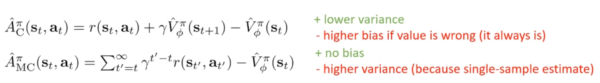
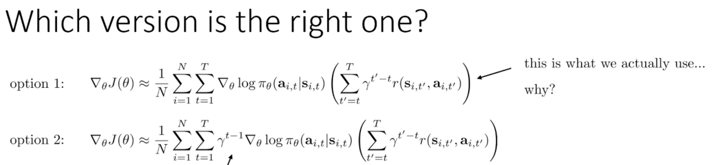

## 0. Meta
- Course: CS 285, Reinforcement Learning
- Date: 2025.12.26
- Lecturer: Sergey Levine
- Source/Link: https://www.youtube.com/watch?v=wr00ef_TY6Q&list=PL_iWQOsE6TfVYGEGiAOMaOzzv41Jfm_Ps&index=21

---

## 1. Big Picture (one-sentence summary of this lecture)
<!-- 오늘 강의의 핵심 메시지/주제 한두 줄 -->
- This lecture connects policy gradients to value functions, showing how actor-critic methods use a learned critic as a baseline or TD advantage to reduce variance. 
- And how practical designs introduce and manage bias-variance trade off

---

## 2. Key Concepts
<!-- 중요한 용어 / 개념 리스트업 (정확한 정의가 아니어도 됨, 나중에 수정 가능) -->
- **$\hat{Q_{i,t}}_t$**: It estimates of expected reward if we take action $a_{i,t}$ in state $s_{i,t}$
    - It made by a single rollout so it would have big variance
- **Discount factor ($\gamma$):** Better to get rewards sooner than later. Usually set the discount factor 0.99~0.999

- **Baseline($b$):** Subtract mean expected value from the reward which agent got ($G_t$, Reward-to-go)
    - It usually use Value Function ($V(s)$) which the everage of reward to get at the state $s$
    - If all the rewards from my actions have positive (+) value, if there's no baseline, algorithm might think "all the actions are good. increase all the probablity". eventhought some action is better than others, also some action is worse than others. So speed of finding a optimal policy will be really slow and gradient might not be stable
    - Judge good or not comparing with everage

- **Actor-Critic algorithm**
    - What Actor and Critic do?
        - Actor: It's policy ($\pi_\theta(a|s)$). It decides which action will we do?
        - Critic: It's value function $\hat{V}_\phi(s)$. Scoring doing the action was good or not after watching the action which Actor did.
        - Reduce variance of policy gradient
    - Equation of advantage in this algorithm is $r + \gamma \hat V(s') - \hat V(s)$. This equation is TD Error. 
        - $r + \gamma \hat V(s')$: This equation is TD Traget. The sum of immediate reward $r$ at the state $s$ and discounted expected future value ($\gamma V^(s′)$) from the next state. iIt represents the estimate of the actual outcome 
        - $\hat V(s)$: This equation is Baseline. Before doing action, expected everage value which I will get at the state $s$
        - Due to use TD Error, you can estimate Q-value even go 1 step and decrease variance because of you don't need to sum reward of whole episode.

- **Replay Buffer:** 
    - Limitation of online 1-sample update
        - Online 1-sample update method calculates gradient with only 1 sample. So there's too big noise and high variance. Also data getting sequensly is quite similar each others. So they're making the model biased
    - Using Replay Buffer
        - Stacking the reward getting after doi action following the previous policy at the bufferand when they train, randomly pick batch and update Actor and Critic through the SGD
        - Result of using Replay buffer, correlations between data are broken because of using randomly mixed data
    - Off-policy ploblem appear
        - Thanks to buffer, training is stable but we cannot evaluate how much the action when I did at the past is good. Because that action made by past policy not current policy.
    - Change $V$ to $Q$
        - Change the shape of the critic to total expected reward $Q$ from everage $V$. 
        - $V$ just represent the average value of actions under the current policy, whereas $Q$ can evaluate any specific action regardless of the current policy's preference

- **Eligibility traces vs n-step return**

    - MC advantage
        - Lower biased 
        - Higher variance because full traectory
    - Critic (1-step TD) advantage
        - Low variance
        - Can be biased if $\hat V$ is inaccurate
    - So they mix tegether to trade off bias and variance!
        - n-step return: Use real rewards for thr first $n$ step, and bootstrap with $\gamma^n \hat V(s_{t+n})$
        - this keeps the target more realistic than 1-step TD while prevent variance from exploding like MC

---

## 3. Important Equations / Diagrams
<!-- 수식, 그림/도식 설명. 수식은 LaTeX로 적어두면 나중에 재사용하기 좋음 -->
- Value function
    - State-Value Function $V^\pi(s_t)$: The total expected reward from $s_t$ when you following policy $\pi$ thereafter
    - Action-Value Function $Q^\pi(s_t,a_t)$: The total expected reward from taking $a_t$ in $s_t$ when you  following policy $\pi$ thereafter
    - Advantage Function $A^\pi(s_t,a_t)$: How much better $a_t$ is as compared to the average performance of your policy pi in state $s_t$

---

## 4. Main Logic / Algorithm Steps
<!-- 강의에서 설명한 절차, 알고리즘 흐름을 단계별로 정리 -->
1. REINFORCE uses a single sample estimate from a single rollout to approximate a very complex expectation, so because the policy and the MDP have randomness, the estimator has very high variance
2. In policy gradient methods, we can subtract a baseline $b(s_t)$ and the expected policy gradient does not change. The baseline can depend on the state and it's safe, but if it depends on the action it can lead to bias.
3. Fitting a Q function or and A function is harder because they depend on both the state and the action, so you need more samples. However $V^\pi(s)$ depends on the only state so it's more convenient to fit and more sample efficient. So lets fit $V^\pi(s)$ first and then derive the advantage approximately
4. Two common target to fit $V^\pi(s)$
    - MC evaluation
        - pros: Unbiased
        - cons: High variance because it uses the sum of rewards along the remainder of the trajectory. (especially for long trajectory)
    - TD evaluation
        - pros: Lower variance. Because it uses the current reward plus the value of the next state
        - cons: It can have higher biase if $\hat V^\pi$ Is incorrect
---

## 5. Examples from the Lecture
<!-- 강의에서 든 예시, 직관, 비유, 데모 정리 -->

- option 2
    - It assume that future's decision is less important than current one.
    - So it discountes both return and timestep contribution.
- option 1
    - The size of update is same for every timesteps. So discount only reward
    - Future rewards are discounting from the timestep $t$
- Conclusion
    - They use $\gamma$ to prevent values from diverging in the infinite horizon
    - When the $t$ increase, future policy almost cannot get update because of $\gamma^{t-1}$ is keep smaller
    - So we typically use Option 1! Because we want to judge action $t$ using the result after time $t$. And it's same of $Q(s_t,a_t)$.
    - Also option 1 tends to be more stable and faster in training
    - Online 1-sample updates are too unstable for Deep RL. sSo they's why we apply batches via Replay Buffer or Parallel workers!
---

## 6. My Confusions & Clarifications
<!-- 강의 들을 때 헷갈린 것들 + 나중에 찾아보고 이해한 내용 -->
### 6.1 What I didn’t understand (at first)
- 

### 6.2 What I found later (from web search, GPT, and books)
- 

---