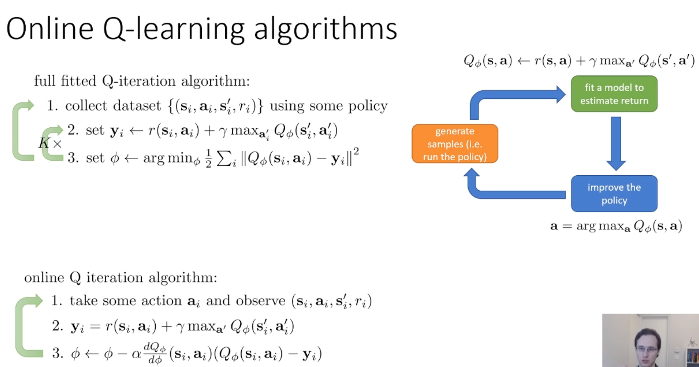

## 0. Meta
- Course: CS 285, Reinforcement Learning
- Date: 2025.12.28
- Lecturer: Sergey Levine
- Source/Link:  https://www.youtube.com/watch?v=pP_67mTJbGw&list=PL_iWQOsE6TfVYGEGiAOMaOzzv41Jfm_Ps&index=26

---

## 1. Big Picture (one-sentence summary of this lecture)
<!-- 오늘 강의의 핵심 메시지/주제 한두 줄 -->
- This lecture is motivated by the question: Is it enough to learn only a value/Q function, without explicitly learning a policy?

- Even without directly learning a policy, if we learn the Q-function well, we can derive actions via $\arg\max$. However, in real environments, we typically cannot rely on a known model, compute expectations exactly, or use tabular representations. Therefore, we use samples and function approximation to regress onto Bellman backup targets (e.g., Fitted Q-Iteration and Q-learning), but then convergence is not theoretically guaranteed.
<!--정책 경사 없이 가치만 쓰자 → 모델 기반이면 Bellman optimality backup으로 Q-iteration 가능 → 실제 환경에서는 전이확률을 모르니 샘플로 backup을 근사해야함 → Q-iteration → 실제 환경에서는 state 수가 너무 많아 (고차원이라) tabular 불가능함 특히 continuous한 환경에서는 안됨. 그러니 target을 함수 근사로 회귀해서 맞춰보자 → Fitted Q-iteration  → 배치로 여러 샘플을 모으지 말고 전이 1개를 온라인으로 한스텝씩 끊어서 업데이트 하자 (Q-learning)-->

--- 

## 2. Key Concepts
<!-- 중요한 용어 / 개념 리스트업 (정확한 정의가 아니어도 됨, 나중에 수정 가능) -->
- **Environment Model (=Transition Dynamics)** 
  - It represents the probability of trasitioning to the next state $s'$ give that the agent takes action $a$ in the current state $s$
  - $P(s' | s, a)$
- **off-policy vs on-policy**
  - on-policy: The policy($\pi$) currently being improved must be identical to the policy actually collecting data in the environment (e.g. Policy gradient, SARSA)
  - off-policy: The policy for collecting data (behavior policy) and the policy currently being trained/improved (Target policy) can be different. this allows for high data efficiency, as past data or data from others can be reused.
- **online algorithm** 
  - Update often when the new trasition comes
  - The circumstance comes like a shape of data stream so it's natural
  - Apply easily with memory efficient and calculate lightly
- **Bellman optimality**
  - Definition: Self-consistency condition that the optimal value function must satisfy "If you act optimally, then the value of a state or state-action pair equals the immediate reward plus the discounted optimal value of the next state"
  - Equations
    - Optimal state value $V^*$:$V^*(s)=\max_a \Big[r(s,a)+\gamma \,\mathbb{E}_{s'\sim p(\cdot|s,a)}[V^*(s')]\Big]$
    - Optimal state value $Q^*$: $Q^*(s,a)=r(s,a)+\gamma \,\mathbb{E}_{s'\sim p(\cdot|s,a)}\Big[\max_{a'} Q^*(s',a')\Big]$
- **Fitted Q-Iteration (FQI)** 
  - FQI is value-based RL method that approximates the action-value function with a neural network $Q_\phi(s,a)$ and trains it by regressing to Bellman optimality targets
  - Make taget $y=r+\gamma\max_{a'}Q(s',a')$ using data ($s, a, s', r$) and minimize MSE to make $Q(s,a)\approx y$
  - As $Q_\phi$ gets closer to the Bellman-optimal fixed point ($Q^*$), the greedy policy improves
  - Why FQI is off-policy?
    - Policy only evaluated by target of $\max_{a'}Q(s',a')$, even though the data not comes from current policy, you can derive the greedy policy!
    - So data efficiency is higher because you can reuse sample 
- **Non-tabular value function learning (Q-learning)**
  - Value iteration is the sequence of "Making a Q table - Update $V$ from max value of each state". Bellman operator $B$ is the process of this iteration. We can represent this process as a equation of $V_{k+1}​=BV_k$
  - Because $\mathcal{B}$ is a contraction in $\|\cdot\|_\infty$, repeated application $V_{k+1}=\mathcal{B}V_k$ converges to the unique fixed point $V^*$ (tabular case)
    - $V^*$ is a value function of optimal policy. and $V^*$ is the unique fixed point of $B$
    - Contraction is characteristic of decreasing a length (difference) like $\|\mathcal{B}V - \mathcal{B}\bar V\| \le \gamma \|V-\bar V\|$ for random vector $V, \bar V$. In this equation $\gamma\in(0,1)$ so guaranteed to be convergence.
  - $\Pi$ (Projection operator): The process of estimation to neural network. It's a contraction at L2-norm
- **epsilon-greedy**
  - Select greedy action as a probability of 1-$\epsilon$, select random action as a probability of $\epsilon$
  - If the $\epsilon$ is small, less exploration and more exploitation. So current Q select action which consider as a optimal action.
  - If the $\epsilon$ is large, more exploration and less exploitation. So current Q do randomly diverse action but less probability to select greedy action short-term performance can be decrease!
  - So usually use epsilon decay which use large $\epsilon$ at the initial of training and decrease epsilon gradually!
  
---

## 3. Important Equations / Diagrams
<!-- 수식, 그림/도식 설명. 수식은 LaTeX로 적어두면 나중에 재사용하기 좋음 -->

- full fitted Q-iteration algorithm
  - Equation:
    1. Data collecting: $D=\{(s_i,a_i,s'_i,r_i)\}$
    2. Calculate target: $y_i \leftarrow r(s_i,a_i)+\gamma \max_{a'}Q_\phi(s'_i,a')$
    3. learn Q by regression: $\phi \leftarrow \arg\min_\phi \frac12\sum_i \|Q_\phi(s_i,a_i)-y_i\|^2$
    Iterate these 3 steps!

- Online Q-iteration algorithm (Q-learning)
  - Equations:
    1. Take one action and observe one transition: $(s_i, a_i, s'_i, r_i)$
    2. Compute the target for this transition:
       $$y_i = r(s_i, a_i) + \gamma \max_{a'} Q_\phi(s'_i, a')$$
    3. One SGD update step:
       $$\phi \leftarrow \phi - \alpha \, \nabla_\phi Q_\phi(s_i, a_i)\, \big(Q_\phi(s_i, a_i) - y_i\big)$$
    - TD error:
      $$\delta_i = y_i - Q_\phi(s_i, a_i)$$

---

## 4. Main Logic / Algorithm Steps
<!-- 강의에서 설명한 절차, 알고리즘 흐름을 단계별로 정리 -->
- **Policy iteration**

  1. Policy evaluation: Getting $V^\pi$ or $Q^\pi$ of current policy $\pi$ to calculate Advantage
  2. Policy improvement: Literally improve the policy using $\pi'(s) = \arg\max_a A^\pi(s,a)$ equation. Prof said that if the discrete action, argmax is easy

- **The overall flow**
1. Omit Policy Gradients: Move from an explicit policy network to an implicit greedy policy by taking $\arg\max$ over an advantage / Q-value.
2. Known-dynamics (tabular DP): If transition dynamics are known, apply Bellman optimality backups exactly (value/Q iteration).
3. Model-free setting: In the real world, transitions are unknown and we cannot “teleport” to the same state to try all actions, so we approximate Bellman backups using sampled tuples $(s,a,s',r)$.
4. Tabular vs. High-dimensional Spaces: Tabular representations break in high-dimensional or continuous state spaces (curse of dimensionality), motivating function approximation (neural networks).
5. Fitted Q-Iteration (FQI): Use a function approximator $Q_\phi$ and regress it onto Bellman optimality targets $y=r+\gamma\max_{a'}Q_\phi(s',a')$ computed from samples.
6. Online Q-learning (Watkins): Instantiate FQI as an online, single-transition update method—compute a target from one transition and take one gradient step (TD error update), enabling off-policy data reuse.

---

## 5. Examples from the Lecture
<!-- 강의에서 든 예시, 직관, 비유, 데모 정리 -->
- **Q-learning cycle**

1. Generate samples: $(s_i,a_i,s'_i,r_i)$
2. Fit a model to estimate return: $Q_\phi(s,a) \leftarrow r(s,a) + \gamma \max_{a'} Q_\phi(s',a')$
3. improve the policy greedy: $a = \arg\max_a Q_\phi(s,a)$ 
---

## 6. My Confusions & Clarifications
<!-- 강의 들을 때 헷갈린 것들 + 나중에 찾아보고 이해한 내용 -->
### 6.1 What I didn’t understand (at first)
- why we need model when we update $V(s)$
- What is the infinity norm?
- What is the Tabular
- Why we can't compute the expectation exactly from samples

### 6.2 What I found later
- why we need model when we update $V(s)$
  - 정확한 가치 $V(s)$를 구하려면 모든 가능성에 대한 가치의 평균(기댓값)을 내야하는데, 이때 각 상태로 갈 확률이 얼마인지 모르면 평균을 계산할 수 없음
  - 하나의 상태 s에서 나올 수 있는 행동 중 어떤 행동이 제일 좋은지 알기 위해서는 모든 행동을 다 고려해봐야 함. 모델이 있으면 시뮬레이션을 돌려보고 최댓값을 고를 수 있지만 모델이 없다면 시간을 돌려가며 동일한 상태에서 행동들을 다 해볼 수 없기 때문에 Max 계산을 할 수 없음
  - **Conclusion:** V(s)는 스테이트에 대해 액션을 선택해야하지만 Q(s,a)는 상태 s에서 행동 a를 했더니 나온 결과가 나와있기 때문에 결과만 보고 업데이트 하면 된다. 

- What is the infinity norm?
  - The infinity norm (max norm) of a vector is the absolute value of its largest entry.
  - For the difference between two value functions:
    $$\|V - \bar V\|_\infty = \max_{s} |V(s) - \bar V(s)|$$
    - It focuses on the *largest* error over all states (worst-case error).
  - Bellman optimality operator is a contraction in the infinity norm:
    $$\|\mathcal{B}V - \mathcal{B}\bar V\|_\infty \le \gamma \, \|V - \bar V\|_\infty$$
    - This implies each Bellman update shrinks the worst-case error by at least a factor of $\gamma$.
    - Therefore, repeatedly applying $\mathcal{B}$ makes $V$ converge to the unique fixed point $V^*$ (in the tabular case).

- What is the Tabular
  - The way how save action or state-action pair as a table. If there is states of $N$, $V$ is a vector length of $N$
  - Tabular $V$: If there are $N$ states, store the state-value function $V(s)$ in a table (array) of length $N$, with one entry per state
  - Tabular $Q$: If there are $N$ states and $M$ actions, store the action-value function $Q(s,a)$ in a table (matrix) of size $N×M$, with one entry per state–action pair

- Why we can't compute the expectation exactly from samples
  - The expectation depends on the full distribution, not one draw.
  - So we can only estimate the expectation using sample averages, not exactly compute
---
