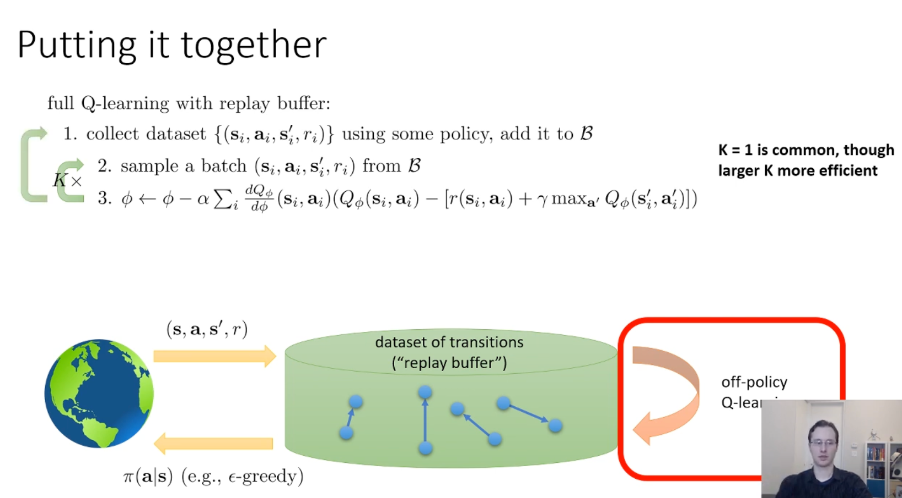
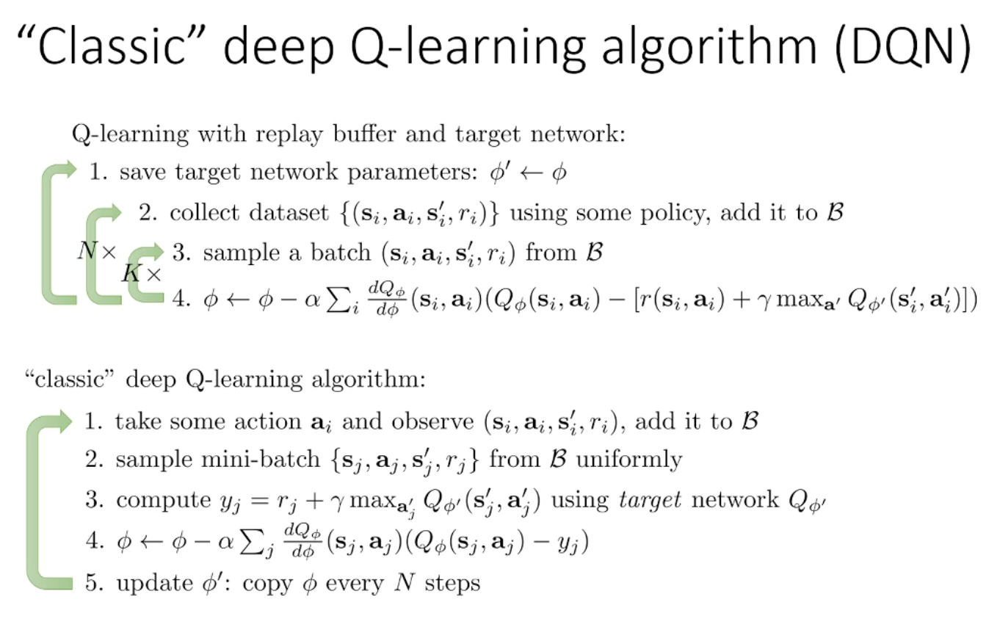
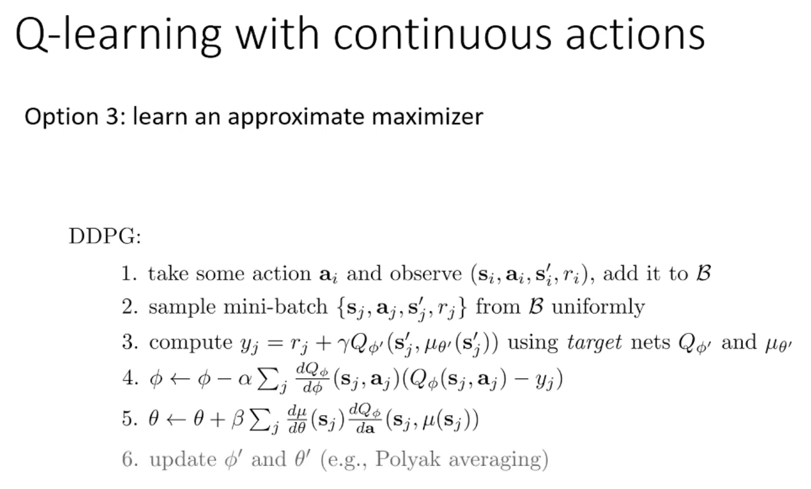

## 0. Meta
- Course: CS 285, Reinforcement Learning
- Date: 2025.01.02
- Lecturer: Sergey Levine
- Source/Link: https://www.youtube.com/watch?v=7-D8RL3D6CI&list=PL_iWQOsE6TfVYGEGiAOMaOzzv41Jfm_Ps&index=30

---

## 1. Big Picture (one-sentence summary of this lecture)
<!-- 오늘 강의의 핵심 메시지/주제 한두 줄 -->
- This lecture introduces practical optimization techniques, such as Replay Buffers and Target Networks, to mitigate the instabilities that arise when applying value-based methods to deep reinforcement learning

---

## 2. Key Concepts
<!-- 중요한 용어 / 개념 리스트업 (정확한 정의가 아니어도 됨, 나중에 수정 가능) -->
- **IID (Independent and Identically Distributed):**
    - Each data sample is Independent/ Identically Distributed each other
    - At the Online Q-learning, $s_t, s_{t+1}, ...$ are continous state and connected each other. So they are not Independent and distribution is keep changing. That's why IID asumption is destory on online Q-learning
- **SGD (Stochastic Gradient Descent)**
    - Instead of computing the gradient on the entire data set, we use a method to approximate and update it using a subset (or even just one) of the sample
- **Replay buffer** 

    - If the function approximator had seen all transitions at once, it might have fit them well. But instead, it only ever sees a small, highly correlated window, which gives it just enough time to overfit and not enough context to generalize
    - steps
        1. collect dataset $(s, a, s', r)$ using some policy, add it to $(B)$
        2. Sample a batch $(s, a, s', r)$ from $B$
        3. Compute target value for each transition and Q-function update by batch per batch so that we can get lower variance
        - We can repeat step2, 3 K times but if the K is larger it will be more efficient. Or If the K is 1 and collect many datas that's the classic Deep Q-learning
    - Replay buffers have a limited size, so we sometimes evict old data periodically (e.g., by using a ring buffer)

- **Polyak averaging**
    - uneven lag problem: When the target network is copied all at once at fixed intervals, he amount of lag vsries significantly. Right after an update, the lag is very small, while just before the next update, the lag can become vary large, which may make training unstable.
    - Soft update (Polyak Averaging): To solve htis issue, Polyak averaging updates the target network slightly and smoothly at every step
    - equation: $\phi' \leftarrow \tau \phi' + (1 - \tau)\phi$
    - In this equation we usualy use large value of $\tau$ like 0.999 to make target network update current network really slowly and stable
- Overestimation problem in Q-learning
    - In the TD target ($y = r + \gamma \max_{a'} Q_{\phi'}(s',a')$), max choice the large noise value because max usually choice coincidently positive noise.
    - So overestimation problem cause because of action and value are from the same policy $Q_{\phi'}$
- **Double Q-learning**
    - Overestimation problem is from  choicing action and evaluation the value of action using same network
    - So they suggest the choicing the action using single network but evaluating a value of the action using different network
        - 선택: $\arg\max_{a'} Q_{\phi}(s',a')$
        - 평가: $Q_{\phi'}(s', \arg\max_{a'} Q_{\phi}(s',a'))$
- **Multi-step returns**
    - Early in training, the Q-function is very bad / essentially random, so the learning signal mostly comes from the reward $r$, and the bootstrap term can act like noise
    - Instead of a 1-step backup $\;r_t + \gamma \max_{a'} Q(s_{t+1}, a')$, using an n-step return sums multiple real rewards and can speed up learning early on.
    - Works best when the data is mostly on-policy (and the action space is small), because intermediate actions in the n-step trajectory should match what the current policy would do.
    - N-step return은 on-policy이기 때문에 off-policy로 만드는 방법에 대해 생각해 봐야함.
- The problem in the continous space
    - In continuous action spaces, the hard part is the $\arg\max / \max$ over actions
    - sol.1: stochastic optimization
        - Random sampling: sample $N$ candidate actions , evaluate $Q(s,a)$ for each, and take the best one. Simple + parallelizable, but becomes inaccurate as action dimension grows
        - CEM (Cross-entropy method): repeatedly sample actions, then refine the sampling distribution toward regions that produced high Q-values, and repeat (fast if you can parallelize and actions are low-dim)
        - CMA-ES: More sophisticated stochastic optimizer (like a fancier CEM); works reasonably well up to ~40D action spaces
    - sol.2: Use function class that is easy to optimize
        - NAF (Normalized Advantage Function) structure: design Q so that, for a fixed state, it is quadratic in the action.
    - sol.3: Learn an approximate maximizer
        - DDPG
            - design $Q$ so that, for a fixed state, it is quadratic in the action.
            train another network $\mu_\theta(s)$ so that $\mu_\theta(s)\approx \arg\max_{a} Q_{\phi}(s,a)$. Then compute targets using target networks: $$y_j = r_j + \gamma Q_{\phi'}\!\big(s'_j, \mu_{\theta'}(s'_j)\big)$$,

---

## 3. Important Equations / Diagrams
<!-- 수식, 그림/도식 설명. 수식은 LaTeX로 적어두면 나중에 재사용하기 좋음 -->
- N-step returns
$$y_{j,t}
=
\sum_{t'=t}^{t+N-1} \gamma^{\,t'-t}\, r_{j,t'}
\;+\;
\gamma^N \max_{a_{j,t+N}} Q_{\phi'}\!\left(s_{j,t+N}, a_{j,t+N}\right)$$

1. 앞으로 N스텝 동안 실제로 받은 보상들을 discount 해서 더함
$$\sum_{t'=t}^{t+N-1} \gamma^{\,t'-t}\, r_{j,t'}$$
2. N스텝 뒤 상태에서의 남은 미래를 타깃 네트워크로 부트스트랩
$$+\ \gamma^N \max_{a} Q_{\phi'}(s_{t+N}, a)$$
---

## 4. Main Logic / Algorithm Steps
<!-- 강의에서 설명한 절차, 알고리즘 흐름을 단계별로 정리 -->
- **Q-learning**

    - Q-learning with Repaly buffer + Traget Network
        1. Save target network parameters: Copy the current network parameters $\phi$ to the target network $\phi'$. so that $\phi' \leftarrow \phi$
        2. Collect Dataset: Use a policy to collect $(s_i, a_i, s'_i, r_i)$ transition paris and add them to the replay buffer $B$
        3. Sample a batch: Randomly sample a batch of data from the $B$ to be used for training
        4. Update Parameters: Update the parameters of the current Network $Q_\phi$ based on target values calculated using the target network $Q_{\phi'}$
        Loop structure: Step 3 and 4 are repeated K times. After the inner loop completes, the algorithm returns to Step 2 to collect more data. This entire process is performed N times before the target network is updated again in Step 1
        - If you set the K as 1, It's totally same as "Classic Deep Q-learning"
    - Classic Q-learning (DQN)
        1. Take Action and observe: Excute and action $a_i$ in the environment, observe the resulting transition $(s_i, a_i, s'_i, r_i)$ and add it to the buffer $B$
        2. Sample Mini-batch: Uniformly sample a mini-batch $(s_j, a_j, s'_j, r_j)$ from the $B$. This random sampling helps to break the correlation between sequential samples.
        3. Compute target: Calculate the target value, which serves as the ground truth for the regression, using the target network
        4. Update current network: Update the current network paremetes $\phi$ to minimize the error between $Q_\phi$ and the previously caculated target $y_j$
        5. Copy target Network: Every N steps, copy the current parameters $\phi$ to the target network $\phi'$. This stabilizes training by resolbing the moving target proble

- DDPG

1. Data collection and buffer storage: The agent takes an action a_i in the environment, observes the resulting transition $(s_i, a_i, s'_i, r_i)$, and stores this transition in the replay buffer $B$
2. Mini-batch sampling: A mini-batch of transitions $(s_j, a_j, s'_j, r_j)$ is sampled uniformly at random from the replay buffer $B$
3. Target value calculation: For each sampled transition, the target value is computed using the target networks: $$y_j = r_j + \gamma Q_{\phi'}\bigl(s'_j, \mu_{\theta'}(s'_j)\bigr)$. Here, $Q_{\phi'}$$ is the target Q-network and $\mu_{\theta'}$ is the target policy network. Using separate target networks helps mitigate the moving target problem and improves training stability
4. Update critic: Perform a gradient update on the parameters $\phi$ of the current Q-network (the critic) by minimizing the error between the predicted Q-value and the target $y_j$
5. Update actor: The parameters $\theta$ of the policy network (actor) are updated to maximize the Q-value
---

## 5. My Confusions & Clarifications
<!-- 강의 들을 때 헷갈린 것들 + 나중에 찾아보고 이해한 내용 -->
### 5.1 What I didn’t understand (at first)
- Why the Q-learning update rule resembles gradient descent but is not actually true gradient descent

### 5.2 What I found later
- Why the Q-learning update rule resembles gradient descent but is not actually true gradient descent
    - In the target definition $$y_i = r_i + \gamma \max_{a'} Q_\phi(s'_i, a')$$ the Q-function Q_\phi itself appears inside the target. However, during the actual update, gradients are not backpropagated through the Q-function used in the target term. 
    - As a result, the chain rule is broken, and the update is not the gradient of any well-defined objective function.