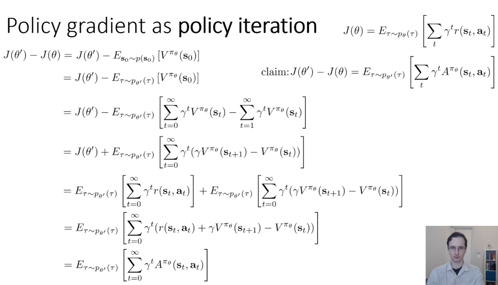
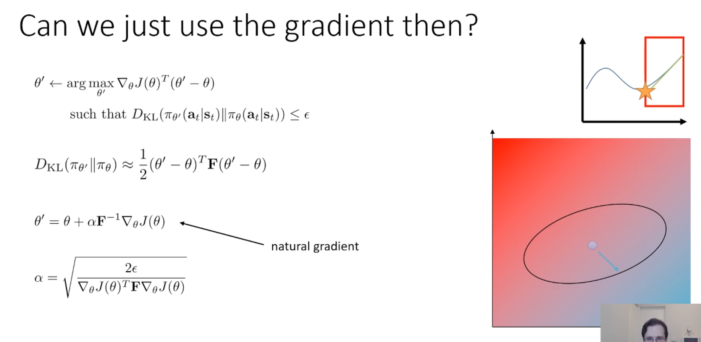

## 0. Meta
- Course: CS 285, Reinforcement Learning
- Date: 2026.01.03
- Lecturer: Sergey Levine
- Source/Link: https://www.youtube.com/watch?v=ySenCHPsKJU&list=PL_iWQOsE6TfVYGEGiAOMaOzzv41Jfm_Ps&index=36

---

## 1. Big Picture (one-sentence summary of this lecture)
<!-- 오늘 강의의 핵심 메시지/주제 한두 줄 -->
- Policy gradient는 “soft policy iteration”으로 해석할 수 있고, state-distribution mismatch 때문에 “정책이 가까울 때만” surrogate가 $J$를 잘 근사하므로, KL trust region(=constraint)을 두거나 그 근사인 natural gradient(Fisher preconditioning)로 안정적 업데이트를 한다.
---

## 2. Key Concepts
<!-- 중요한 용어 / 개념 리스트업 (정확한 정의가 아니어도 됨, 나중에 수정 가능) -->
- **Policy gradient (PG) vs Policy iteration (PI)**   
    – PG:
        1. advantage $\hat A^\pi$ 추정
        2. $\nabla_\theta \log \pi_\theta(a|s)\hat A$ 로 확률을 부드럽게 이동(soft improvement)
    - PI: 
        1. policy evaluation으로 $V^\pi$ 또는 $Q^\pi$를 추정
        2. greedy 개선 $\pi'=\arg\max_a Q^\pi(s,a)$
    - So both algorithm have same roof!
    - 두 알고리즘 모두 Advantage가 큰 action의 확률을 올리고 작은 action의 확률을 낮추는 개선을 반복한다
    - Tequnically PG following PI but follow slowly (softly). So If you suddenly change the policy, if the calcuation of advantage is little wrong, the policy will totally destroy
- State distribution mismatch
    - $p_{\theta'}(s_t)$ 때문에 surrogate 최적화가 근사가 됨
    - $p_{\theta'}(s_t)$ 대신 $p_\theta(s_t)$ 로 바꿔쓴 surrogate objective가 성능 개선을 잘 근사하려면 새 정책 $\pi_{\theta'}$ 가 옛 정책 $\pi_\theta$ 와 가까워야 한다($\epsilon$ 이 작아야 한다)
    - 하지만 이전 정책과 가깝게 만들기 위해 Total variation (TV)로 제한하는건 실제 정책 클래스에서 계산 및 최적화가 어렵다. 왜냐하면 TV는 매끈하지 않기 때문에 미분을 하지 못해서 다루기 불편함
    - TV대신 KL divergence로 제약을 걸자! 그리고 KL을 작게 만들면 TV도 작아진다.
    - KL trust region 안에서 surrogate를 최대화 -> TRPO/PPO
- Performance difference Lemma
    - 이전 정책의 advantage를 새 정책의 분포 아래에서 많이 얻을수록 성능이 오른다
- Natural Gradient (Constrant using KL Divergence)
    - valilla gradient ascent는 parameter space에서 circular 제약 아래에서 최적 $\Delta\theta$ 를 고르는 것
    - 하지만 RL에서 필요한 건 parameter 변화량을 제어하는것이 아닌 정책 분포 변화량 (KL)을 제어하는 것
    - 파라미터마다 정책 확률에 미치는 민감도가 다르기 때문에 $\|\Delta\theta\|$ 작아도 KL이 커질 수 있음 → 불안정
    - KL은 가정을 $\theta' = \theta$ 에서 하고, 두 정책이 완전히 같다면 차이는 0이고 최소값이다. 이는 최소점이기 때문에 기울기는 0이 나오게 된다.
    - 따라서 이를 1계 미분하게 되면 0이 나오기 때문에 곡률을 알기위해 2차 미분을 하고 근사를 통해 Fisher 행렬을 얻는다.
    - Natural gradient equation ($\theta' = \theta + \alpha\, F(\theta)^{-1}\nabla_\theta J(\theta)$)에서 F의 역행렬을 곱해줘서 그라디언트를 올바르게 재스케일하여 정책이 너무 급격히 변하지 않도록 해준다

---

## 3. Important Equations / Diagrams
<!-- 수식, 그림/도식 설명. 수식은 LaTeX로 적어두면 나중에 재사용하기 좋음 -->
- PG as PI

1. 목표 설정
    - $J(\theta') - J(\theta)$
    - 새 정책의 점수에서 이전 정책의 점수를 뺀 값을 구해보자. 개선량을 구해보자.
2. 기댓값의 기준 변경
    - $E_{s_0 \sim p(s_0)}$에서 $E_{\tau \sim p_{\theta'}(\tau)}$ 로 변경됨
    - 초기 상태 $s_0$는 어떤 정책을 사용해도 동일한 분포에서 나오기 때문에 변경 가능함
    - 변경함으로써 새로운 정책($\\pi_{\theta'}$)이 수집할 궤적 ($\tau$)에 대한 기댓값으로 계산 가능
3. Telescoping sum
    - $V^{\pi_\theta}(s_0)$를 t=0부터 무한대까지의 합과 t=1부터 무한대까지의 합의 차이로 표현
    - 이를 정리하면 $\sum \gamma^t (\gamma V^{\pi_\theta}(s_{t+1}) - V^{\pi_\theta}(s_t))$ 나옴
4. Get Advantage
    - From the 4th line, $J(\theta')$의 정의 $(\sum \gamma^t r_t)$ 의 기댓값을 대입
    - 보상 ($r_t$)과 만든 $V$관련 항들을 하나로 묶음
- 새로운 정책이 얻을 보상의 합($J(\theta')$)은 예전 정책의 이점 ($A^{\pi_\theta}$)을 새 정책의 분포 하에서 더한 만큼 예전 정책보다 좋아진다.
- 그래서 $J(\theta')$가 얼마인지 직접 계산하는 것 대신 이미 알고있는 $A^{\pi_\theta}$를 새로운 정책 ($\pi_{\theta'}$)하에서 최대화하기만 하면 강화학습의 최종 목표($J$ 최대화)를 달성

- Performance Difference Lemma
    - $$J(\theta')-J(\theta)=\mathbb{E}_{\tau\sim \pi_{\theta'}}\Big[\sum_{t=0}^\infty \gamma^t\, A_{\pi_\theta}(s_t,a_t)\Big]$$

- Surrogate objective
$$\bar J(\theta')=\mathbb{E}_{s\sim p_\theta,\ a\sim \pi_\theta}\left[\frac{\pi_{\theta'}(a|s)}{\pi_\theta(a|s)}\, A_{\pi_\theta}(s,a)\right]$$

- Fisher information matrix
$$F(\theta)=\mathbb{E}_{s\sim p_\theta,\ a\sim \pi_{\theta}}\left[\nabla_\theta \log \pi_\theta(a|s)\ \nabla_\theta \log \pi_\theta(a|s)^\top\right]$$

- Natural gradient
$\theta' = \theta + \alpha\, F(\theta)^{-1}\nabla_\theta J(\theta)$
---

## 4. Main Logic / Algorithm Steps
<!-- 강의에서 설명한 절차, 알고리즘 흐름을 단계별로 정리 -->
1. 기존 방법: Policy gradient (REINFORCE/Actor-critic) → Gradient니까 업데이트 해서 좋아진다가 아니라 왜 PG 업데이트가 실제로 J($\pi$)를 올린다고 확신할 수 있을까?
2. PG는 soft policy iteration임. 현재 정책의 advantage를 추정하고 advantage가 큰 쪽으로 정책을 조금씩 개선하는 스텝의 반복이다.
3. $J(\theta')-J(\theta)=\mathbb{E}_{\tau\sim \pi_{\theta'}}\left[\sum_t \gamma^t A_{\pi_\theta}(s_t,a_t)\right]$ 으로 인해 새 정책에서 이전의 advantage의 expectation을 키우면 진짜 성능이 오른다는 것을 증명함. 
4. 하지만 Distribution mismatch가 생김. 3번의 식은 기댓값이 새 정책의 상태분포 $p_\theta(s)$아래에 있음. 하지만 우리는 $\theta$를 모르니까 생플링이 불가능 하기 때문에 $p_\theta$로 계산하려면 근사를 해야함.
5. 아이디어: 정책이 가까우면 상태분포도 가까움. 즉 상태마다 정책이 조금만 달라지면 ($\epsilon$ 이 작으면) $p_{\theta'}(s_t)$와 $p_\theta(s_t)$도 크게 안 달라짐. 그렇기 때문에 업데이트를 작게 제한하면 분포가 크게 달라지는걸 제한할 수 있음
6. 결론적으로는 업데이트를 작게 제한해야함. 근데 TV로 제약은 힘들기 때문에 KL로 방법을 바꿔 TV를 간접적으로 제한하자. KL은 tractable하며 KL이 TV도 간접적으로 제한한다. -> KL trust region
7. KL제약을 직접 풀면 TRPO (panalty/clip로 근사하면 PPO). KL 제약을 2차 근사하면 natural gradient로 worng constraint를 고쳐 안정적 업데이트

---

## 5. Examples from the Lecture
<!-- 강의에서 든 예시, 직관, 비유, 데모 정리 -->

- Gradient ascent의 제약조건이 원형이 아닌 타원형으로 찌그러져 있어야하는 이유
    - 매개변수 공간 ($\theta$)와 확률 분포 공간 ($\pi$) 사이의 민감도 차이 때문
    - Original gradient ascent
        - 모든 매개변수 방향으로 동일한 거리 (L2 norm)만큼 이동하는 것을 허용함. 그 결과로 여러가지 매개변수를 동일한 수치로 변경해도 효과가 동일하게 나타남. 
        - 하지만 딥러닝 모델에서는 어떤 매개변수는 조금만 바꿔도 확률분포가 급격하게 변하고, 어떤 매개변수는 많이 바꿔도 확률변화가 거의 없을 수 있다.
    - 수정된 결론
        - 민감한 방향은 매개변수 값의 작은 변화가 정책의 행동을 크게 바꾸는 방향임.
        - 그래서 민감한 방향에서는 제약조건을 걸어 매개변수가 조금 변해도 KL 발산이 커지는 (분포가 갑자기 너무 많이 바뀌는) 것을 막을 수 있게 함
        - 반대로 둔감한 방향에서는 매개변수를 많이 바꿔도 확률 변화가 적기 때문에 타원을 길게 늘려주어 더욱 과감한 업데이트를 할 수 있도록 함

---

## 6. My Confusions & Clarifications
<!-- 강의 들을 때 헷갈린 것들 + 나중에 찾아보고 이해한 내용 -->
### 6.1 What I didn’t understand (at first)
- 왜 expectation을 $p(s_0)$ 에서 $p_{\theta'}(\tau)$ 로 바꿔도 되는지
- TV를 왜 KL로 바꿔도 되는지
- What is KL?
- 왜 2차 미분을 계산이 아닌 근사를 사용하는지?
- 왜 목적함수는 1차 근사, 제약 조건은 2차 근사를 하는지?
- 2차 근사를 하려면 어쨌든 2차 미분값을 알아야하는거 아닌지?

### 6.2 What I found later
- 왜 expectation을 $p(s_0)$ 에서 $p_{\theta'}(\tau)$ 로 바꿔도 되는지
    - 초기 상태 $s_0$ 는 환경에서 주어지는 것이기 때문에 정책과 무관함. 그렇기 때문에 어떤 정책에 대해서도 동일한 분포에서 샘플링 되기 때문이다.
- TV를 왜 KL로 바꿔도 되는지
    - TV는 절댓값 형태이기 때문에 미분을 하지 못하고 최적화에 불리함
    - KL은 기댓값 형태 (로그비)라 continuous policy에서 계산 및 근사에 이점이 있음
    - 또한 KL이 작으면 TV도 작다는 부등식 (Pinsker)을 이용해 TV를 KL을 이용하여 조절할 수 있음
- What is KL?
    - 강화학습에서 우리가 진짜로 가까워야 한다 라고 말하는건 파라미터 $\theta$ 가 아닌 정책 분포가 가까워야한다는 것. 그리고 이 행동 분포 공간에서의 변화량을 측정하는 기준
    - 예전 정책이 자주 내는 행동을 새로운 정책이 얼마나 낮은 확률로 (낯설게) 보는지의 평균
    - $D_{\mathrm{KL}}(\pi_{\theta'}\|\pi_{\theta})$
- 왜 2차 미분을 계산이 아닌 근사를 사용하는지?
    1. 원래의 식이 너무 복잡한 비선형 함수이기 대문에 이를 풀려면 수많은 반복 계산을 거쳐야 한다.
    2. 효율성: 근사를 하게되면 단 한번의 수식($\theta' = \theta + \alpha\, F(\theta)^{-1}\nabla_\theta J(\theta)$) 계산만에 업데이트를 끝낼 수 있음
    3. 먼 거리를 근사하면 부정확하지만 가까운 거리에서는 매우 정확하다. 또한 KL 제약조건 ($\epsilon$)은 아주 작은 값이기 때문에 좁은 범위 안에서의 근사치는 실제 값과 거의 일치함
    - 결론적으로 정확하지만 계산이 불가능한 방법 대신 약간의 오차는 있지만 효율적이고 성능향상이 보장되는 방법을 사용하는것이 현명하기 때문
- 왜 목적함수는 1차 근사, 제약 조건은 2차 근사를 하는지?
    - 목적함수: 1차 근사 (기울기) 만으로도 어느 방향으로 움직여야 점수가 높아지는지 충분히 알 수 있고 직선으로 만들면 최적화 문제가 훨씬 단순해짐
    - 제약 조건: 기울기가 0이기 때문에 정책이 얼마나 변하는지 알 수가 없음. 그래서 2차 미분값 (Fisher)을 포함한 2차 근사를 통해 어느 방향이 더 민감한지 확인
- 2차 근사를 하려면 어쨌든 2차 미분값을 알아야하는거 아닌지?
    - $\theta' = \theta$ 지점에서 2차 미분한 결과가 수학적으로 Fisher information matrix와 정확히 일치함.
    - 피셔 행렬 공식: $$F(\theta)=\mathbb{E}_{s\sim p_{\theta},\,a\sim \pi_{\theta}}\left[\nabla_\theta \log \pi_\theta(a|s)\ \nabla_\theta \log \pi_\theta(a|s)^\top\right]$$
    - 새로운 미분 계산을 할 필요 없이, 이미 구한 1차 미분값들을 서로 곱해서 평균 (기댓값)만 내면 바로 2차 근사에 필요한 가중치 (Fisher information matrix)를 구할 수 있음