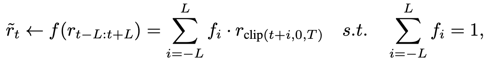
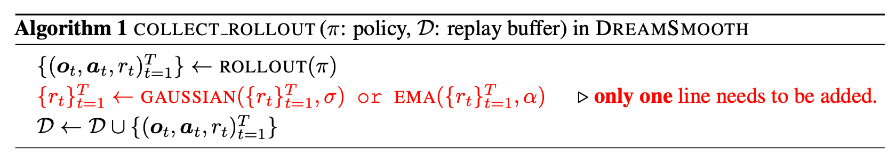
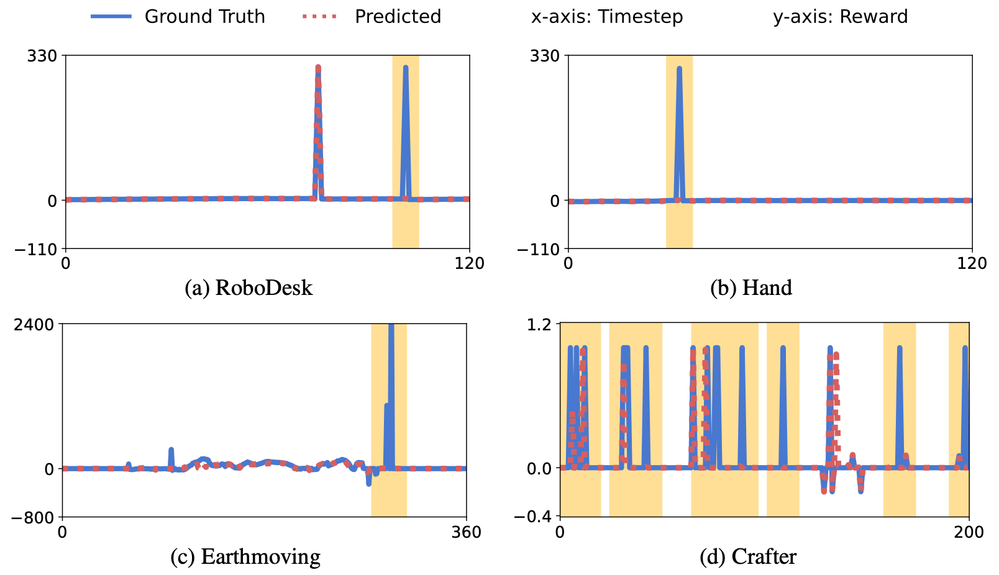
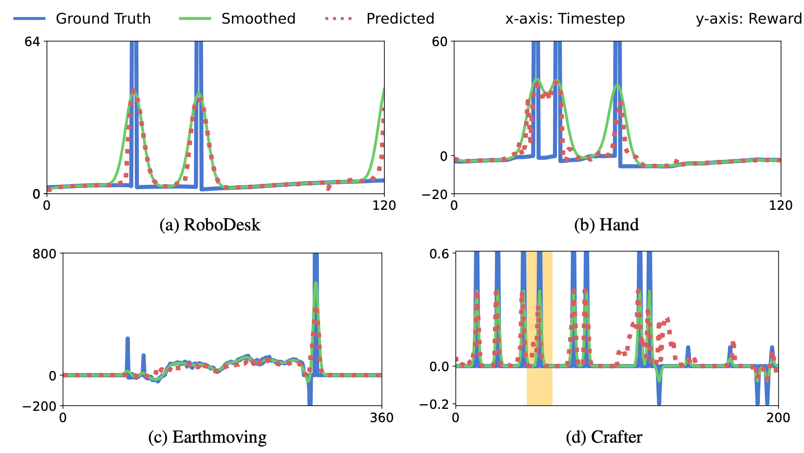
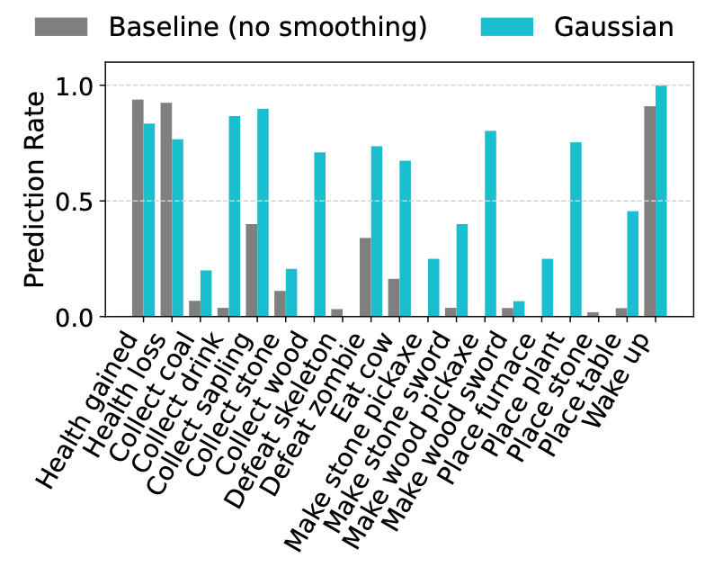
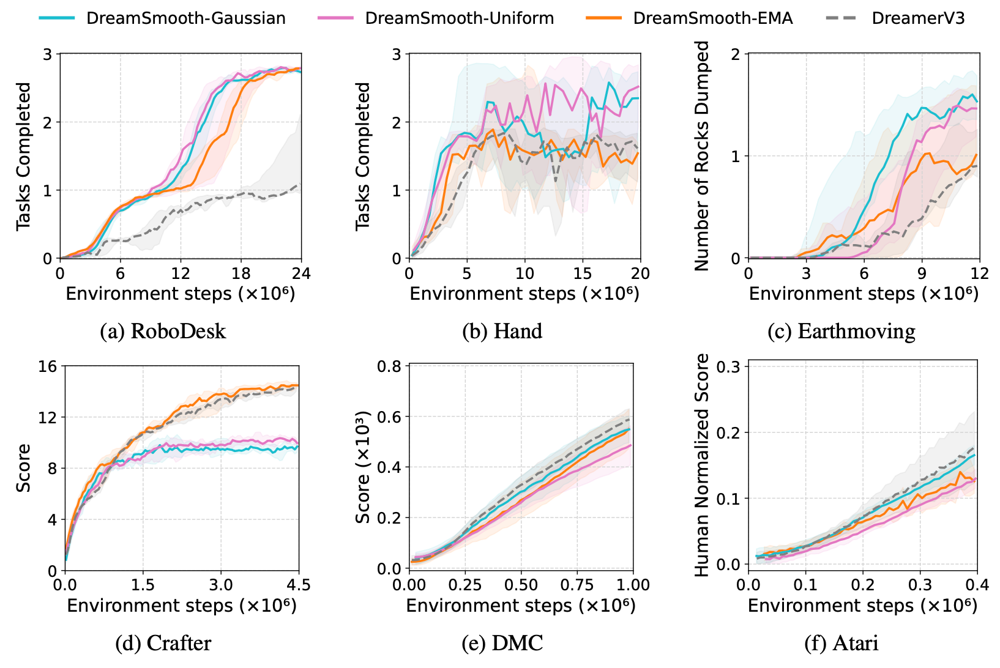
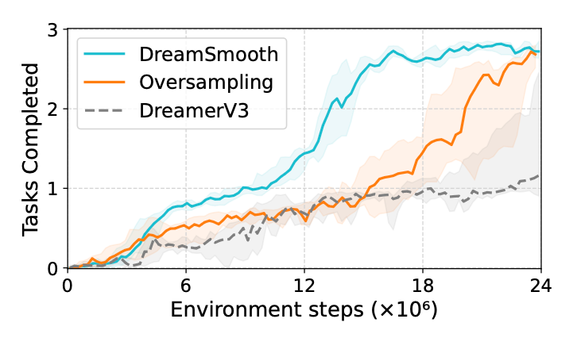
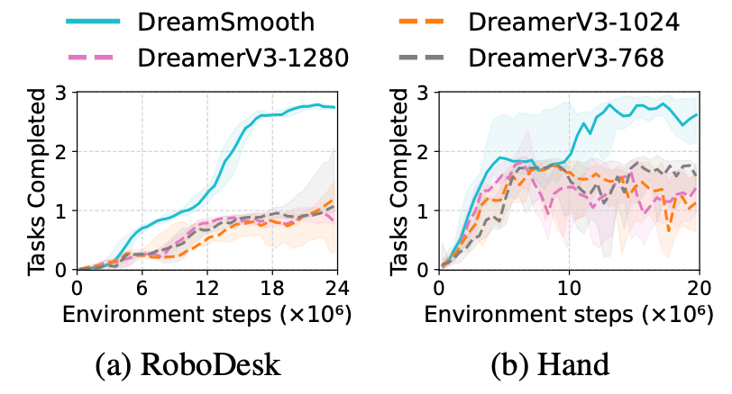

# > 저자: DREAMSMOOTH: IMPROVING MODEL-BASED REIN-FORCEMENT LEARNING VIA REWARD SMOOTHING | 
> 저자: Vint Lee, Pieter Abbeel, Youngwoon Lee | 컨퍼런스/저널: ICLR 2024
> 논문 링크: https://arxiv.org/pdf/2311.01450
> 관련 코드: https://github.com/vint-1/dreamsmooth
---

## 1. Summary (세 줄 요약)
* **Problem:**: Sparse reward 환경에서 MBRL의 reward model이 보상의 exact timestep을 예측하지 못해, 전체 보상을 0으로 수렴시켜버리는 구조적 병목(bottleneck)이 존재
* **Method:**: 정확한 timestep의 reward 예측 대신, temporally smoothed reward를 예측하도록 학습하는 DreamSmooth  기법을 제안
* **Result:**: DreamerV3, TD-MPC, MBPO 등 다양한 MBRL 알고리즘에서 sparse reward task의 sample efficiency와 최종 성능을 크게 개선하며, 기존 dense benchmark에서는 성능 저하 없이 유지하는것을 보임

## 2. Introduction & Background
* **Motivation:** 
    - 기존 MBRL 연구는 주로 world model의 구조 및 표현력 강화에 집중했으며 reward model에 대한 연구는 간과되어왔음
    - 인간은 보상의 정확한 시점보다는 대략적인 미래 보상 추청치만을 가지고 계획을 세움다는점에서 동기를 얻음
* **Problem Statement:**
    - Sparse reward 환경에서 MSE 기반 reward regression은 reward를 몇스텝 일찍 혹은 늦게 예측해도 매우 높은 손실을 일으키니 아예 0으로 무시하는게 (Omitting sparse reward) loss관점에서 유리해짐
    - 그 결과 reward model이 sparse reward를 학습하기보다는 보상을 0으로 예측(Omitting sparse rewards)해서 오차를 줄이려는 편향된 학습을 하게되며 이로써 정책학습에 병목이 걸림

## 3. Proposed Method
* **Key Architecture:** 
    - 에피소드 수집 직후 Replay Buffer에 저장하기 전 보상 신호에 smoothing function (Gaussian, Uniform, EMA)를 적용하여 보상 신호를 주변 타임스텝으로 분산시킴
* **Novelty:** 
    - 모델 구조를 바꾸지 않고 기존 알고리즘에 단 한줄의 코드만 추가하면 적용 가능
    - EMA smoothing의 경우 과거 히스토리를 포함한 POMDP 환경에서 optimality presevation을 이론적으로 증명함
* **Technical Details:** (수식이나 알고리즘 단계 요약)
1. Reward Smoothing equation
    
    - $\tilde r_t \leftarrow f(r_{t-L:t+L}) = \sum_{i=-L}^{L} f_i \cdot r_{\text{clip}(t+i,0,T)}$
        - $\bar r_t$ (smoothed reward): 특점 시점 t에서 모델이 학습에 실제로 사용하는 smoothing된 보상값
        - $f$: Smoothing function. 논문에서는 Gaussian, Uniform, EMA를 사용
        - $L$: Exact reward timestep $t$로부터 떨어진 지점 좌우로 $L$칸
        - $\text{clip}(t+i,0,T)$ (경계처리): $t$가 처음/끝 근처면 $t+i$가 범위를 벗어날 수 있기때문에 $0~T$사이로 잘라서 인덱스를 넘어가지 못하도록 막음. 만약 넘어가는 인덱스는 경계값에 가중합
    - $\quad \text{s.t.}\quad \sum_{i=-L}^{L} f_i = 1$
        - 전체 보상의 합을 보존
        - 보상을 각 timestep 주위로 넓게 퍼뜨리더라도 에피소드 전체에서 얻는 총 보상량은 변하지 않음
2. Algorithm 1
    
    - 알고리즘 순서
        1. Policy $\pi$로 rollout을 굴려서 $t=1$ 부터 $T$까지의 transition을 보음
        2. Step1에서 수집한 episode의 reward 시퀀스 전체를 $[r_1, r_2, \dots, r_T]$ 한번에 변환해서 $[ \tilde r_1, \tilde r_2, \dots, \tilde r_T]$ 같은 smoothed reward로 변환
        3. replay buffer $\mathcal D$에 episode transition ($(o_t, a_t, \tilde r_t)$)을 추가
    - 이후 학습 코드 수정 없이 smoothed reward만 보고 학습을 진행할 수 있게 됨
        
## 4. Experiments & Results
* **Dataset:** 
    - Sparse Reward Tasks
        - RoboDesk (Sequence manipulation)
        - Hand (Shadow Hand sequential rotation)
        - Earthmoving (중장비 조작)
        - Crafter (Minecraft-like 2D env, 22 achievements)
        - Dense Benchmark
        - DeepMind Control Suite (7 tasks)
        - Atari (6 games, 100K steps) 
* **Evaluation Metrics:** 성능 측정 기준 (Accuracy, F1-score, mAP 등)
* **Result:** 기존 SOTA(State-of-the-Art) 모델들과의 비교 수치
1. Reward predictioin visualization
    

    
    
    

- Figure2에서는 reward 예측을 거의 못했지만, reward smoothing을 적용한 후 reward model이 대부분의 이벤트를 포착한 것을 확인 가능
- Reward model이 예측을 잘 못했던것은 모델의 성능이 안좋아서가 아닌 reward가 등장하는 정확한 timestep을 맞춰야하는 목표가 너무 어려웠기 때문
2. Crafter sub-task prediction rate
    

    
    

- 회색 막대그래프: Baseline인 DreamerV3에서는 대부분의 task에서 sparse reward를 omit해서 예측률이 엄청나게 낮게 나옴
- 파란색 막대그래프: 15개 task에서 baseline보다 압도적으로 높은 성능을 기록함
- reward smoothing이 에이전트의 성능을 높이는것 + sparse reward 환경에서 학습하기 훨씬 유리하다는것을 입증함 
3. Comparison of learning curve
    

    
    

- RoboDesk (a), Hand (b), Earthmoving (c)
    - Baseline이 학습을 못하고 정체되어있을때 DreamSmooth는 목표를 잘 달성함
    - EMA를 smoothing function으로 썼을때 b, c에서 성능이 다른 함수보다 떨어지는것을 확일할 수 있는데, 이는 EMA는 reward 발생 이후시점부터 보상을 smoothing하기 때문에 1스텝이라도 일찍 예측하게되면 패널티를 받게 된다.
- Crafter (d)
    - 여기서는 baseline보다 DreamSmooth가 성능이 낮은것을 확인할 수 있는데 Crafter task에서는 reward를 받을 수 있는 상황이 많기 때문에 미래 보상을 미리 예측하면 보상을 받는 Gaussian/Uniform을 쓰면 FP가 많이 나올 수 있기 때문
    - 아직 업적을 달성하지도 않았는데 이미 보상을 받았다고 착각하게 만듬
- DMC (e), Atari (f)
    - e, f처럼 기존 벤치마ㅡㅋ에서도 성능 저하가 없음을 보여줌으로써 구조를 망가뜨리지 않고 범용적으로 쓸 수 있음을 증명
- reward smoothing이 일반적으로 효과가 있지만 각 task별 reward sparsity 및 특성에 따라 적절한 function을 적용해야 좋은 효과를 볼 수 있음
4. Generalizability of DreamSmooth
    

    
    

    - 세 가지 태스크 모두에서 reward smoothing 없이 성능이 크게 저하되는 것을 확인할 수 있으며, 이는 reward prediction을 사용하는 MBRL 전반에 reward smoothing이 적용 가능함을 보임
5. Oversampling & Increasing model size
    

    
    
    

    - 단순히 데이터를 Over sampling하거나 모델크기를 키우는 것 만으로는 Omitting sparse reward problem을 해결하지 못함을 증명

## 5. Discussion & Personal Opinion
* **Strengths:** 
    - 복잡한 수학적 수식 없이, 모델의 구조/학습 파이프라인의 변화 없이 코드 한줄로 MBRL의 한계저밍었던 Omitting sparse reward problem을 해결함
    - Baseline인 dream-based world model DreamerV3 뿐만 아니라 reward prediction을 사용하는 MBRL에 적용가능
* **Weaknesses:** 
    - Gaussian/Uniform 함수 같은 경우 미래의 보상을 과거/현재로 가져오기 때문에 모델이 미래를 너무 일찍 예측해버리는 False positive가 나타나서 학습을 방해할 수 있음
* **Future Work:** 
- Smoothing function을 학습하거나 선택. Crafter같이 보상이 많이 나오는 상황같이 보상의 양이나 빈도에따라 파라미터값 Or function을 바꿔서 데이터를 적용하도록?
- Smoothing을 오히려 epsilon-greedy처럼 exploration 하도록 
- 오히려 MSE 때문에 문제가 생겼으니까 MSE말고 다른 loss를 쓸 수는 없나. NLP도 다 MSE 일단 넣고 생각하는것같던데
- 

<!-- ---
## 💡 용어 정리 (Optional)
* **[용어 A]:** 설명
* **[용어 B]:** 설명 -->