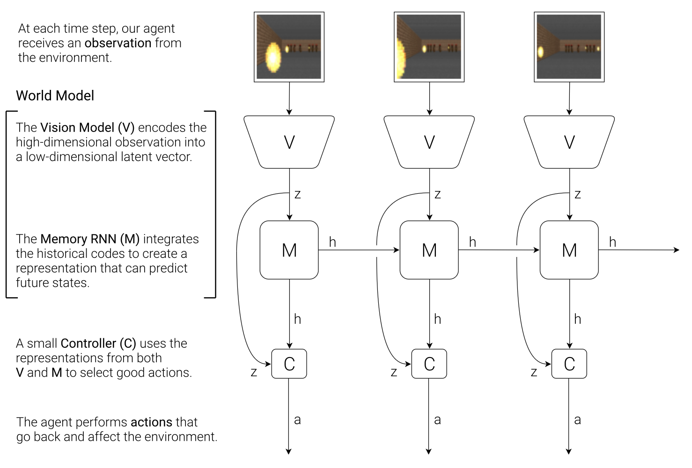
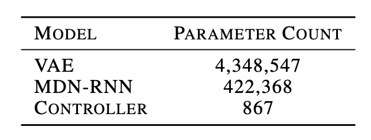
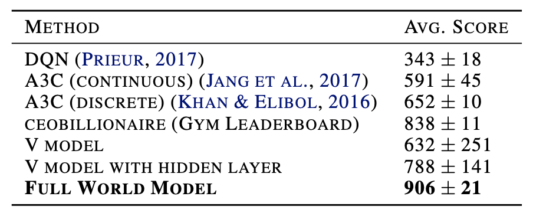
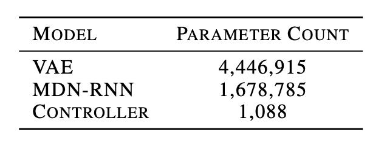
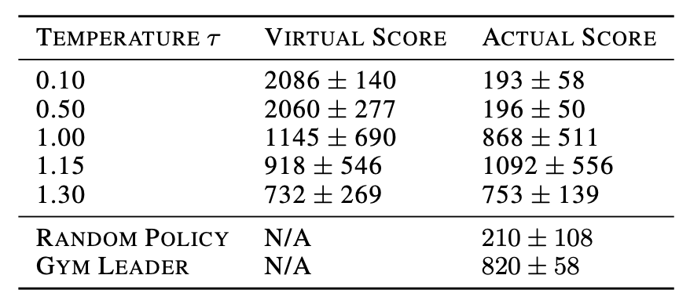

# World models
> 저자: David Ha, Jürgen Schmidhuber | 컨퍼런스/저널: NeurIPS 2018 
> 논문 링크: https://papers.nips.cc/paper_files/paper/2018/hash/2de5d16682c3c35007e4e92982f1a2ba-Abstract.html 
> 관련 코드: https://worldmodels.github.io

---

## 1. Summary (세 줄 요약)
* **Problem:** 에이전트가 고차원 관측값 (이미지, 비디오 등)에서 핵심 정보를 추출하고 미래를 예측하며 효율적으로 학습하도록 만드는 것이 어렵다. 또한 수백만 개의 매개변수를 가진 대형 신경망 모델 학습 시 신뢰 할당 문제 (Credit assignment problem)로 인해 병목현상이 발생하여 주로 작은 신경망을 사용함
* **Method:** 고차원 Observation을 V(압축) + M(동역학 예측) + C(정책) 로 분해하고, M이 만든 Dream (Hallucinated) 환경 안에서 C를 학습해 실제로 전이한다
* **Result:** 실제 환경 뿐만 아니라 에이전트의 꿈 (Hallucinated dream) 내부에서도 학슴이 가능함을 보였음. CarRacing-v0과 VizDoom 환경에서 SOTA를 달성함. 또한 Hallucinated dream 내부에서만 학습한 정책을 실제 VizDoom 환경에 이식하여 목표점수 750 스텝을 훌쩍 넘은 1100 타입스텝을 기록함

## 2. Introduction & Background
* **Motivation:** 인간은 제한된 감각으로 획득한 정보를 바탕으로 뇌 속에 내부 모델을 구축하여 의식적 계획 없이도 내부 모델의 예측에 기반해 본능적이고 반사적인 행동을 수행함
* **Limitation of related work:** 기존의 Model-free RL은 매개변수가 많은 대규모 신경망을 학습할 때 Credit assignment problem으로 인해 병목현상을 겪는다.
* **Problem Statement:** 딥러닝은 대규모 모델 학습에 강하지만, 전통적인 강화학습 알고리즘은 모델의 가중치가 늘어나면 탐색 효율이 급격히 떨어짐. 이를 해결하기 위해 모델의 복잡성(V, M)과 정책의 복잡성(C)을 분리할 수는 없을까?

## 3. Proposed Method
* **Key Architecture:** 

    1. Vision Model (V): 
        - VAE를 사용하여 고차원 관측 값 (64x64x3)을 저차원의 latent vector $z$로 압축
        - VAE를 사용하기 때문에 original 관측 데이터의 픽셀 디테일은 손실되지만 핵심 구조는 남음
    2. Memory RNN (M): 
        - MDN-RNN을 사용하여 현재의 $z$와 행동 $a_t$를 바탕으로 다음 상태 $z_{t+1}$의 확률 분포를 예측
        - M이 모델링 target: $P(z_{t+1}\mid a_t, z_t, h_t)$
        - 샘플링 시 temperature $\tau$로 노이즈값을 조정할 수 있음. 논문에서는 파이어볼을 얼마나 랜덤하게 쏠지 조정함
    3. Controller (C): 
        - $z$와 $M$의 숨겨진 상태 $h$를 입력받아 행동을 결정하는 선형 모델. CMA-ES 알고리즘을 통해 최적화
        - policy equation: $a_t = W_c [z_t\; h_t] + b_c$
        - 복잡한건 V와 M에 넣고 실제 정책인 C는 가볍게 만든다.
        - 결국 World model (V, M)은 reward를 모르고 C만 실제 reward를 알 수 있음.
* **Novelty:** 에이전트가 실제 환경이 아닌 자신의 내부 모델 M이 예측한 가상 환경 (Hallucinated dream) 안에서 훈련받고 이슬 실제 환경에 전이할 수 있음
* **Technical Details:** 
    - VizDoom에서 dream 환경에서 학습이 가능한 이유는 M이 다음 $z$뿐 아니라 마지막 Terminal state인 죽는 것 까지 예측할 수 있어 완전한 RL 환경을 만들 수 있음
    - death 확률이 50%를 넘으면 done==True로 컷오프 하는 방식이 베르누이 샘플림보다 안정적이었다고 연구자들이 밝힘

## 4. Experiments & Results
* **Dataset:** 
    1. CarRacing-v0: 무작위로 생성된 트랙을 완주하는 과제
    2. VizDoom (Take Cover): 날아오는 Fireballs을 피해 생존하는 과제
### 4.1 CarRacing-v0
- 목표
    - 트랙이 매번 랜덤 생성되고, 가능한 많은 타일을 빠르게 방문할수록 보상이 커짐.
    - 해결에 대한 기준은 평균 점수 900 수준을 달성해야함.
- 데이터 수집
    - 랜덤 정책으로 10000 rollouts를 수집하고, 각 시점의 행동 $a_t$와 observation을 기록함
- 학습 파이프라인
    1. 랜덤 Rollouts 10000개 수집
    2. VAE (V) 학습. $$z \in \mathbb{R}^{32}$$로 인코딩 
    3. MDN-RNN (M) 학습. $P(z_{t+1}\mid a_t, z_t, h_t)$ 모델링
    4. Controller C 정의 $a_t = W_c [z_t, h_t] + b_c$
    5. CMA-ES로 C 최적화(기대 누적 보상 최대화) 
- CarRacing task에 사용된 모델 파라미터

    - 복잡한 연산은 world model 내부에서 진행하고 controller를 가볍게 모델링한 것을 확인할 수 있다. 
- 실험 설계
    1. V만 사용하는 경우 (=z만 입력): 주행이 불안정하면 코너에서 자주 실패함
    2. V+M을 사용하는 경우 (=z+h 입력): 더 안정적으로 코너를 공략함. 미래에 대한 분포 정보가 h에 담겨 즉각적 반사적 결정이 가능하다고 연구자들은 해석함
- 결과
    - V만 사용: 평균 632 ± 251  
	- V + (C에 hidden layer 추가): 788 ± 141 (V만 사용한 것에 비해 개선됐지만 solve에는 부족)
	- Full World Model (V+M) + 선형 C: 906 ± 21로 solve 달성  
	- 비교로 기존 딥RL/리더보드 성능(예: A3C, 리더보드 최고치 등)도 표로 제시되며, 연구자들은 “이 과제를 해결한 첫 보고”임을 주장
    - CarRacing 기존 딥RL/리더보드 성능 비교
    
- 달성 목표
    - 픽셀 입력 기반 CarRacing에서 평균 900+로 solve 수준 달성
-  Contribution
    - 보상 없이 학습된 world model이 만들어낸 시공간 표현 ($s, h$)만으로도 아주 작은 정책이 높은 성능을 낼 수 있음을 입증함
    - 전통적 Deep RL이 쓰는 프레임 스태깅/엣지 전처리 없이도 raw RGB 스트림에서 representation을 학습하여 높은 성능을 냄

### 4.2 VizDoom
- 목표
    - 몬스터가 쏘는 파이어볼을 피하며 살아남는 시간 (타임스텝 수)이 점수. 최대 에피소드 수 2100 stpes, 100회 평균 생존 시간이 750 stpes 초과일 시 solve
- CarRacing과의 핵심 차이점
    - CarRacing은 현실 환경에서 C를 학습했다면, VizDoom은 M이 만든 가상 환경에서 C를 학습하고, 그 C (정책)를 실제 환경으로 이식하는것이 목표
- 데이터 수집
    - 랜덤 정책으로 10000 rollouts를 수집하고, 각 시점의 행동 $a_t$와 observation을 기록함
- VisDoom task에 사용된 모델 파라미터

    - VizDoom task 역시 복잡한 연산은 world model 내부에서 진행하고 controller를 가볍게 모델링한 것을 확인할 수 있다. 
- 학습 파이프라인
    1. 랜덤 Rollouts 10000개 수집
    2. VAE로 프레임을 $$z \in \mathbb{R}^{64}$$로 변환
	3. MDN-RNN이 $P(z_{t+1}, d_{t+1}\mid a_t, z_t, h_t)$ 모델링
	4. C는 $a_t = W_c[z_t, h_t]$
	5. dream 환경(M으로 만든 gym 인터페이스) 안에서 CMA-ES로 C 학습
	6. 학습된 C를 실제 VizDoom에 배치하여 성능 측정
- 결과
    - Dream 환경에서 학습한 에이전트가 가상환경에서 약 900 steps 수준 생존
    - 그 정책을 실제 환경에 배치했을 때 100회 평균 약 1100 step으로 solve 기준인 750 steps을 크게 상회하는 결과를 얻음
- $\tau$ (temperature) 실험

    - $\tau$ 낮출경우: Dream이 너무 결정적/단순해져서 현실에서는 잘 적응하지 못함 (실제 표에서 Virtual score은 높은데 비해 Actual score는 현저히 낮은것을 볼 수 있음)
    - $\tau$ 높일 경우: Dream이 더 불확실/어려워져서 현실 transfer시 성능이 좋아지기도 하지만, 너무 크면 학습이 어려워ㅕ지는 하이퍼 파라미터 문제가 됨. (실제 표에서 1.3에서는 virtual, actual에서 성적이 오히려 낮아지는 결과 확인 가능)
- 달성 목표
    - 학습된 world model이 만든 dream 환경에서만 훈련한 정책을 실제 환경으로 전히아혀 문제를 solve할 수 있음을 실험으로 보임
- Contribution
    - M이 관측 + 끝나는 시점을 예측하도록 확장하여 학습된 동역학 모델로 실제 환경을 대체하는 형태의 ent-to-end RL 실험을 구성함

## 5. Discussion & Personal Opinion
* **Strengths:** 이 논문의 가장 큰 장점 또는 배울 점
* **Weaknesses:** 읽으면서 느낀 아쉬운 점이나 한계점
* **Future Work:** 이 기술을 내 프로젝트에 어떻게 응용할 수 있을까?

---
## 💡 용어 정리 (Optional)
* **Variational Auto-Encoder (VAE):** 
    - 확률분포 $p_\theta(z)$를 prior로 가지는 z로부터 input data와 유사한 x를 생성하는 decoder 학습
    - 오토인코더는 input x를 하나의 latent vector z로 나타낸다. 하지만 이를 생성모델로 사용할 때에는 임의의 random latent vector z를 docoder에 넣으면 이상한 출력이 나올 수 있다. 그래서 latent를 점이 아니라 distribution으로 만들고, 그 분포가 정해진 prior (보통 표준 정규분포 N(0, I))랑 비슷해지도록 학습한다 
    - 장점
        - latent 공간이 연속적이고 매끈해짐. -> latent를 아무데나 흩뿌려 놓는게 아닌 전체 공간을 표준 정규분포처럼 연속적으로 채우도록 강제하기 때문
        - 샘플링으로 자연스럽게 생성이 가능. -> 학습할때 latent를 prior distribution (usually normal distribution)을 따르도록 맞춰놓음. 그래서 임의의 z를 입력으로 넣더라도 prior에서 뽑으면 훈련에서 자주 보던 latent에 있을 확률이 높음. 
    - 단점
        - 출력이 뭉개지는 경향이 있음 (특히 MSE/BCE 사용 시) -> MSE/BCE 기반 likelihood에서는 여러개의 후보군들의 평균값이 최적해가 되기 쉬어 , 후보들이 평균화되며 출력이 뭉개지는 현상이 발생한다.
* **CMA-ES Algorithm:** 설명